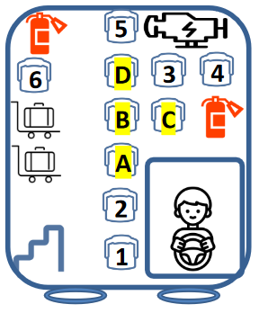

```{r setup, include=FALSE}
knitr::include_graphics
knitr::opts_chunk$set(echo = FALSE)
```

# Excercise #2
For this exercise we are investigating the idea of centrality in networks. We will look at what seat or position that we should sit on for the bus ride to Fakebook from downtown San Francisco! We can network with the people in our immediate area but not outside of that.

## The Problem
We need to pick an optimal set on the bus. We can talk to people within a fixed range (forward, back, side or diagonal) so we will need to be careful how we pick the seat.
Here is an illustration of the problem. seats A-D are open and avaiable to sit in whereas the number seats 1-6 are open. For now we will assume that the other seats will be filled up.

<center>

</center>

## Data acquisition & preprocessing

We can reduce this problem to a set of coordinates and use X- Y Cartesian plane to measure distances and proximity. We will simplify the bus problem slightly by:
1- Ignoring the alley in the bus therefore seat 6 and D are adjacent in this model.

2- Creating a 4x6 grid where seats are either: taken, available or un-available. The un-available seats do not exist. 

3-assume a 100% than all seats will be filled/

```{r import pacakges}

#install.packages("gt")
library(gt)
library(visNetwork)
library(networkD3)
library(ggplot2)
library(dplyr)
library(cluster)
library(tidyverse)
library(igraph)
library(tidygraph)
```

### Making a bus coordinate system

```{r Set coordinates}
#These are the seats withi the rows
x_dimention=4
#These are the number of rows on the bus
y_dimention=6

Coords <- data.frame(
   Seat = rep(c(1:x_dimention),times=y_dimention), 
   Row = rep(c(1:y_dimention),each=x_dimention),
   Status=rep('Available',x_dimention*y_dimention)
   )


#set some conditions First un-available (non existent seats)
unavail="Un-Available"
#remove non existant seats on left
Coords$Status[Coords$Row != 5 & Coords$Seat == 1] <- unavail
#remove on right
Coords$Status[(Coords$Row != 5 & Coords$Seat == 4)] <- unavail
#remove driver cabin
Coords$Status[(Coords$Row < 4 & Coords$Seat > 2)] <- unavail
#remove seats over engine
Coords$Status[(Coords$Row == 6 & Coords$Seat > 2)] <- unavail

#now lets mark the occupied or taken seats
taken="Taken"
#first two rows and last row 
Coords$Status[(Coords$Row <3 | Coords$Row >5) & Coords$Status == 'Available' ] <- taken
#seat number on on the left side
Coords$Status[Coords$Seat <2 & Coords$Status == 'Available' ] <- taken
#seat number on on the left side
Coords$Status[Coords$Seat >2 & Coords$Status == 'Available' & Coords$Row >4 ] <- taken
```

### Lets Vislualize
Let's take a look at our data!

```{r plot seats}
#plotting the seats
ggplot(data=Coords,aes(x=Seat,y=Row))+
  geom_point(aes(shape = Status, color = Status),size=10)+
  scale_shape_manual(values = c(19,15,4,1))+
  scale_color_manual(values=c("#234F1E", "#FFA500", "#E3242B"))
```

Looks like we have our bus, the seats available and taken!
Now lets filter our data frame to have only the useful coordinates, or seats that exist
```{r filter coordinates}

Cords_Simple_Status <- Coords %>%
  filter(Status != unavail) %>%
  rename("Y" = "Row", "X"= "Seat")

Cords_Simple <- Cords_Simple_Status[, c("X", "Y")]
Cords_Simple_Status <- rowid_to_column(Cords_Simple_Status, "id")

```

```{r plot seats 2}
#plotting the seats
ggplot(data=Cords_Simple_Status,aes(x=X,y=Y,color=Status,label=id))+
  geom_point(size=10)+
  geom_text(hjust=.5, vjust=0.5,color="black")

Cords_Simple_Status <- Cords_Simple_Status %>%
  select(-id)
```
We have a simplified coordinate system with the existing seats. We will need all of this information to compute the degree of centrality for each seat, which we can then filter out.

## Centrality Measure
Centrality indicates the influence of a node in a network. Higher centrality means higher influence. Therefore for this problem we would want higher centrality.

### Distance Matrix
We will need to look at the distance between each seat to see which seats can form connection with others. Ultimately we will find the most central in our network.

```{r euclidian distance}

##  Dissimilarities using Euclidean metric
dist_seats <- daisy(Cords_Simple, metric = "euclidean")
#convert matrix to dataframe
dist_seats=as.data.frame(as.matrix(dist_seats))
#bind the status and coords to each row
dist_seats=cbind(Cords_Simple_Status,dist_seats)

#pivot to make into tabular form
dist_seats <- dist_seats %>% 
  pivot_longer(where(is.numeric) & (!contains(c("X","Y"))),names_to = "to_seat_id")

#quick change the name of value to distance
dist_seats <- dist_seats %>%
  rename("Distance" = "value")

#get the from seat id
lcords=nrow(Cords_Simple_Status)
dist_seats <- cbind(from_seat_id = rep(c(1:lcords),each=lcords), dist_seats)

# #reciprocal relationship we need to remove
# lrow=nrow(dist_seats)
# dist_seats <- dist_seats[1:(lrow/2),]

#remove all duplicated rows 55 of them (10 choose 2 is 45)
dist_seats=unique(dist_seats) 

#remove all the self relationships and if the seat is taken
dist_seats <- dist_seats %>% 
  filter(to_seat_id != from_seat_id)
  #filter(Status != taken)

head(dist_seats) %>%gt
```

This is just a sample, but the table overall contains all the distances between seats.

Now we have the distance between each of the availabel seats and the taken or occiped seats. We just need to apply the rules of connections (diagonal, front,back, ect) and we will be able to summarize the table to get the stregth of each seat based on the connections. We will filter all of the connections who are further than sqrt 2 away from the current seat

``` {r ,results="hide", name="summarize table 1"}

#get all connections within distance
dist_seats <- dist_seats %>%
  filter(Distance <= sqrt(2)) %>%
  rename(from = from_seat_id , to = to_seat_id)

#Create the degree of centrality of the seat values. We are using dist_seats which accounts for the open seats only since we don't care about the occupied seats.
seat_vals <- dist_seats %>%
  group_by(from) %>%
  summarize(value=n())


#crete the edges
edges <- unique(select(dist_seats, from, to))
edges$to <- as.numeric(edges$to)
#remove the recipricals
d1 <- as.data.frame(t(apply(edges, 1, sort)))
edges <- edges[!duplicated(d1),]


#create the nodes
nodes <- Cords_Simple_Status
nodes <- rowid_to_column(nodes, "id")
nodes <- nodes %>% 
  left_join(seat_vals, by = c("id" = "from")) %>%
  replace(is.na(.),1)
nodes$name <- as.character(nodes$id)
nodes <- nodes %>% 
  mutate(title = paste("Coords:",paste(X, Y,sep=","),"ID:",id,"size:",value, sep = " ")) %>%
  rename(group = Status,label = name) 


visNetwork(nodes, edges)%>%
  visGroups(groupname="Available", color="#234F1E") %>%
  visGroups(groupname="Available", color="#E3242B")  %>%
  visLegend()

# dist_seats$to = as.numeric(dist_seats$to)
# dist_seats_test <- dist_seats %>% 
#   left_join(nodes,by=c('to'='id'))
# 
# ggplot(data=dist_seats,aes(x=X,y=Y,group=to,label=from))+
#   geom_point(aes(color = Status),size=10)+
#   geom_line()+
#   geom_text(hjust=0, vjust=0)

```


Now let's try to find the measures for each seat
## Centrality Measures

### Degree Centrality
Is the number of links incident upon a node (i.e., the number of ties that a node has).

```{r degree centrality}
#attach(mtcars)
#relabel seats
seat_labs <- data.frame(
  label=c("A","B","C","D"),
  seat_id=c(3,4,5,7)
   )

seat_vals_table <- seat_vals %>% 
  rename(seat_id = from) %>%
  right_join(seat_labs,by='seat_id') %>%
  rename(Seat = label,Degree_Centrality = value) %>%
  select(-seat_id)

#formaint to make it look nice
seat_vals_table <- seat_vals_table[, c("Seat", "Degree_Centrality")]
seat_vals_table = seat_vals_table[order(-seat_vals_table$Degree_Centrality),]
seat_vals_table %>%gt
``` 

We can validate this with the igraph package wich has a built in functionality for centrality degree
```{r degree central igraph}
g = tbl_graph(nodes = nodes, edges = edges, directed = FALSE)

nodes_avail <- nodes %>%
  filter(id %in% c(3,4,5,7))

edges_avail <- edges %>%
  filter(from %in% c(3,4,5,7))


g <- g %>% 
  activate(nodes) %>% 
  mutate(degree = centrality_degree()) %>% 
  activate(edges) %>% 
  filter (from %in% c(3,4,5,7))

tg_nodes <-
  g %>%
  activate(nodes) %>%
  data.frame() %>%
  rownames_to_column("rowid") %>%
  mutate(rowid = as.integer(rowid)) %>%
  arrange(desc(degree)) %>%
  filter (label %in% c(3,4,5,7)) %>%
  rename( seat_id = id , Centrality_Degree=degree, id2= label)


#data cleaning
seat_vals_table <- tg_nodes %>% 
  left_join(seat_labs,by='seat_id') %>%
  rename(Seat = label) %>%
  select(Seat,Centrality_Degree
)

seat_vals_table <- seat_vals_table[, c("Seat", "Centrality_Degree")]

degree_table=seat_vals_table


#data output
seat_vals_table %>% gt

Cords_Simple_Status <- rowid_to_column(Cords_Simple_Status, "id")
Cords_Simple_Status_vis <- Cords_Simple_Status %>%
  left_join(tg_nodes,by=c("id"="rowid"))

ggplot(data=Cords_Simple_Status_vis,aes(x=X.x,y=Y.x,color=Status))+
  geom_point(aes(size=Centrality_Degree))
```

There is agreement between our calculations and the calculations for the package therefore we can use them!

### Closeness centrality
is a way of detecting nodes that are able to spread information very efficiently through a graph. The closeness centrality of a node measures its average farness (inverse distance) to all other nodes

```{r closeness centrality}
g = tbl_graph(nodes = nodes, edges = edges, directed = FALSE)

g <- g %>% 
  activate(nodes) %>% 
  mutate(degree = centrality_closeness()) %>% 
  activate(edges) %>% 
  filter (from %in% c(3,4,5,7))

tg_nodes <-
  g %>%
  activate(nodes) %>%
  data.frame() %>%
  rownames_to_column("rowid") %>%
  mutate(rowid = as.integer(rowid)) %>%
  arrange(desc(degree)) %>%
  filter (label %in% c(3,4,5,7)) %>%
  rename( seat_id = id , Centrality_Degree=degree, id2= label)


#data cleaning
seat_vals_table <- tg_nodes %>% 
  left_join(seat_labs,by='seat_id') %>%
  rename(Seat = label,Closeness_Degree= Centrality_Degree) %>%
  select(Seat,Closeness_Degree)

seat_vals_table <- seat_vals_table[, c("Seat", "Closeness_Degree")]

closeness_table=seat_vals_table

#data output
seat_vals_table %>% gt

#visulize
Cords_Simple_Status_vis <- Cords_Simple_Status %>%
  left_join(tg_nodes,by=c("id"="rowid"))

ggplot(data=Cords_Simple_Status_vis,aes(x=X.x,y=Y.x,color=Status))+
  geom_point(aes(size=Centrality_Degree))
```

### Betweenness centrality
s a way of detecting the amount of influence a node has over the flow of information in a graph.

```{r betweeness centrality}
g = tbl_graph(nodes = nodes, edges = edges, directed = FALSE)

g <- g %>% 
  activate(nodes) %>% 
  mutate(degree = centrality_betweenness()) %>% 
  activate(edges) %>% 
  filter (from %in% c(3,4,5,7))

tg_nodes <-
  g %>%
  activate(nodes) %>%
  data.frame() %>%
  rownames_to_column("rowid") %>%
  mutate(rowid = as.integer(rowid)) %>%
  arrange(desc(degree)) %>%
  filter (label %in% c(3,4,5,7)) %>%
  rename( seat_id = id , Centrality_Degree=degree, id2= label)


#data cleaning
seat_vals_table <- tg_nodes %>% 
  left_join(seat_labs,by='seat_id') %>%
  rename(Seat = label,Betweenness_Degree= Centrality_Degree) %>%
  select(Seat,Betweenness_Degree
)

seat_vals_table <- seat_vals_table[, c("Seat", "Betweenness_Degree")]

betweeness_table=seat_vals_table


#data output
seat_vals_table %>% gt


Cords_Simple_Status_vis <- Cords_Simple_Status %>%
  left_join(tg_nodes,by=c("id"="rowid"))

ggplot(data=Cords_Simple_Status_vis,aes(x=X.x,y=Y.x,color=Status))+
  geom_point(aes(size=Centrality_Degree))
```


### Comparison between all 3!
```{r comparison}
fulltable=rbind(degree_table,setNames(closeness_table, names(degree_table)),setNames(betweeness_table, names(degree_table)))

gtTable = gt(fulltable) %>%
  tab_row_group(
    label = "Centrality Degree",
    rows = 1:4
  ) %>% 
  tab_row_group(
    label = "Closesness",
    rows = 5:8
  )%>% 
  tab_row_group(
    label = "Betweeness",
    rows = 9:12
  )
gtTable

```
