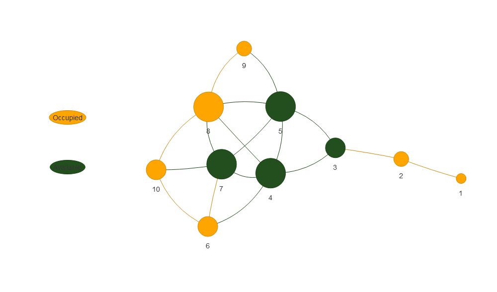
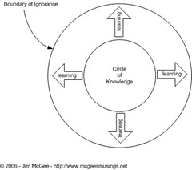
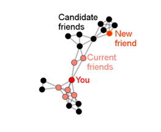

Assignment 2
================
Emery Dittmer
2023-03-09

# Excercise \#2

For this exercise we are investigating the idea of centrality in
networks. We will look at what seat or position that we should sit on
for the bus ride to Fakebook from downtown San Francisco! We can network
with the people in our immediate area but not outside of that.

## 1. Context & Modeling

### 1.1 Problem Description

For this problem, we will be a summer intern at Fakebook. This intern
takes a bus every morning from San Francisco to Menlo park. When he
boards the bus, there are 4 empty seats (labelled A-D). However, not all
of these seats are equal. Anyone on the bus can form connections with
their nearest neighbors who are in front, behind, to the side or
diagonal from each other. Our goal is to sit in the seat that is the
most advantageous to us. Let’s assume that seats with a lot of contact
or centrality will be the most advantageous. With this example, we will
examine network centrality to determine which seats have the most
prominent centrality. We have the following image to base our network
and centrality measures off of.

<center>


</center>

### 1.2 Assumptions

To simplify the problem, we will use several assumptions that are listed
here: 1. We will use a grid to model this problem with 3 types of seats:
a. No Seat: defines a position on the bus that is not a seat. The cabin
for the driver or engine take up these spots. b. Occupied: a seat that
exists but is currently occupied c. Available: an available seat to be
sat in. These are the choice nodes we have. 2. We will assume that all
the seats will be occupied. Therefore, we will set the weight of each
edge from available seats to 100%, even if the seat is currently
available. 3. We will assume that the alley for walking that divides the
seats does not exist. We will not need to account for the small extra
distance between seats D and 6.

    ## 
    ## Attaching package: 'dplyr'

    ## The following objects are masked from 'package:stats':
    ## 
    ##     filter, lag

    ## The following objects are masked from 'package:base':
    ## 
    ##     intersect, setdiff, setequal, union

    ## ── Attaching packages ─────────────────────────────────────── tidyverse 1.3.2 ──
    ## ✔ tibble  3.1.8     ✔ purrr   0.3.4
    ## ✔ tidyr   1.2.1     ✔ stringr 1.4.1
    ## ✔ readr   2.1.3     ✔ forcats 0.5.2
    ## ── Conflicts ────────────────────────────────────────── tidyverse_conflicts() ──
    ## ✖ dplyr::filter() masks stats::filter()
    ## ✖ dplyr::lag()    masks stats::lag()
    ## 
    ## Attaching package: 'igraph'
    ## 
    ## 
    ## The following objects are masked from 'package:purrr':
    ## 
    ##     compose, simplify
    ## 
    ## 
    ## The following object is masked from 'package:tidyr':
    ## 
    ##     crossing
    ## 
    ## 
    ## The following object is masked from 'package:tibble':
    ## 
    ##     as_data_frame
    ## 
    ## 
    ## The following objects are masked from 'package:dplyr':
    ## 
    ##     as_data_frame, groups, union
    ## 
    ## 
    ## The following objects are masked from 'package:stats':
    ## 
    ##     decompose, spectrum
    ## 
    ## 
    ## The following object is masked from 'package:base':
    ## 
    ##     union
    ## 
    ## 
    ## 
    ## Attaching package: 'tidygraph'
    ## 
    ## 
    ## The following object is masked from 'package:igraph':
    ## 
    ##     groups
    ## 
    ## 
    ## The following object is masked from 'package:stats':
    ## 
    ##     filter

### 1.3 Data Collection: Making a bus coordinate system

No csv, or other data exists; however, based on the image above, we can
form a coordinate grid to model the bus. A 4x6 grid will model the bus
sufficiently for our purposes. However, some coordinates in this grid
are not actual seats; worse still, some are already occupied. To
correctly represent the situation, we need to label the seats and remove
unneeded seats. We will label the seats as either available, occupied or
no seat to differentiate the seats (nodes) within the bus (network).
Then we will remove the points that do not actually sit. Lastly, we will
index or create arbitrary seat ids for modelling purposes.

<!-- -->

Let’s take a look at our data!

<!-- -->

Looks like we have our bus, the seats available and taken! Now lets
filter our data frame to have only the useful coordinates, or seats that
exist.

let’s remove the seats that do not actually exist.

<!-- -->

We have a simplified coordinate system with the existing seats. We will
need all of this information to compute the degree of centrality for
each seat, which we can then filter out.

### 1.4 Transformations to Data

Centrality indicates the influence of a node in a network. Higher
centrality means higher influence. Therefore for this problem we would
want higher centrality. Special considerations and data transformation

### Distance Matrix Transformations

We will need to look at the distance between each seat to see which
seats can form connection with others. Ultimately we will find the most
central in our network.

<div id="vqgenvzfvu" style="padding-left:0px;padding-right:0px;padding-top:10px;padding-bottom:10px;overflow-x:auto;overflow-y:auto;width:auto;height:auto;">
<style>html {
  font-family: -apple-system, BlinkMacSystemFont, 'Segoe UI', Roboto, Oxygen, Ubuntu, Cantarell, 'Helvetica Neue', 'Fira Sans', 'Droid Sans', Arial, sans-serif;
}

#vqgenvzfvu .gt_table {
  display: table;
  border-collapse: collapse;
  margin-left: auto;
  margin-right: auto;
  color: #333333;
  font-size: 16px;
  font-weight: normal;
  font-style: normal;
  background-color: #FFFFFF;
  width: auto;
  border-top-style: solid;
  border-top-width: 2px;
  border-top-color: #A8A8A8;
  border-right-style: none;
  border-right-width: 2px;
  border-right-color: #D3D3D3;
  border-bottom-style: solid;
  border-bottom-width: 2px;
  border-bottom-color: #A8A8A8;
  border-left-style: none;
  border-left-width: 2px;
  border-left-color: #D3D3D3;
}

#vqgenvzfvu .gt_heading {
  background-color: #FFFFFF;
  text-align: center;
  border-bottom-color: #FFFFFF;
  border-left-style: none;
  border-left-width: 1px;
  border-left-color: #D3D3D3;
  border-right-style: none;
  border-right-width: 1px;
  border-right-color: #D3D3D3;
}

#vqgenvzfvu .gt_caption {
  padding-top: 4px;
  padding-bottom: 4px;
}

#vqgenvzfvu .gt_title {
  color: #333333;
  font-size: 125%;
  font-weight: initial;
  padding-top: 4px;
  padding-bottom: 4px;
  padding-left: 5px;
  padding-right: 5px;
  border-bottom-color: #FFFFFF;
  border-bottom-width: 0;
}

#vqgenvzfvu .gt_subtitle {
  color: #333333;
  font-size: 85%;
  font-weight: initial;
  padding-top: 0;
  padding-bottom: 6px;
  padding-left: 5px;
  padding-right: 5px;
  border-top-color: #FFFFFF;
  border-top-width: 0;
}

#vqgenvzfvu .gt_bottom_border {
  border-bottom-style: solid;
  border-bottom-width: 2px;
  border-bottom-color: #D3D3D3;
}

#vqgenvzfvu .gt_col_headings {
  border-top-style: solid;
  border-top-width: 2px;
  border-top-color: #D3D3D3;
  border-bottom-style: solid;
  border-bottom-width: 2px;
  border-bottom-color: #D3D3D3;
  border-left-style: none;
  border-left-width: 1px;
  border-left-color: #D3D3D3;
  border-right-style: none;
  border-right-width: 1px;
  border-right-color: #D3D3D3;
}

#vqgenvzfvu .gt_col_heading {
  color: #333333;
  background-color: #FFFFFF;
  font-size: 100%;
  font-weight: normal;
  text-transform: inherit;
  border-left-style: none;
  border-left-width: 1px;
  border-left-color: #D3D3D3;
  border-right-style: none;
  border-right-width: 1px;
  border-right-color: #D3D3D3;
  vertical-align: bottom;
  padding-top: 5px;
  padding-bottom: 6px;
  padding-left: 5px;
  padding-right: 5px;
  overflow-x: hidden;
}

#vqgenvzfvu .gt_column_spanner_outer {
  color: #333333;
  background-color: #FFFFFF;
  font-size: 100%;
  font-weight: normal;
  text-transform: inherit;
  padding-top: 0;
  padding-bottom: 0;
  padding-left: 4px;
  padding-right: 4px;
}

#vqgenvzfvu .gt_column_spanner_outer:first-child {
  padding-left: 0;
}

#vqgenvzfvu .gt_column_spanner_outer:last-child {
  padding-right: 0;
}

#vqgenvzfvu .gt_column_spanner {
  border-bottom-style: solid;
  border-bottom-width: 2px;
  border-bottom-color: #D3D3D3;
  vertical-align: bottom;
  padding-top: 5px;
  padding-bottom: 5px;
  overflow-x: hidden;
  display: inline-block;
  width: 100%;
}

#vqgenvzfvu .gt_group_heading {
  padding-top: 8px;
  padding-bottom: 8px;
  padding-left: 5px;
  padding-right: 5px;
  color: #333333;
  background-color: #FFFFFF;
  font-size: 100%;
  font-weight: initial;
  text-transform: inherit;
  border-top-style: solid;
  border-top-width: 2px;
  border-top-color: #D3D3D3;
  border-bottom-style: solid;
  border-bottom-width: 2px;
  border-bottom-color: #D3D3D3;
  border-left-style: none;
  border-left-width: 1px;
  border-left-color: #D3D3D3;
  border-right-style: none;
  border-right-width: 1px;
  border-right-color: #D3D3D3;
  vertical-align: middle;
  text-align: left;
}

#vqgenvzfvu .gt_empty_group_heading {
  padding: 0.5px;
  color: #333333;
  background-color: #FFFFFF;
  font-size: 100%;
  font-weight: initial;
  border-top-style: solid;
  border-top-width: 2px;
  border-top-color: #D3D3D3;
  border-bottom-style: solid;
  border-bottom-width: 2px;
  border-bottom-color: #D3D3D3;
  vertical-align: middle;
}

#vqgenvzfvu .gt_from_md > :first-child {
  margin-top: 0;
}

#vqgenvzfvu .gt_from_md > :last-child {
  margin-bottom: 0;
}

#vqgenvzfvu .gt_row {
  padding-top: 8px;
  padding-bottom: 8px;
  padding-left: 5px;
  padding-right: 5px;
  margin: 10px;
  border-top-style: solid;
  border-top-width: 1px;
  border-top-color: #D3D3D3;
  border-left-style: none;
  border-left-width: 1px;
  border-left-color: #D3D3D3;
  border-right-style: none;
  border-right-width: 1px;
  border-right-color: #D3D3D3;
  vertical-align: middle;
  overflow-x: hidden;
}

#vqgenvzfvu .gt_stub {
  color: #333333;
  background-color: #FFFFFF;
  font-size: 100%;
  font-weight: initial;
  text-transform: inherit;
  border-right-style: solid;
  border-right-width: 2px;
  border-right-color: #D3D3D3;
  padding-left: 5px;
  padding-right: 5px;
}

#vqgenvzfvu .gt_stub_row_group {
  color: #333333;
  background-color: #FFFFFF;
  font-size: 100%;
  font-weight: initial;
  text-transform: inherit;
  border-right-style: solid;
  border-right-width: 2px;
  border-right-color: #D3D3D3;
  padding-left: 5px;
  padding-right: 5px;
  vertical-align: top;
}

#vqgenvzfvu .gt_row_group_first td {
  border-top-width: 2px;
}

#vqgenvzfvu .gt_summary_row {
  color: #333333;
  background-color: #FFFFFF;
  text-transform: inherit;
  padding-top: 8px;
  padding-bottom: 8px;
  padding-left: 5px;
  padding-right: 5px;
}

#vqgenvzfvu .gt_first_summary_row {
  border-top-style: solid;
  border-top-color: #D3D3D3;
}

#vqgenvzfvu .gt_first_summary_row.thick {
  border-top-width: 2px;
}

#vqgenvzfvu .gt_last_summary_row {
  padding-top: 8px;
  padding-bottom: 8px;
  padding-left: 5px;
  padding-right: 5px;
  border-bottom-style: solid;
  border-bottom-width: 2px;
  border-bottom-color: #D3D3D3;
}

#vqgenvzfvu .gt_grand_summary_row {
  color: #333333;
  background-color: #FFFFFF;
  text-transform: inherit;
  padding-top: 8px;
  padding-bottom: 8px;
  padding-left: 5px;
  padding-right: 5px;
}

#vqgenvzfvu .gt_first_grand_summary_row {
  padding-top: 8px;
  padding-bottom: 8px;
  padding-left: 5px;
  padding-right: 5px;
  border-top-style: double;
  border-top-width: 6px;
  border-top-color: #D3D3D3;
}

#vqgenvzfvu .gt_striped {
  background-color: rgba(128, 128, 128, 0.05);
}

#vqgenvzfvu .gt_table_body {
  border-top-style: solid;
  border-top-width: 2px;
  border-top-color: #D3D3D3;
  border-bottom-style: solid;
  border-bottom-width: 2px;
  border-bottom-color: #D3D3D3;
}

#vqgenvzfvu .gt_footnotes {
  color: #333333;
  background-color: #FFFFFF;
  border-bottom-style: none;
  border-bottom-width: 2px;
  border-bottom-color: #D3D3D3;
  border-left-style: none;
  border-left-width: 2px;
  border-left-color: #D3D3D3;
  border-right-style: none;
  border-right-width: 2px;
  border-right-color: #D3D3D3;
}

#vqgenvzfvu .gt_footnote {
  margin: 0px;
  font-size: 90%;
  padding-left: 4px;
  padding-right: 4px;
  padding-left: 5px;
  padding-right: 5px;
}

#vqgenvzfvu .gt_sourcenotes {
  color: #333333;
  background-color: #FFFFFF;
  border-bottom-style: none;
  border-bottom-width: 2px;
  border-bottom-color: #D3D3D3;
  border-left-style: none;
  border-left-width: 2px;
  border-left-color: #D3D3D3;
  border-right-style: none;
  border-right-width: 2px;
  border-right-color: #D3D3D3;
}

#vqgenvzfvu .gt_sourcenote {
  font-size: 90%;
  padding-top: 4px;
  padding-bottom: 4px;
  padding-left: 5px;
  padding-right: 5px;
}

#vqgenvzfvu .gt_left {
  text-align: left;
}

#vqgenvzfvu .gt_center {
  text-align: center;
}

#vqgenvzfvu .gt_right {
  text-align: right;
  font-variant-numeric: tabular-nums;
}

#vqgenvzfvu .gt_font_normal {
  font-weight: normal;
}

#vqgenvzfvu .gt_font_bold {
  font-weight: bold;
}

#vqgenvzfvu .gt_font_italic {
  font-style: italic;
}

#vqgenvzfvu .gt_super {
  font-size: 65%;
}

#vqgenvzfvu .gt_footnote_marks {
  font-style: italic;
  font-weight: normal;
  font-size: 75%;
  vertical-align: 0.4em;
}

#vqgenvzfvu .gt_asterisk {
  font-size: 100%;
  vertical-align: 0;
}

#vqgenvzfvu .gt_indent_1 {
  text-indent: 5px;
}

#vqgenvzfvu .gt_indent_2 {
  text-indent: 10px;
}

#vqgenvzfvu .gt_indent_3 {
  text-indent: 15px;
}

#vqgenvzfvu .gt_indent_4 {
  text-indent: 20px;
}

#vqgenvzfvu .gt_indent_5 {
  text-indent: 25px;
}
</style>
<table class="gt_table">
  
  <thead class="gt_col_headings">
    <tr>
      <th class="gt_col_heading gt_columns_bottom_border gt_right" rowspan="1" colspan="1" scope="col" id="1">1</th>
      <th class="gt_col_heading gt_columns_bottom_border gt_right" rowspan="1" colspan="1" scope="col" id="2">2</th>
      <th class="gt_col_heading gt_columns_bottom_border gt_right" rowspan="1" colspan="1" scope="col" id="3">3</th>
      <th class="gt_col_heading gt_columns_bottom_border gt_right" rowspan="1" colspan="1" scope="col" id="4">4</th>
      <th class="gt_col_heading gt_columns_bottom_border gt_right" rowspan="1" colspan="1" scope="col" id="5">5</th>
      <th class="gt_col_heading gt_columns_bottom_border gt_right" rowspan="1" colspan="1" scope="col" id="6">6</th>
      <th class="gt_col_heading gt_columns_bottom_border gt_right" rowspan="1" colspan="1" scope="col" id="7">7</th>
      <th class="gt_col_heading gt_columns_bottom_border gt_right" rowspan="1" colspan="1" scope="col" id="8">8</th>
      <th class="gt_col_heading gt_columns_bottom_border gt_right" rowspan="1" colspan="1" scope="col" id="9">9</th>
      <th class="gt_col_heading gt_columns_bottom_border gt_right" rowspan="1" colspan="1" scope="col" id="10">10</th>
    </tr>
  </thead>
  <tbody class="gt_table_body">
    <tr><td headers="1" class="gt_row gt_right">0.000000</td>
<td headers="2" class="gt_row gt_right">1.000000</td>
<td headers="3" class="gt_row gt_right">2.000000</td>
<td headers="4" class="gt_row gt_right">3.000000</td>
<td headers="5" class="gt_row gt_right">3.162278</td>
<td headers="6" class="gt_row gt_right">4.123106</td>
<td headers="7" class="gt_row gt_right">4.000000</td>
<td headers="8" class="gt_row gt_right">4.123106</td>
<td headers="9" class="gt_row gt_right">4.472136</td>
<td headers="10" class="gt_row gt_right">5.000000</td></tr>
    <tr><td headers="1" class="gt_row gt_right">1.000000</td>
<td headers="2" class="gt_row gt_right">0.000000</td>
<td headers="3" class="gt_row gt_right">1.000000</td>
<td headers="4" class="gt_row gt_right">2.000000</td>
<td headers="5" class="gt_row gt_right">2.236068</td>
<td headers="6" class="gt_row gt_right">3.162278</td>
<td headers="7" class="gt_row gt_right">3.000000</td>
<td headers="8" class="gt_row gt_right">3.162278</td>
<td headers="9" class="gt_row gt_right">3.605551</td>
<td headers="10" class="gt_row gt_right">4.000000</td></tr>
    <tr><td headers="1" class="gt_row gt_right">2.000000</td>
<td headers="2" class="gt_row gt_right">1.000000</td>
<td headers="3" class="gt_row gt_right">0.000000</td>
<td headers="4" class="gt_row gt_right">1.000000</td>
<td headers="5" class="gt_row gt_right">1.414214</td>
<td headers="6" class="gt_row gt_right">2.236068</td>
<td headers="7" class="gt_row gt_right">2.000000</td>
<td headers="8" class="gt_row gt_right">2.236068</td>
<td headers="9" class="gt_row gt_right">2.828427</td>
<td headers="10" class="gt_row gt_right">3.000000</td></tr>
    <tr><td headers="1" class="gt_row gt_right">3.000000</td>
<td headers="2" class="gt_row gt_right">2.000000</td>
<td headers="3" class="gt_row gt_right">1.000000</td>
<td headers="4" class="gt_row gt_right">0.000000</td>
<td headers="5" class="gt_row gt_right">1.000000</td>
<td headers="6" class="gt_row gt_right">1.414214</td>
<td headers="7" class="gt_row gt_right">1.000000</td>
<td headers="8" class="gt_row gt_right">1.414214</td>
<td headers="9" class="gt_row gt_right">2.236068</td>
<td headers="10" class="gt_row gt_right">2.000000</td></tr>
    <tr><td headers="1" class="gt_row gt_right">3.162278</td>
<td headers="2" class="gt_row gt_right">2.236068</td>
<td headers="3" class="gt_row gt_right">1.414214</td>
<td headers="4" class="gt_row gt_right">1.000000</td>
<td headers="5" class="gt_row gt_right">0.000000</td>
<td headers="6" class="gt_row gt_right">2.236068</td>
<td headers="7" class="gt_row gt_right">1.414214</td>
<td headers="8" class="gt_row gt_right">1.000000</td>
<td headers="9" class="gt_row gt_right">1.414214</td>
<td headers="10" class="gt_row gt_right">2.236068</td></tr>
    <tr><td headers="1" class="gt_row gt_right">4.123106</td>
<td headers="2" class="gt_row gt_right">3.162278</td>
<td headers="3" class="gt_row gt_right">2.236068</td>
<td headers="4" class="gt_row gt_right">1.414214</td>
<td headers="5" class="gt_row gt_right">2.236068</td>
<td headers="6" class="gt_row gt_right">0.000000</td>
<td headers="7" class="gt_row gt_right">1.000000</td>
<td headers="8" class="gt_row gt_right">2.000000</td>
<td headers="9" class="gt_row gt_right">3.000000</td>
<td headers="10" class="gt_row gt_right">1.414214</td></tr>
    <tr><td headers="1" class="gt_row gt_right">4.000000</td>
<td headers="2" class="gt_row gt_right">3.000000</td>
<td headers="3" class="gt_row gt_right">2.000000</td>
<td headers="4" class="gt_row gt_right">1.000000</td>
<td headers="5" class="gt_row gt_right">1.414214</td>
<td headers="6" class="gt_row gt_right">1.000000</td>
<td headers="7" class="gt_row gt_right">0.000000</td>
<td headers="8" class="gt_row gt_right">1.000000</td>
<td headers="9" class="gt_row gt_right">2.000000</td>
<td headers="10" class="gt_row gt_right">1.000000</td></tr>
    <tr><td headers="1" class="gt_row gt_right">4.123106</td>
<td headers="2" class="gt_row gt_right">3.162278</td>
<td headers="3" class="gt_row gt_right">2.236068</td>
<td headers="4" class="gt_row gt_right">1.414214</td>
<td headers="5" class="gt_row gt_right">1.000000</td>
<td headers="6" class="gt_row gt_right">2.000000</td>
<td headers="7" class="gt_row gt_right">1.000000</td>
<td headers="8" class="gt_row gt_right">0.000000</td>
<td headers="9" class="gt_row gt_right">1.000000</td>
<td headers="10" class="gt_row gt_right">1.414214</td></tr>
    <tr><td headers="1" class="gt_row gt_right">4.472136</td>
<td headers="2" class="gt_row gt_right">3.605551</td>
<td headers="3" class="gt_row gt_right">2.828427</td>
<td headers="4" class="gt_row gt_right">2.236068</td>
<td headers="5" class="gt_row gt_right">1.414214</td>
<td headers="6" class="gt_row gt_right">3.000000</td>
<td headers="7" class="gt_row gt_right">2.000000</td>
<td headers="8" class="gt_row gt_right">1.000000</td>
<td headers="9" class="gt_row gt_right">0.000000</td>
<td headers="10" class="gt_row gt_right">2.236068</td></tr>
    <tr><td headers="1" class="gt_row gt_right">5.000000</td>
<td headers="2" class="gt_row gt_right">4.000000</td>
<td headers="3" class="gt_row gt_right">3.000000</td>
<td headers="4" class="gt_row gt_right">2.000000</td>
<td headers="5" class="gt_row gt_right">2.236068</td>
<td headers="6" class="gt_row gt_right">1.414214</td>
<td headers="7" class="gt_row gt_right">1.000000</td>
<td headers="8" class="gt_row gt_right">1.414214</td>
<td headers="9" class="gt_row gt_right">2.236068</td>
<td headers="10" class="gt_row gt_right">0.000000</td></tr>
  </tbody>
  
  
</table>
</div>
<div id="ljzrtngini" style="padding-left:0px;padding-right:0px;padding-top:10px;padding-bottom:10px;overflow-x:auto;overflow-y:auto;width:auto;height:auto;">
<style>html {
  font-family: -apple-system, BlinkMacSystemFont, 'Segoe UI', Roboto, Oxygen, Ubuntu, Cantarell, 'Helvetica Neue', 'Fira Sans', 'Droid Sans', Arial, sans-serif;
}

#ljzrtngini .gt_table {
  display: table;
  border-collapse: collapse;
  margin-left: auto;
  margin-right: auto;
  color: #333333;
  font-size: 16px;
  font-weight: normal;
  font-style: normal;
  background-color: #FFFFFF;
  width: auto;
  border-top-style: solid;
  border-top-width: 2px;
  border-top-color: #A8A8A8;
  border-right-style: none;
  border-right-width: 2px;
  border-right-color: #D3D3D3;
  border-bottom-style: solid;
  border-bottom-width: 2px;
  border-bottom-color: #A8A8A8;
  border-left-style: none;
  border-left-width: 2px;
  border-left-color: #D3D3D3;
}

#ljzrtngini .gt_heading {
  background-color: #FFFFFF;
  text-align: center;
  border-bottom-color: #FFFFFF;
  border-left-style: none;
  border-left-width: 1px;
  border-left-color: #D3D3D3;
  border-right-style: none;
  border-right-width: 1px;
  border-right-color: #D3D3D3;
}

#ljzrtngini .gt_caption {
  padding-top: 4px;
  padding-bottom: 4px;
}

#ljzrtngini .gt_title {
  color: #333333;
  font-size: 125%;
  font-weight: initial;
  padding-top: 4px;
  padding-bottom: 4px;
  padding-left: 5px;
  padding-right: 5px;
  border-bottom-color: #FFFFFF;
  border-bottom-width: 0;
}

#ljzrtngini .gt_subtitle {
  color: #333333;
  font-size: 85%;
  font-weight: initial;
  padding-top: 0;
  padding-bottom: 6px;
  padding-left: 5px;
  padding-right: 5px;
  border-top-color: #FFFFFF;
  border-top-width: 0;
}

#ljzrtngini .gt_bottom_border {
  border-bottom-style: solid;
  border-bottom-width: 2px;
  border-bottom-color: #D3D3D3;
}

#ljzrtngini .gt_col_headings {
  border-top-style: solid;
  border-top-width: 2px;
  border-top-color: #D3D3D3;
  border-bottom-style: solid;
  border-bottom-width: 2px;
  border-bottom-color: #D3D3D3;
  border-left-style: none;
  border-left-width: 1px;
  border-left-color: #D3D3D3;
  border-right-style: none;
  border-right-width: 1px;
  border-right-color: #D3D3D3;
}

#ljzrtngini .gt_col_heading {
  color: #333333;
  background-color: #FFFFFF;
  font-size: 100%;
  font-weight: normal;
  text-transform: inherit;
  border-left-style: none;
  border-left-width: 1px;
  border-left-color: #D3D3D3;
  border-right-style: none;
  border-right-width: 1px;
  border-right-color: #D3D3D3;
  vertical-align: bottom;
  padding-top: 5px;
  padding-bottom: 6px;
  padding-left: 5px;
  padding-right: 5px;
  overflow-x: hidden;
}

#ljzrtngini .gt_column_spanner_outer {
  color: #333333;
  background-color: #FFFFFF;
  font-size: 100%;
  font-weight: normal;
  text-transform: inherit;
  padding-top: 0;
  padding-bottom: 0;
  padding-left: 4px;
  padding-right: 4px;
}

#ljzrtngini .gt_column_spanner_outer:first-child {
  padding-left: 0;
}

#ljzrtngini .gt_column_spanner_outer:last-child {
  padding-right: 0;
}

#ljzrtngini .gt_column_spanner {
  border-bottom-style: solid;
  border-bottom-width: 2px;
  border-bottom-color: #D3D3D3;
  vertical-align: bottom;
  padding-top: 5px;
  padding-bottom: 5px;
  overflow-x: hidden;
  display: inline-block;
  width: 100%;
}

#ljzrtngini .gt_group_heading {
  padding-top: 8px;
  padding-bottom: 8px;
  padding-left: 5px;
  padding-right: 5px;
  color: #333333;
  background-color: #FFFFFF;
  font-size: 100%;
  font-weight: initial;
  text-transform: inherit;
  border-top-style: solid;
  border-top-width: 2px;
  border-top-color: #D3D3D3;
  border-bottom-style: solid;
  border-bottom-width: 2px;
  border-bottom-color: #D3D3D3;
  border-left-style: none;
  border-left-width: 1px;
  border-left-color: #D3D3D3;
  border-right-style: none;
  border-right-width: 1px;
  border-right-color: #D3D3D3;
  vertical-align: middle;
  text-align: left;
}

#ljzrtngini .gt_empty_group_heading {
  padding: 0.5px;
  color: #333333;
  background-color: #FFFFFF;
  font-size: 100%;
  font-weight: initial;
  border-top-style: solid;
  border-top-width: 2px;
  border-top-color: #D3D3D3;
  border-bottom-style: solid;
  border-bottom-width: 2px;
  border-bottom-color: #D3D3D3;
  vertical-align: middle;
}

#ljzrtngini .gt_from_md > :first-child {
  margin-top: 0;
}

#ljzrtngini .gt_from_md > :last-child {
  margin-bottom: 0;
}

#ljzrtngini .gt_row {
  padding-top: 8px;
  padding-bottom: 8px;
  padding-left: 5px;
  padding-right: 5px;
  margin: 10px;
  border-top-style: solid;
  border-top-width: 1px;
  border-top-color: #D3D3D3;
  border-left-style: none;
  border-left-width: 1px;
  border-left-color: #D3D3D3;
  border-right-style: none;
  border-right-width: 1px;
  border-right-color: #D3D3D3;
  vertical-align: middle;
  overflow-x: hidden;
}

#ljzrtngini .gt_stub {
  color: #333333;
  background-color: #FFFFFF;
  font-size: 100%;
  font-weight: initial;
  text-transform: inherit;
  border-right-style: solid;
  border-right-width: 2px;
  border-right-color: #D3D3D3;
  padding-left: 5px;
  padding-right: 5px;
}

#ljzrtngini .gt_stub_row_group {
  color: #333333;
  background-color: #FFFFFF;
  font-size: 100%;
  font-weight: initial;
  text-transform: inherit;
  border-right-style: solid;
  border-right-width: 2px;
  border-right-color: #D3D3D3;
  padding-left: 5px;
  padding-right: 5px;
  vertical-align: top;
}

#ljzrtngini .gt_row_group_first td {
  border-top-width: 2px;
}

#ljzrtngini .gt_summary_row {
  color: #333333;
  background-color: #FFFFFF;
  text-transform: inherit;
  padding-top: 8px;
  padding-bottom: 8px;
  padding-left: 5px;
  padding-right: 5px;
}

#ljzrtngini .gt_first_summary_row {
  border-top-style: solid;
  border-top-color: #D3D3D3;
}

#ljzrtngini .gt_first_summary_row.thick {
  border-top-width: 2px;
}

#ljzrtngini .gt_last_summary_row {
  padding-top: 8px;
  padding-bottom: 8px;
  padding-left: 5px;
  padding-right: 5px;
  border-bottom-style: solid;
  border-bottom-width: 2px;
  border-bottom-color: #D3D3D3;
}

#ljzrtngini .gt_grand_summary_row {
  color: #333333;
  background-color: #FFFFFF;
  text-transform: inherit;
  padding-top: 8px;
  padding-bottom: 8px;
  padding-left: 5px;
  padding-right: 5px;
}

#ljzrtngini .gt_first_grand_summary_row {
  padding-top: 8px;
  padding-bottom: 8px;
  padding-left: 5px;
  padding-right: 5px;
  border-top-style: double;
  border-top-width: 6px;
  border-top-color: #D3D3D3;
}

#ljzrtngini .gt_striped {
  background-color: rgba(128, 128, 128, 0.05);
}

#ljzrtngini .gt_table_body {
  border-top-style: solid;
  border-top-width: 2px;
  border-top-color: #D3D3D3;
  border-bottom-style: solid;
  border-bottom-width: 2px;
  border-bottom-color: #D3D3D3;
}

#ljzrtngini .gt_footnotes {
  color: #333333;
  background-color: #FFFFFF;
  border-bottom-style: none;
  border-bottom-width: 2px;
  border-bottom-color: #D3D3D3;
  border-left-style: none;
  border-left-width: 2px;
  border-left-color: #D3D3D3;
  border-right-style: none;
  border-right-width: 2px;
  border-right-color: #D3D3D3;
}

#ljzrtngini .gt_footnote {
  margin: 0px;
  font-size: 90%;
  padding-left: 4px;
  padding-right: 4px;
  padding-left: 5px;
  padding-right: 5px;
}

#ljzrtngini .gt_sourcenotes {
  color: #333333;
  background-color: #FFFFFF;
  border-bottom-style: none;
  border-bottom-width: 2px;
  border-bottom-color: #D3D3D3;
  border-left-style: none;
  border-left-width: 2px;
  border-left-color: #D3D3D3;
  border-right-style: none;
  border-right-width: 2px;
  border-right-color: #D3D3D3;
}

#ljzrtngini .gt_sourcenote {
  font-size: 90%;
  padding-top: 4px;
  padding-bottom: 4px;
  padding-left: 5px;
  padding-right: 5px;
}

#ljzrtngini .gt_left {
  text-align: left;
}

#ljzrtngini .gt_center {
  text-align: center;
}

#ljzrtngini .gt_right {
  text-align: right;
  font-variant-numeric: tabular-nums;
}

#ljzrtngini .gt_font_normal {
  font-weight: normal;
}

#ljzrtngini .gt_font_bold {
  font-weight: bold;
}

#ljzrtngini .gt_font_italic {
  font-style: italic;
}

#ljzrtngini .gt_super {
  font-size: 65%;
}

#ljzrtngini .gt_footnote_marks {
  font-style: italic;
  font-weight: normal;
  font-size: 75%;
  vertical-align: 0.4em;
}

#ljzrtngini .gt_asterisk {
  font-size: 100%;
  vertical-align: 0;
}

#ljzrtngini .gt_indent_1 {
  text-indent: 5px;
}

#ljzrtngini .gt_indent_2 {
  text-indent: 10px;
}

#ljzrtngini .gt_indent_3 {
  text-indent: 15px;
}

#ljzrtngini .gt_indent_4 {
  text-indent: 20px;
}

#ljzrtngini .gt_indent_5 {
  text-indent: 25px;
}
</style>
<table class="gt_table">
  
  <thead class="gt_col_headings">
    <tr>
      <th class="gt_col_heading gt_columns_bottom_border gt_right" rowspan="1" colspan="1" scope="col" id="from_seat_id">from_seat_id</th>
      <th class="gt_col_heading gt_columns_bottom_border gt_right" rowspan="1" colspan="1" scope="col" id="X">X</th>
      <th class="gt_col_heading gt_columns_bottom_border gt_right" rowspan="1" colspan="1" scope="col" id="Y">Y</th>
      <th class="gt_col_heading gt_columns_bottom_border gt_left" rowspan="1" colspan="1" scope="col" id="Status">Status</th>
      <th class="gt_col_heading gt_columns_bottom_border gt_right" rowspan="1" colspan="1" scope="col" id="to_seat_id">to_seat_id</th>
      <th class="gt_col_heading gt_columns_bottom_border gt_right" rowspan="1" colspan="1" scope="col" id="Distance">Distance</th>
    </tr>
  </thead>
  <tbody class="gt_table_body">
    <tr><td headers="from_seat_id" class="gt_row gt_right">1</td>
<td headers="X" class="gt_row gt_right">2</td>
<td headers="Y" class="gt_row gt_right">1</td>
<td headers="Status" class="gt_row gt_left">Occupied</td>
<td headers="to_seat_id" class="gt_row gt_right">2</td>
<td headers="Distance" class="gt_row gt_right">1.000000</td></tr>
    <tr><td headers="from_seat_id" class="gt_row gt_right">1</td>
<td headers="X" class="gt_row gt_right">2</td>
<td headers="Y" class="gt_row gt_right">1</td>
<td headers="Status" class="gt_row gt_left">Occupied</td>
<td headers="to_seat_id" class="gt_row gt_right">3</td>
<td headers="Distance" class="gt_row gt_right">2.000000</td></tr>
    <tr><td headers="from_seat_id" class="gt_row gt_right">1</td>
<td headers="X" class="gt_row gt_right">2</td>
<td headers="Y" class="gt_row gt_right">1</td>
<td headers="Status" class="gt_row gt_left">Occupied</td>
<td headers="to_seat_id" class="gt_row gt_right">4</td>
<td headers="Distance" class="gt_row gt_right">3.000000</td></tr>
    <tr><td headers="from_seat_id" class="gt_row gt_right">1</td>
<td headers="X" class="gt_row gt_right">2</td>
<td headers="Y" class="gt_row gt_right">1</td>
<td headers="Status" class="gt_row gt_left">Occupied</td>
<td headers="to_seat_id" class="gt_row gt_right">5</td>
<td headers="Distance" class="gt_row gt_right">3.162278</td></tr>
    <tr><td headers="from_seat_id" class="gt_row gt_right">1</td>
<td headers="X" class="gt_row gt_right">2</td>
<td headers="Y" class="gt_row gt_right">1</td>
<td headers="Status" class="gt_row gt_left">Occupied</td>
<td headers="to_seat_id" class="gt_row gt_right">6</td>
<td headers="Distance" class="gt_row gt_right">4.123106</td></tr>
    <tr><td headers="from_seat_id" class="gt_row gt_right">1</td>
<td headers="X" class="gt_row gt_right">2</td>
<td headers="Y" class="gt_row gt_right">1</td>
<td headers="Status" class="gt_row gt_left">Occupied</td>
<td headers="to_seat_id" class="gt_row gt_right">7</td>
<td headers="Distance" class="gt_row gt_right">4.000000</td></tr>
  </tbody>
  
  
</table>
</div>

This is just a sample, but the table overall contains all the distances
between seats.

Now we have the distance between each of the available seats and the
taken or occupied seats. We just need to apply the rules of connections
(diagonal, front,back, ect) and we will be able to summarize the table
to get the strength of each seat based on the connections. We will
filter all of the connections who are further than sqrt 2 away from the
current seat

<div id="ttiqmouoma" style="padding-left:0px;padding-right:0px;padding-top:10px;padding-bottom:10px;overflow-x:auto;overflow-y:auto;width:auto;height:auto;">
<style>html {
  font-family: -apple-system, BlinkMacSystemFont, 'Segoe UI', Roboto, Oxygen, Ubuntu, Cantarell, 'Helvetica Neue', 'Fira Sans', 'Droid Sans', Arial, sans-serif;
}

#ttiqmouoma .gt_table {
  display: table;
  border-collapse: collapse;
  margin-left: auto;
  margin-right: auto;
  color: #333333;
  font-size: 16px;
  font-weight: normal;
  font-style: normal;
  background-color: #FFFFFF;
  width: auto;
  border-top-style: solid;
  border-top-width: 2px;
  border-top-color: #A8A8A8;
  border-right-style: none;
  border-right-width: 2px;
  border-right-color: #D3D3D3;
  border-bottom-style: solid;
  border-bottom-width: 2px;
  border-bottom-color: #A8A8A8;
  border-left-style: none;
  border-left-width: 2px;
  border-left-color: #D3D3D3;
}

#ttiqmouoma .gt_heading {
  background-color: #FFFFFF;
  text-align: center;
  border-bottom-color: #FFFFFF;
  border-left-style: none;
  border-left-width: 1px;
  border-left-color: #D3D3D3;
  border-right-style: none;
  border-right-width: 1px;
  border-right-color: #D3D3D3;
}

#ttiqmouoma .gt_caption {
  padding-top: 4px;
  padding-bottom: 4px;
}

#ttiqmouoma .gt_title {
  color: #333333;
  font-size: 125%;
  font-weight: initial;
  padding-top: 4px;
  padding-bottom: 4px;
  padding-left: 5px;
  padding-right: 5px;
  border-bottom-color: #FFFFFF;
  border-bottom-width: 0;
}

#ttiqmouoma .gt_subtitle {
  color: #333333;
  font-size: 85%;
  font-weight: initial;
  padding-top: 0;
  padding-bottom: 6px;
  padding-left: 5px;
  padding-right: 5px;
  border-top-color: #FFFFFF;
  border-top-width: 0;
}

#ttiqmouoma .gt_bottom_border {
  border-bottom-style: solid;
  border-bottom-width: 2px;
  border-bottom-color: #D3D3D3;
}

#ttiqmouoma .gt_col_headings {
  border-top-style: solid;
  border-top-width: 2px;
  border-top-color: #D3D3D3;
  border-bottom-style: solid;
  border-bottom-width: 2px;
  border-bottom-color: #D3D3D3;
  border-left-style: none;
  border-left-width: 1px;
  border-left-color: #D3D3D3;
  border-right-style: none;
  border-right-width: 1px;
  border-right-color: #D3D3D3;
}

#ttiqmouoma .gt_col_heading {
  color: #333333;
  background-color: #FFFFFF;
  font-size: 100%;
  font-weight: normal;
  text-transform: inherit;
  border-left-style: none;
  border-left-width: 1px;
  border-left-color: #D3D3D3;
  border-right-style: none;
  border-right-width: 1px;
  border-right-color: #D3D3D3;
  vertical-align: bottom;
  padding-top: 5px;
  padding-bottom: 6px;
  padding-left: 5px;
  padding-right: 5px;
  overflow-x: hidden;
}

#ttiqmouoma .gt_column_spanner_outer {
  color: #333333;
  background-color: #FFFFFF;
  font-size: 100%;
  font-weight: normal;
  text-transform: inherit;
  padding-top: 0;
  padding-bottom: 0;
  padding-left: 4px;
  padding-right: 4px;
}

#ttiqmouoma .gt_column_spanner_outer:first-child {
  padding-left: 0;
}

#ttiqmouoma .gt_column_spanner_outer:last-child {
  padding-right: 0;
}

#ttiqmouoma .gt_column_spanner {
  border-bottom-style: solid;
  border-bottom-width: 2px;
  border-bottom-color: #D3D3D3;
  vertical-align: bottom;
  padding-top: 5px;
  padding-bottom: 5px;
  overflow-x: hidden;
  display: inline-block;
  width: 100%;
}

#ttiqmouoma .gt_group_heading {
  padding-top: 8px;
  padding-bottom: 8px;
  padding-left: 5px;
  padding-right: 5px;
  color: #333333;
  background-color: #FFFFFF;
  font-size: 100%;
  font-weight: initial;
  text-transform: inherit;
  border-top-style: solid;
  border-top-width: 2px;
  border-top-color: #D3D3D3;
  border-bottom-style: solid;
  border-bottom-width: 2px;
  border-bottom-color: #D3D3D3;
  border-left-style: none;
  border-left-width: 1px;
  border-left-color: #D3D3D3;
  border-right-style: none;
  border-right-width: 1px;
  border-right-color: #D3D3D3;
  vertical-align: middle;
  text-align: left;
}

#ttiqmouoma .gt_empty_group_heading {
  padding: 0.5px;
  color: #333333;
  background-color: #FFFFFF;
  font-size: 100%;
  font-weight: initial;
  border-top-style: solid;
  border-top-width: 2px;
  border-top-color: #D3D3D3;
  border-bottom-style: solid;
  border-bottom-width: 2px;
  border-bottom-color: #D3D3D3;
  vertical-align: middle;
}

#ttiqmouoma .gt_from_md > :first-child {
  margin-top: 0;
}

#ttiqmouoma .gt_from_md > :last-child {
  margin-bottom: 0;
}

#ttiqmouoma .gt_row {
  padding-top: 8px;
  padding-bottom: 8px;
  padding-left: 5px;
  padding-right: 5px;
  margin: 10px;
  border-top-style: solid;
  border-top-width: 1px;
  border-top-color: #D3D3D3;
  border-left-style: none;
  border-left-width: 1px;
  border-left-color: #D3D3D3;
  border-right-style: none;
  border-right-width: 1px;
  border-right-color: #D3D3D3;
  vertical-align: middle;
  overflow-x: hidden;
}

#ttiqmouoma .gt_stub {
  color: #333333;
  background-color: #FFFFFF;
  font-size: 100%;
  font-weight: initial;
  text-transform: inherit;
  border-right-style: solid;
  border-right-width: 2px;
  border-right-color: #D3D3D3;
  padding-left: 5px;
  padding-right: 5px;
}

#ttiqmouoma .gt_stub_row_group {
  color: #333333;
  background-color: #FFFFFF;
  font-size: 100%;
  font-weight: initial;
  text-transform: inherit;
  border-right-style: solid;
  border-right-width: 2px;
  border-right-color: #D3D3D3;
  padding-left: 5px;
  padding-right: 5px;
  vertical-align: top;
}

#ttiqmouoma .gt_row_group_first td {
  border-top-width: 2px;
}

#ttiqmouoma .gt_summary_row {
  color: #333333;
  background-color: #FFFFFF;
  text-transform: inherit;
  padding-top: 8px;
  padding-bottom: 8px;
  padding-left: 5px;
  padding-right: 5px;
}

#ttiqmouoma .gt_first_summary_row {
  border-top-style: solid;
  border-top-color: #D3D3D3;
}

#ttiqmouoma .gt_first_summary_row.thick {
  border-top-width: 2px;
}

#ttiqmouoma .gt_last_summary_row {
  padding-top: 8px;
  padding-bottom: 8px;
  padding-left: 5px;
  padding-right: 5px;
  border-bottom-style: solid;
  border-bottom-width: 2px;
  border-bottom-color: #D3D3D3;
}

#ttiqmouoma .gt_grand_summary_row {
  color: #333333;
  background-color: #FFFFFF;
  text-transform: inherit;
  padding-top: 8px;
  padding-bottom: 8px;
  padding-left: 5px;
  padding-right: 5px;
}

#ttiqmouoma .gt_first_grand_summary_row {
  padding-top: 8px;
  padding-bottom: 8px;
  padding-left: 5px;
  padding-right: 5px;
  border-top-style: double;
  border-top-width: 6px;
  border-top-color: #D3D3D3;
}

#ttiqmouoma .gt_striped {
  background-color: rgba(128, 128, 128, 0.05);
}

#ttiqmouoma .gt_table_body {
  border-top-style: solid;
  border-top-width: 2px;
  border-top-color: #D3D3D3;
  border-bottom-style: solid;
  border-bottom-width: 2px;
  border-bottom-color: #D3D3D3;
}

#ttiqmouoma .gt_footnotes {
  color: #333333;
  background-color: #FFFFFF;
  border-bottom-style: none;
  border-bottom-width: 2px;
  border-bottom-color: #D3D3D3;
  border-left-style: none;
  border-left-width: 2px;
  border-left-color: #D3D3D3;
  border-right-style: none;
  border-right-width: 2px;
  border-right-color: #D3D3D3;
}

#ttiqmouoma .gt_footnote {
  margin: 0px;
  font-size: 90%;
  padding-left: 4px;
  padding-right: 4px;
  padding-left: 5px;
  padding-right: 5px;
}

#ttiqmouoma .gt_sourcenotes {
  color: #333333;
  background-color: #FFFFFF;
  border-bottom-style: none;
  border-bottom-width: 2px;
  border-bottom-color: #D3D3D3;
  border-left-style: none;
  border-left-width: 2px;
  border-left-color: #D3D3D3;
  border-right-style: none;
  border-right-width: 2px;
  border-right-color: #D3D3D3;
}

#ttiqmouoma .gt_sourcenote {
  font-size: 90%;
  padding-top: 4px;
  padding-bottom: 4px;
  padding-left: 5px;
  padding-right: 5px;
}

#ttiqmouoma .gt_left {
  text-align: left;
}

#ttiqmouoma .gt_center {
  text-align: center;
}

#ttiqmouoma .gt_right {
  text-align: right;
  font-variant-numeric: tabular-nums;
}

#ttiqmouoma .gt_font_normal {
  font-weight: normal;
}

#ttiqmouoma .gt_font_bold {
  font-weight: bold;
}

#ttiqmouoma .gt_font_italic {
  font-style: italic;
}

#ttiqmouoma .gt_super {
  font-size: 65%;
}

#ttiqmouoma .gt_footnote_marks {
  font-style: italic;
  font-weight: normal;
  font-size: 75%;
  vertical-align: 0.4em;
}

#ttiqmouoma .gt_asterisk {
  font-size: 100%;
  vertical-align: 0;
}

#ttiqmouoma .gt_indent_1 {
  text-indent: 5px;
}

#ttiqmouoma .gt_indent_2 {
  text-indent: 10px;
}

#ttiqmouoma .gt_indent_3 {
  text-indent: 15px;
}

#ttiqmouoma .gt_indent_4 {
  text-indent: 20px;
}

#ttiqmouoma .gt_indent_5 {
  text-indent: 25px;
}
</style>
<table class="gt_table">
  
  <thead class="gt_col_headings">
    <tr>
      <th class="gt_col_heading gt_columns_bottom_border gt_right" rowspan="1" colspan="1" scope="col" id="from">from</th>
      <th class="gt_col_heading gt_columns_bottom_border gt_right" rowspan="1" colspan="1" scope="col" id="X">X</th>
      <th class="gt_col_heading gt_columns_bottom_border gt_right" rowspan="1" colspan="1" scope="col" id="Y">Y</th>
      <th class="gt_col_heading gt_columns_bottom_border gt_left" rowspan="1" colspan="1" scope="col" id="Status">Status</th>
      <th class="gt_col_heading gt_columns_bottom_border gt_right" rowspan="1" colspan="1" scope="col" id="to">to</th>
      <th class="gt_col_heading gt_columns_bottom_border gt_right" rowspan="1" colspan="1" scope="col" id="Distance">Distance</th>
    </tr>
  </thead>
  <tbody class="gt_table_body">
    <tr><td headers="from" class="gt_row gt_right">1</td>
<td headers="X" class="gt_row gt_right">2</td>
<td headers="Y" class="gt_row gt_right">1</td>
<td headers="Status" class="gt_row gt_left">Occupied</td>
<td headers="to" class="gt_row gt_right">2</td>
<td headers="Distance" class="gt_row gt_right">1</td></tr>
    <tr><td headers="from" class="gt_row gt_right">2</td>
<td headers="X" class="gt_row gt_right">2</td>
<td headers="Y" class="gt_row gt_right">2</td>
<td headers="Status" class="gt_row gt_left">Occupied</td>
<td headers="to" class="gt_row gt_right">1</td>
<td headers="Distance" class="gt_row gt_right">1</td></tr>
    <tr><td headers="from" class="gt_row gt_right">2</td>
<td headers="X" class="gt_row gt_right">2</td>
<td headers="Y" class="gt_row gt_right">2</td>
<td headers="Status" class="gt_row gt_left">Occupied</td>
<td headers="to" class="gt_row gt_right">3</td>
<td headers="Distance" class="gt_row gt_right">1</td></tr>
    <tr><td headers="from" class="gt_row gt_right">3</td>
<td headers="X" class="gt_row gt_right">2</td>
<td headers="Y" class="gt_row gt_right">3</td>
<td headers="Status" class="gt_row gt_left">Available</td>
<td headers="to" class="gt_row gt_right">2</td>
<td headers="Distance" class="gt_row gt_right">1</td></tr>
    <tr><td headers="from" class="gt_row gt_right">3</td>
<td headers="X" class="gt_row gt_right">2</td>
<td headers="Y" class="gt_row gt_right">3</td>
<td headers="Status" class="gt_row gt_left">Available</td>
<td headers="to" class="gt_row gt_right">4</td>
<td headers="Distance" class="gt_row gt_right">1</td></tr>
  </tbody>
  
  
</table>
</div>

Now we have the final distance tables. We can begin the transformation
of data to edges and nodes.

<!-- -->

Now let’s try to find the measures for each seat \## 2. Centrality
Measures

### 2.1 Degree Centrality

The count of the number of links each node has to other nodes. For
instance, seat A(labelled as 3 above) has a degree centrality of 3 since
it is connected to 3 other nodes: 2, B & C (B labelled as 4 and C
labelled as 5 above)

<div id="gwmyoexwkn" style="padding-left:0px;padding-right:0px;padding-top:10px;padding-bottom:10px;overflow-x:auto;overflow-y:auto;width:auto;height:auto;">
<style>html {
  font-family: -apple-system, BlinkMacSystemFont, 'Segoe UI', Roboto, Oxygen, Ubuntu, Cantarell, 'Helvetica Neue', 'Fira Sans', 'Droid Sans', Arial, sans-serif;
}

#gwmyoexwkn .gt_table {
  display: table;
  border-collapse: collapse;
  margin-left: auto;
  margin-right: auto;
  color: #333333;
  font-size: 16px;
  font-weight: normal;
  font-style: normal;
  background-color: #FFFFFF;
  width: auto;
  border-top-style: solid;
  border-top-width: 2px;
  border-top-color: #A8A8A8;
  border-right-style: none;
  border-right-width: 2px;
  border-right-color: #D3D3D3;
  border-bottom-style: solid;
  border-bottom-width: 2px;
  border-bottom-color: #A8A8A8;
  border-left-style: none;
  border-left-width: 2px;
  border-left-color: #D3D3D3;
}

#gwmyoexwkn .gt_heading {
  background-color: #FFFFFF;
  text-align: center;
  border-bottom-color: #FFFFFF;
  border-left-style: none;
  border-left-width: 1px;
  border-left-color: #D3D3D3;
  border-right-style: none;
  border-right-width: 1px;
  border-right-color: #D3D3D3;
}

#gwmyoexwkn .gt_caption {
  padding-top: 4px;
  padding-bottom: 4px;
}

#gwmyoexwkn .gt_title {
  color: #333333;
  font-size: 125%;
  font-weight: initial;
  padding-top: 4px;
  padding-bottom: 4px;
  padding-left: 5px;
  padding-right: 5px;
  border-bottom-color: #FFFFFF;
  border-bottom-width: 0;
}

#gwmyoexwkn .gt_subtitle {
  color: #333333;
  font-size: 85%;
  font-weight: initial;
  padding-top: 0;
  padding-bottom: 6px;
  padding-left: 5px;
  padding-right: 5px;
  border-top-color: #FFFFFF;
  border-top-width: 0;
}

#gwmyoexwkn .gt_bottom_border {
  border-bottom-style: solid;
  border-bottom-width: 2px;
  border-bottom-color: #D3D3D3;
}

#gwmyoexwkn .gt_col_headings {
  border-top-style: solid;
  border-top-width: 2px;
  border-top-color: #D3D3D3;
  border-bottom-style: solid;
  border-bottom-width: 2px;
  border-bottom-color: #D3D3D3;
  border-left-style: none;
  border-left-width: 1px;
  border-left-color: #D3D3D3;
  border-right-style: none;
  border-right-width: 1px;
  border-right-color: #D3D3D3;
}

#gwmyoexwkn .gt_col_heading {
  color: #333333;
  background-color: #FFFFFF;
  font-size: 100%;
  font-weight: normal;
  text-transform: inherit;
  border-left-style: none;
  border-left-width: 1px;
  border-left-color: #D3D3D3;
  border-right-style: none;
  border-right-width: 1px;
  border-right-color: #D3D3D3;
  vertical-align: bottom;
  padding-top: 5px;
  padding-bottom: 6px;
  padding-left: 5px;
  padding-right: 5px;
  overflow-x: hidden;
}

#gwmyoexwkn .gt_column_spanner_outer {
  color: #333333;
  background-color: #FFFFFF;
  font-size: 100%;
  font-weight: normal;
  text-transform: inherit;
  padding-top: 0;
  padding-bottom: 0;
  padding-left: 4px;
  padding-right: 4px;
}

#gwmyoexwkn .gt_column_spanner_outer:first-child {
  padding-left: 0;
}

#gwmyoexwkn .gt_column_spanner_outer:last-child {
  padding-right: 0;
}

#gwmyoexwkn .gt_column_spanner {
  border-bottom-style: solid;
  border-bottom-width: 2px;
  border-bottom-color: #D3D3D3;
  vertical-align: bottom;
  padding-top: 5px;
  padding-bottom: 5px;
  overflow-x: hidden;
  display: inline-block;
  width: 100%;
}

#gwmyoexwkn .gt_group_heading {
  padding-top: 8px;
  padding-bottom: 8px;
  padding-left: 5px;
  padding-right: 5px;
  color: #333333;
  background-color: #FFFFFF;
  font-size: 100%;
  font-weight: initial;
  text-transform: inherit;
  border-top-style: solid;
  border-top-width: 2px;
  border-top-color: #D3D3D3;
  border-bottom-style: solid;
  border-bottom-width: 2px;
  border-bottom-color: #D3D3D3;
  border-left-style: none;
  border-left-width: 1px;
  border-left-color: #D3D3D3;
  border-right-style: none;
  border-right-width: 1px;
  border-right-color: #D3D3D3;
  vertical-align: middle;
  text-align: left;
}

#gwmyoexwkn .gt_empty_group_heading {
  padding: 0.5px;
  color: #333333;
  background-color: #FFFFFF;
  font-size: 100%;
  font-weight: initial;
  border-top-style: solid;
  border-top-width: 2px;
  border-top-color: #D3D3D3;
  border-bottom-style: solid;
  border-bottom-width: 2px;
  border-bottom-color: #D3D3D3;
  vertical-align: middle;
}

#gwmyoexwkn .gt_from_md > :first-child {
  margin-top: 0;
}

#gwmyoexwkn .gt_from_md > :last-child {
  margin-bottom: 0;
}

#gwmyoexwkn .gt_row {
  padding-top: 8px;
  padding-bottom: 8px;
  padding-left: 5px;
  padding-right: 5px;
  margin: 10px;
  border-top-style: solid;
  border-top-width: 1px;
  border-top-color: #D3D3D3;
  border-left-style: none;
  border-left-width: 1px;
  border-left-color: #D3D3D3;
  border-right-style: none;
  border-right-width: 1px;
  border-right-color: #D3D3D3;
  vertical-align: middle;
  overflow-x: hidden;
}

#gwmyoexwkn .gt_stub {
  color: #333333;
  background-color: #FFFFFF;
  font-size: 100%;
  font-weight: initial;
  text-transform: inherit;
  border-right-style: solid;
  border-right-width: 2px;
  border-right-color: #D3D3D3;
  padding-left: 5px;
  padding-right: 5px;
}

#gwmyoexwkn .gt_stub_row_group {
  color: #333333;
  background-color: #FFFFFF;
  font-size: 100%;
  font-weight: initial;
  text-transform: inherit;
  border-right-style: solid;
  border-right-width: 2px;
  border-right-color: #D3D3D3;
  padding-left: 5px;
  padding-right: 5px;
  vertical-align: top;
}

#gwmyoexwkn .gt_row_group_first td {
  border-top-width: 2px;
}

#gwmyoexwkn .gt_summary_row {
  color: #333333;
  background-color: #FFFFFF;
  text-transform: inherit;
  padding-top: 8px;
  padding-bottom: 8px;
  padding-left: 5px;
  padding-right: 5px;
}

#gwmyoexwkn .gt_first_summary_row {
  border-top-style: solid;
  border-top-color: #D3D3D3;
}

#gwmyoexwkn .gt_first_summary_row.thick {
  border-top-width: 2px;
}

#gwmyoexwkn .gt_last_summary_row {
  padding-top: 8px;
  padding-bottom: 8px;
  padding-left: 5px;
  padding-right: 5px;
  border-bottom-style: solid;
  border-bottom-width: 2px;
  border-bottom-color: #D3D3D3;
}

#gwmyoexwkn .gt_grand_summary_row {
  color: #333333;
  background-color: #FFFFFF;
  text-transform: inherit;
  padding-top: 8px;
  padding-bottom: 8px;
  padding-left: 5px;
  padding-right: 5px;
}

#gwmyoexwkn .gt_first_grand_summary_row {
  padding-top: 8px;
  padding-bottom: 8px;
  padding-left: 5px;
  padding-right: 5px;
  border-top-style: double;
  border-top-width: 6px;
  border-top-color: #D3D3D3;
}

#gwmyoexwkn .gt_striped {
  background-color: rgba(128, 128, 128, 0.05);
}

#gwmyoexwkn .gt_table_body {
  border-top-style: solid;
  border-top-width: 2px;
  border-top-color: #D3D3D3;
  border-bottom-style: solid;
  border-bottom-width: 2px;
  border-bottom-color: #D3D3D3;
}

#gwmyoexwkn .gt_footnotes {
  color: #333333;
  background-color: #FFFFFF;
  border-bottom-style: none;
  border-bottom-width: 2px;
  border-bottom-color: #D3D3D3;
  border-left-style: none;
  border-left-width: 2px;
  border-left-color: #D3D3D3;
  border-right-style: none;
  border-right-width: 2px;
  border-right-color: #D3D3D3;
}

#gwmyoexwkn .gt_footnote {
  margin: 0px;
  font-size: 90%;
  padding-left: 4px;
  padding-right: 4px;
  padding-left: 5px;
  padding-right: 5px;
}

#gwmyoexwkn .gt_sourcenotes {
  color: #333333;
  background-color: #FFFFFF;
  border-bottom-style: none;
  border-bottom-width: 2px;
  border-bottom-color: #D3D3D3;
  border-left-style: none;
  border-left-width: 2px;
  border-left-color: #D3D3D3;
  border-right-style: none;
  border-right-width: 2px;
  border-right-color: #D3D3D3;
}

#gwmyoexwkn .gt_sourcenote {
  font-size: 90%;
  padding-top: 4px;
  padding-bottom: 4px;
  padding-left: 5px;
  padding-right: 5px;
}

#gwmyoexwkn .gt_left {
  text-align: left;
}

#gwmyoexwkn .gt_center {
  text-align: center;
}

#gwmyoexwkn .gt_right {
  text-align: right;
  font-variant-numeric: tabular-nums;
}

#gwmyoexwkn .gt_font_normal {
  font-weight: normal;
}

#gwmyoexwkn .gt_font_bold {
  font-weight: bold;
}

#gwmyoexwkn .gt_font_italic {
  font-style: italic;
}

#gwmyoexwkn .gt_super {
  font-size: 65%;
}

#gwmyoexwkn .gt_footnote_marks {
  font-style: italic;
  font-weight: normal;
  font-size: 75%;
  vertical-align: 0.4em;
}

#gwmyoexwkn .gt_asterisk {
  font-size: 100%;
  vertical-align: 0;
}

#gwmyoexwkn .gt_indent_1 {
  text-indent: 5px;
}

#gwmyoexwkn .gt_indent_2 {
  text-indent: 10px;
}

#gwmyoexwkn .gt_indent_3 {
  text-indent: 15px;
}

#gwmyoexwkn .gt_indent_4 {
  text-indent: 20px;
}

#gwmyoexwkn .gt_indent_5 {
  text-indent: 25px;
}
</style>
<table class="gt_table">
  
  <thead class="gt_col_headings">
    <tr>
      <th class="gt_col_heading gt_columns_bottom_border gt_left" rowspan="1" colspan="1" scope="col" id="Seat">Seat</th>
      <th class="gt_col_heading gt_columns_bottom_border gt_right" rowspan="1" colspan="1" scope="col" id="Degree_Centrality">Degree_Centrality</th>
    </tr>
  </thead>
  <tbody class="gt_table_body">
    <tr><td headers="Seat" class="gt_row gt_left">B</td>
<td headers="Degree_Centrality" class="gt_row gt_right">5</td></tr>
    <tr><td headers="Seat" class="gt_row gt_left">C</td>
<td headers="Degree_Centrality" class="gt_row gt_right">5</td></tr>
    <tr><td headers="Seat" class="gt_row gt_left">D</td>
<td headers="Degree_Centrality" class="gt_row gt_right">5</td></tr>
    <tr><td headers="Seat" class="gt_row gt_left">A</td>
<td headers="Degree_Centrality" class="gt_row gt_right">3</td></tr>
  </tbody>
  
  
</table>
</div>

We can validate this with the igraph package wich has a built in
functionality for centrality degree

<div id="rvqqpwmpnr" style="padding-left:0px;padding-right:0px;padding-top:10px;padding-bottom:10px;overflow-x:auto;overflow-y:auto;width:auto;height:auto;">
<style>html {
  font-family: -apple-system, BlinkMacSystemFont, 'Segoe UI', Roboto, Oxygen, Ubuntu, Cantarell, 'Helvetica Neue', 'Fira Sans', 'Droid Sans', Arial, sans-serif;
}

#rvqqpwmpnr .gt_table {
  display: table;
  border-collapse: collapse;
  margin-left: auto;
  margin-right: auto;
  color: #333333;
  font-size: 16px;
  font-weight: normal;
  font-style: normal;
  background-color: #FFFFFF;
  width: auto;
  border-top-style: solid;
  border-top-width: 2px;
  border-top-color: #A8A8A8;
  border-right-style: none;
  border-right-width: 2px;
  border-right-color: #D3D3D3;
  border-bottom-style: solid;
  border-bottom-width: 2px;
  border-bottom-color: #A8A8A8;
  border-left-style: none;
  border-left-width: 2px;
  border-left-color: #D3D3D3;
}

#rvqqpwmpnr .gt_heading {
  background-color: #FFFFFF;
  text-align: center;
  border-bottom-color: #FFFFFF;
  border-left-style: none;
  border-left-width: 1px;
  border-left-color: #D3D3D3;
  border-right-style: none;
  border-right-width: 1px;
  border-right-color: #D3D3D3;
}

#rvqqpwmpnr .gt_caption {
  padding-top: 4px;
  padding-bottom: 4px;
}

#rvqqpwmpnr .gt_title {
  color: #333333;
  font-size: 125%;
  font-weight: initial;
  padding-top: 4px;
  padding-bottom: 4px;
  padding-left: 5px;
  padding-right: 5px;
  border-bottom-color: #FFFFFF;
  border-bottom-width: 0;
}

#rvqqpwmpnr .gt_subtitle {
  color: #333333;
  font-size: 85%;
  font-weight: initial;
  padding-top: 0;
  padding-bottom: 6px;
  padding-left: 5px;
  padding-right: 5px;
  border-top-color: #FFFFFF;
  border-top-width: 0;
}

#rvqqpwmpnr .gt_bottom_border {
  border-bottom-style: solid;
  border-bottom-width: 2px;
  border-bottom-color: #D3D3D3;
}

#rvqqpwmpnr .gt_col_headings {
  border-top-style: solid;
  border-top-width: 2px;
  border-top-color: #D3D3D3;
  border-bottom-style: solid;
  border-bottom-width: 2px;
  border-bottom-color: #D3D3D3;
  border-left-style: none;
  border-left-width: 1px;
  border-left-color: #D3D3D3;
  border-right-style: none;
  border-right-width: 1px;
  border-right-color: #D3D3D3;
}

#rvqqpwmpnr .gt_col_heading {
  color: #333333;
  background-color: #FFFFFF;
  font-size: 100%;
  font-weight: normal;
  text-transform: inherit;
  border-left-style: none;
  border-left-width: 1px;
  border-left-color: #D3D3D3;
  border-right-style: none;
  border-right-width: 1px;
  border-right-color: #D3D3D3;
  vertical-align: bottom;
  padding-top: 5px;
  padding-bottom: 6px;
  padding-left: 5px;
  padding-right: 5px;
  overflow-x: hidden;
}

#rvqqpwmpnr .gt_column_spanner_outer {
  color: #333333;
  background-color: #FFFFFF;
  font-size: 100%;
  font-weight: normal;
  text-transform: inherit;
  padding-top: 0;
  padding-bottom: 0;
  padding-left: 4px;
  padding-right: 4px;
}

#rvqqpwmpnr .gt_column_spanner_outer:first-child {
  padding-left: 0;
}

#rvqqpwmpnr .gt_column_spanner_outer:last-child {
  padding-right: 0;
}

#rvqqpwmpnr .gt_column_spanner {
  border-bottom-style: solid;
  border-bottom-width: 2px;
  border-bottom-color: #D3D3D3;
  vertical-align: bottom;
  padding-top: 5px;
  padding-bottom: 5px;
  overflow-x: hidden;
  display: inline-block;
  width: 100%;
}

#rvqqpwmpnr .gt_group_heading {
  padding-top: 8px;
  padding-bottom: 8px;
  padding-left: 5px;
  padding-right: 5px;
  color: #333333;
  background-color: #FFFFFF;
  font-size: 100%;
  font-weight: initial;
  text-transform: inherit;
  border-top-style: solid;
  border-top-width: 2px;
  border-top-color: #D3D3D3;
  border-bottom-style: solid;
  border-bottom-width: 2px;
  border-bottom-color: #D3D3D3;
  border-left-style: none;
  border-left-width: 1px;
  border-left-color: #D3D3D3;
  border-right-style: none;
  border-right-width: 1px;
  border-right-color: #D3D3D3;
  vertical-align: middle;
  text-align: left;
}

#rvqqpwmpnr .gt_empty_group_heading {
  padding: 0.5px;
  color: #333333;
  background-color: #FFFFFF;
  font-size: 100%;
  font-weight: initial;
  border-top-style: solid;
  border-top-width: 2px;
  border-top-color: #D3D3D3;
  border-bottom-style: solid;
  border-bottom-width: 2px;
  border-bottom-color: #D3D3D3;
  vertical-align: middle;
}

#rvqqpwmpnr .gt_from_md > :first-child {
  margin-top: 0;
}

#rvqqpwmpnr .gt_from_md > :last-child {
  margin-bottom: 0;
}

#rvqqpwmpnr .gt_row {
  padding-top: 8px;
  padding-bottom: 8px;
  padding-left: 5px;
  padding-right: 5px;
  margin: 10px;
  border-top-style: solid;
  border-top-width: 1px;
  border-top-color: #D3D3D3;
  border-left-style: none;
  border-left-width: 1px;
  border-left-color: #D3D3D3;
  border-right-style: none;
  border-right-width: 1px;
  border-right-color: #D3D3D3;
  vertical-align: middle;
  overflow-x: hidden;
}

#rvqqpwmpnr .gt_stub {
  color: #333333;
  background-color: #FFFFFF;
  font-size: 100%;
  font-weight: initial;
  text-transform: inherit;
  border-right-style: solid;
  border-right-width: 2px;
  border-right-color: #D3D3D3;
  padding-left: 5px;
  padding-right: 5px;
}

#rvqqpwmpnr .gt_stub_row_group {
  color: #333333;
  background-color: #FFFFFF;
  font-size: 100%;
  font-weight: initial;
  text-transform: inherit;
  border-right-style: solid;
  border-right-width: 2px;
  border-right-color: #D3D3D3;
  padding-left: 5px;
  padding-right: 5px;
  vertical-align: top;
}

#rvqqpwmpnr .gt_row_group_first td {
  border-top-width: 2px;
}

#rvqqpwmpnr .gt_summary_row {
  color: #333333;
  background-color: #FFFFFF;
  text-transform: inherit;
  padding-top: 8px;
  padding-bottom: 8px;
  padding-left: 5px;
  padding-right: 5px;
}

#rvqqpwmpnr .gt_first_summary_row {
  border-top-style: solid;
  border-top-color: #D3D3D3;
}

#rvqqpwmpnr .gt_first_summary_row.thick {
  border-top-width: 2px;
}

#rvqqpwmpnr .gt_last_summary_row {
  padding-top: 8px;
  padding-bottom: 8px;
  padding-left: 5px;
  padding-right: 5px;
  border-bottom-style: solid;
  border-bottom-width: 2px;
  border-bottom-color: #D3D3D3;
}

#rvqqpwmpnr .gt_grand_summary_row {
  color: #333333;
  background-color: #FFFFFF;
  text-transform: inherit;
  padding-top: 8px;
  padding-bottom: 8px;
  padding-left: 5px;
  padding-right: 5px;
}

#rvqqpwmpnr .gt_first_grand_summary_row {
  padding-top: 8px;
  padding-bottom: 8px;
  padding-left: 5px;
  padding-right: 5px;
  border-top-style: double;
  border-top-width: 6px;
  border-top-color: #D3D3D3;
}

#rvqqpwmpnr .gt_striped {
  background-color: rgba(128, 128, 128, 0.05);
}

#rvqqpwmpnr .gt_table_body {
  border-top-style: solid;
  border-top-width: 2px;
  border-top-color: #D3D3D3;
  border-bottom-style: solid;
  border-bottom-width: 2px;
  border-bottom-color: #D3D3D3;
}

#rvqqpwmpnr .gt_footnotes {
  color: #333333;
  background-color: #FFFFFF;
  border-bottom-style: none;
  border-bottom-width: 2px;
  border-bottom-color: #D3D3D3;
  border-left-style: none;
  border-left-width: 2px;
  border-left-color: #D3D3D3;
  border-right-style: none;
  border-right-width: 2px;
  border-right-color: #D3D3D3;
}

#rvqqpwmpnr .gt_footnote {
  margin: 0px;
  font-size: 90%;
  padding-left: 4px;
  padding-right: 4px;
  padding-left: 5px;
  padding-right: 5px;
}

#rvqqpwmpnr .gt_sourcenotes {
  color: #333333;
  background-color: #FFFFFF;
  border-bottom-style: none;
  border-bottom-width: 2px;
  border-bottom-color: #D3D3D3;
  border-left-style: none;
  border-left-width: 2px;
  border-left-color: #D3D3D3;
  border-right-style: none;
  border-right-width: 2px;
  border-right-color: #D3D3D3;
}

#rvqqpwmpnr .gt_sourcenote {
  font-size: 90%;
  padding-top: 4px;
  padding-bottom: 4px;
  padding-left: 5px;
  padding-right: 5px;
}

#rvqqpwmpnr .gt_left {
  text-align: left;
}

#rvqqpwmpnr .gt_center {
  text-align: center;
}

#rvqqpwmpnr .gt_right {
  text-align: right;
  font-variant-numeric: tabular-nums;
}

#rvqqpwmpnr .gt_font_normal {
  font-weight: normal;
}

#rvqqpwmpnr .gt_font_bold {
  font-weight: bold;
}

#rvqqpwmpnr .gt_font_italic {
  font-style: italic;
}

#rvqqpwmpnr .gt_super {
  font-size: 65%;
}

#rvqqpwmpnr .gt_footnote_marks {
  font-style: italic;
  font-weight: normal;
  font-size: 75%;
  vertical-align: 0.4em;
}

#rvqqpwmpnr .gt_asterisk {
  font-size: 100%;
  vertical-align: 0;
}

#rvqqpwmpnr .gt_indent_1 {
  text-indent: 5px;
}

#rvqqpwmpnr .gt_indent_2 {
  text-indent: 10px;
}

#rvqqpwmpnr .gt_indent_3 {
  text-indent: 15px;
}

#rvqqpwmpnr .gt_indent_4 {
  text-indent: 20px;
}

#rvqqpwmpnr .gt_indent_5 {
  text-indent: 25px;
}
</style>
<table class="gt_table">
  
  <thead class="gt_col_headings">
    <tr>
      <th class="gt_col_heading gt_columns_bottom_border gt_left" rowspan="1" colspan="1" scope="col" id="Seat">Seat</th>
      <th class="gt_col_heading gt_columns_bottom_border gt_right" rowspan="1" colspan="1" scope="col" id="Centrality_Degree">Centrality_Degree</th>
    </tr>
  </thead>
  <tbody class="gt_table_body">
    <tr><td headers="Seat" class="gt_row gt_left">B</td>
<td headers="Centrality_Degree" class="gt_row gt_right">5</td></tr>
    <tr><td headers="Seat" class="gt_row gt_left">C</td>
<td headers="Centrality_Degree" class="gt_row gt_right">5</td></tr>
    <tr><td headers="Seat" class="gt_row gt_left">D</td>
<td headers="Centrality_Degree" class="gt_row gt_right">5</td></tr>
    <tr><td headers="Seat" class="gt_row gt_left">A</td>
<td headers="Centrality_Degree" class="gt_row gt_right">3</td></tr>
  </tbody>
  
  
</table>
</div>

<!-- -->

There is agreement between our calculations and the calculations for the
package therefore we can use them!

### 2.2 Closeness centrality

    A measure that calculates the ability to spread information efficiently via the edges the node is connected to. It is calculated as the inverse of the average shortest path between nodes.

For instance, for node A (labelled 3), the closeness is
1/((1+2+1+1+2+2+2+2+3))=0.0625. The higher the number, the closer the
node is to the center based on distance. See appendix For details

<div id="yktkcnwcfv" style="padding-left:0px;padding-right:0px;padding-top:10px;padding-bottom:10px;overflow-x:auto;overflow-y:auto;width:auto;height:auto;">
<style>html {
  font-family: -apple-system, BlinkMacSystemFont, 'Segoe UI', Roboto, Oxygen, Ubuntu, Cantarell, 'Helvetica Neue', 'Fira Sans', 'Droid Sans', Arial, sans-serif;
}

#yktkcnwcfv .gt_table {
  display: table;
  border-collapse: collapse;
  margin-left: auto;
  margin-right: auto;
  color: #333333;
  font-size: 16px;
  font-weight: normal;
  font-style: normal;
  background-color: #FFFFFF;
  width: auto;
  border-top-style: solid;
  border-top-width: 2px;
  border-top-color: #A8A8A8;
  border-right-style: none;
  border-right-width: 2px;
  border-right-color: #D3D3D3;
  border-bottom-style: solid;
  border-bottom-width: 2px;
  border-bottom-color: #A8A8A8;
  border-left-style: none;
  border-left-width: 2px;
  border-left-color: #D3D3D3;
}

#yktkcnwcfv .gt_heading {
  background-color: #FFFFFF;
  text-align: center;
  border-bottom-color: #FFFFFF;
  border-left-style: none;
  border-left-width: 1px;
  border-left-color: #D3D3D3;
  border-right-style: none;
  border-right-width: 1px;
  border-right-color: #D3D3D3;
}

#yktkcnwcfv .gt_caption {
  padding-top: 4px;
  padding-bottom: 4px;
}

#yktkcnwcfv .gt_title {
  color: #333333;
  font-size: 125%;
  font-weight: initial;
  padding-top: 4px;
  padding-bottom: 4px;
  padding-left: 5px;
  padding-right: 5px;
  border-bottom-color: #FFFFFF;
  border-bottom-width: 0;
}

#yktkcnwcfv .gt_subtitle {
  color: #333333;
  font-size: 85%;
  font-weight: initial;
  padding-top: 0;
  padding-bottom: 6px;
  padding-left: 5px;
  padding-right: 5px;
  border-top-color: #FFFFFF;
  border-top-width: 0;
}

#yktkcnwcfv .gt_bottom_border {
  border-bottom-style: solid;
  border-bottom-width: 2px;
  border-bottom-color: #D3D3D3;
}

#yktkcnwcfv .gt_col_headings {
  border-top-style: solid;
  border-top-width: 2px;
  border-top-color: #D3D3D3;
  border-bottom-style: solid;
  border-bottom-width: 2px;
  border-bottom-color: #D3D3D3;
  border-left-style: none;
  border-left-width: 1px;
  border-left-color: #D3D3D3;
  border-right-style: none;
  border-right-width: 1px;
  border-right-color: #D3D3D3;
}

#yktkcnwcfv .gt_col_heading {
  color: #333333;
  background-color: #FFFFFF;
  font-size: 100%;
  font-weight: normal;
  text-transform: inherit;
  border-left-style: none;
  border-left-width: 1px;
  border-left-color: #D3D3D3;
  border-right-style: none;
  border-right-width: 1px;
  border-right-color: #D3D3D3;
  vertical-align: bottom;
  padding-top: 5px;
  padding-bottom: 6px;
  padding-left: 5px;
  padding-right: 5px;
  overflow-x: hidden;
}

#yktkcnwcfv .gt_column_spanner_outer {
  color: #333333;
  background-color: #FFFFFF;
  font-size: 100%;
  font-weight: normal;
  text-transform: inherit;
  padding-top: 0;
  padding-bottom: 0;
  padding-left: 4px;
  padding-right: 4px;
}

#yktkcnwcfv .gt_column_spanner_outer:first-child {
  padding-left: 0;
}

#yktkcnwcfv .gt_column_spanner_outer:last-child {
  padding-right: 0;
}

#yktkcnwcfv .gt_column_spanner {
  border-bottom-style: solid;
  border-bottom-width: 2px;
  border-bottom-color: #D3D3D3;
  vertical-align: bottom;
  padding-top: 5px;
  padding-bottom: 5px;
  overflow-x: hidden;
  display: inline-block;
  width: 100%;
}

#yktkcnwcfv .gt_group_heading {
  padding-top: 8px;
  padding-bottom: 8px;
  padding-left: 5px;
  padding-right: 5px;
  color: #333333;
  background-color: #FFFFFF;
  font-size: 100%;
  font-weight: initial;
  text-transform: inherit;
  border-top-style: solid;
  border-top-width: 2px;
  border-top-color: #D3D3D3;
  border-bottom-style: solid;
  border-bottom-width: 2px;
  border-bottom-color: #D3D3D3;
  border-left-style: none;
  border-left-width: 1px;
  border-left-color: #D3D3D3;
  border-right-style: none;
  border-right-width: 1px;
  border-right-color: #D3D3D3;
  vertical-align: middle;
  text-align: left;
}

#yktkcnwcfv .gt_empty_group_heading {
  padding: 0.5px;
  color: #333333;
  background-color: #FFFFFF;
  font-size: 100%;
  font-weight: initial;
  border-top-style: solid;
  border-top-width: 2px;
  border-top-color: #D3D3D3;
  border-bottom-style: solid;
  border-bottom-width: 2px;
  border-bottom-color: #D3D3D3;
  vertical-align: middle;
}

#yktkcnwcfv .gt_from_md > :first-child {
  margin-top: 0;
}

#yktkcnwcfv .gt_from_md > :last-child {
  margin-bottom: 0;
}

#yktkcnwcfv .gt_row {
  padding-top: 8px;
  padding-bottom: 8px;
  padding-left: 5px;
  padding-right: 5px;
  margin: 10px;
  border-top-style: solid;
  border-top-width: 1px;
  border-top-color: #D3D3D3;
  border-left-style: none;
  border-left-width: 1px;
  border-left-color: #D3D3D3;
  border-right-style: none;
  border-right-width: 1px;
  border-right-color: #D3D3D3;
  vertical-align: middle;
  overflow-x: hidden;
}

#yktkcnwcfv .gt_stub {
  color: #333333;
  background-color: #FFFFFF;
  font-size: 100%;
  font-weight: initial;
  text-transform: inherit;
  border-right-style: solid;
  border-right-width: 2px;
  border-right-color: #D3D3D3;
  padding-left: 5px;
  padding-right: 5px;
}

#yktkcnwcfv .gt_stub_row_group {
  color: #333333;
  background-color: #FFFFFF;
  font-size: 100%;
  font-weight: initial;
  text-transform: inherit;
  border-right-style: solid;
  border-right-width: 2px;
  border-right-color: #D3D3D3;
  padding-left: 5px;
  padding-right: 5px;
  vertical-align: top;
}

#yktkcnwcfv .gt_row_group_first td {
  border-top-width: 2px;
}

#yktkcnwcfv .gt_summary_row {
  color: #333333;
  background-color: #FFFFFF;
  text-transform: inherit;
  padding-top: 8px;
  padding-bottom: 8px;
  padding-left: 5px;
  padding-right: 5px;
}

#yktkcnwcfv .gt_first_summary_row {
  border-top-style: solid;
  border-top-color: #D3D3D3;
}

#yktkcnwcfv .gt_first_summary_row.thick {
  border-top-width: 2px;
}

#yktkcnwcfv .gt_last_summary_row {
  padding-top: 8px;
  padding-bottom: 8px;
  padding-left: 5px;
  padding-right: 5px;
  border-bottom-style: solid;
  border-bottom-width: 2px;
  border-bottom-color: #D3D3D3;
}

#yktkcnwcfv .gt_grand_summary_row {
  color: #333333;
  background-color: #FFFFFF;
  text-transform: inherit;
  padding-top: 8px;
  padding-bottom: 8px;
  padding-left: 5px;
  padding-right: 5px;
}

#yktkcnwcfv .gt_first_grand_summary_row {
  padding-top: 8px;
  padding-bottom: 8px;
  padding-left: 5px;
  padding-right: 5px;
  border-top-style: double;
  border-top-width: 6px;
  border-top-color: #D3D3D3;
}

#yktkcnwcfv .gt_striped {
  background-color: rgba(128, 128, 128, 0.05);
}

#yktkcnwcfv .gt_table_body {
  border-top-style: solid;
  border-top-width: 2px;
  border-top-color: #D3D3D3;
  border-bottom-style: solid;
  border-bottom-width: 2px;
  border-bottom-color: #D3D3D3;
}

#yktkcnwcfv .gt_footnotes {
  color: #333333;
  background-color: #FFFFFF;
  border-bottom-style: none;
  border-bottom-width: 2px;
  border-bottom-color: #D3D3D3;
  border-left-style: none;
  border-left-width: 2px;
  border-left-color: #D3D3D3;
  border-right-style: none;
  border-right-width: 2px;
  border-right-color: #D3D3D3;
}

#yktkcnwcfv .gt_footnote {
  margin: 0px;
  font-size: 90%;
  padding-left: 4px;
  padding-right: 4px;
  padding-left: 5px;
  padding-right: 5px;
}

#yktkcnwcfv .gt_sourcenotes {
  color: #333333;
  background-color: #FFFFFF;
  border-bottom-style: none;
  border-bottom-width: 2px;
  border-bottom-color: #D3D3D3;
  border-left-style: none;
  border-left-width: 2px;
  border-left-color: #D3D3D3;
  border-right-style: none;
  border-right-width: 2px;
  border-right-color: #D3D3D3;
}

#yktkcnwcfv .gt_sourcenote {
  font-size: 90%;
  padding-top: 4px;
  padding-bottom: 4px;
  padding-left: 5px;
  padding-right: 5px;
}

#yktkcnwcfv .gt_left {
  text-align: left;
}

#yktkcnwcfv .gt_center {
  text-align: center;
}

#yktkcnwcfv .gt_right {
  text-align: right;
  font-variant-numeric: tabular-nums;
}

#yktkcnwcfv .gt_font_normal {
  font-weight: normal;
}

#yktkcnwcfv .gt_font_bold {
  font-weight: bold;
}

#yktkcnwcfv .gt_font_italic {
  font-style: italic;
}

#yktkcnwcfv .gt_super {
  font-size: 65%;
}

#yktkcnwcfv .gt_footnote_marks {
  font-style: italic;
  font-weight: normal;
  font-size: 75%;
  vertical-align: 0.4em;
}

#yktkcnwcfv .gt_asterisk {
  font-size: 100%;
  vertical-align: 0;
}

#yktkcnwcfv .gt_indent_1 {
  text-indent: 5px;
}

#yktkcnwcfv .gt_indent_2 {
  text-indent: 10px;
}

#yktkcnwcfv .gt_indent_3 {
  text-indent: 15px;
}

#yktkcnwcfv .gt_indent_4 {
  text-indent: 20px;
}

#yktkcnwcfv .gt_indent_5 {
  text-indent: 25px;
}
</style>
<table class="gt_table">
  
  <thead class="gt_col_headings">
    <tr>
      <th class="gt_col_heading gt_columns_bottom_border gt_left" rowspan="1" colspan="1" scope="col" id="Seat">Seat</th>
      <th class="gt_col_heading gt_columns_bottom_border gt_right" rowspan="1" colspan="1" scope="col" id="Closeness_Degree">Closeness_Degree</th>
    </tr>
  </thead>
  <tbody class="gt_table_body">
    <tr><td headers="Seat" class="gt_row gt_left">B</td>
<td headers="Closeness_Degree" class="gt_row gt_right">0.07142857</td></tr>
    <tr><td headers="Seat" class="gt_row gt_left">C</td>
<td headers="Closeness_Degree" class="gt_row gt_right">0.07142857</td></tr>
    <tr><td headers="Seat" class="gt_row gt_left">A</td>
<td headers="Closeness_Degree" class="gt_row gt_right">0.06250000</td></tr>
    <tr><td headers="Seat" class="gt_row gt_left">D</td>
<td headers="Closeness_Degree" class="gt_row gt_right">0.06250000</td></tr>
  </tbody>
  
  
</table>
</div>

<!-- -->

### 2.3 Betweenness centrality

A measure that detects a node’s influence over the flow of information
within a graph. This is the sum of the shortest paths between two points
i and j divided by the number of shortest paths that pass-through node
v.

<div id="ddanffqkjw" style="padding-left:0px;padding-right:0px;padding-top:10px;padding-bottom:10px;overflow-x:auto;overflow-y:auto;width:auto;height:auto;">
<style>html {
  font-family: -apple-system, BlinkMacSystemFont, 'Segoe UI', Roboto, Oxygen, Ubuntu, Cantarell, 'Helvetica Neue', 'Fira Sans', 'Droid Sans', Arial, sans-serif;
}

#ddanffqkjw .gt_table {
  display: table;
  border-collapse: collapse;
  margin-left: auto;
  margin-right: auto;
  color: #333333;
  font-size: 16px;
  font-weight: normal;
  font-style: normal;
  background-color: #FFFFFF;
  width: auto;
  border-top-style: solid;
  border-top-width: 2px;
  border-top-color: #A8A8A8;
  border-right-style: none;
  border-right-width: 2px;
  border-right-color: #D3D3D3;
  border-bottom-style: solid;
  border-bottom-width: 2px;
  border-bottom-color: #A8A8A8;
  border-left-style: none;
  border-left-width: 2px;
  border-left-color: #D3D3D3;
}

#ddanffqkjw .gt_heading {
  background-color: #FFFFFF;
  text-align: center;
  border-bottom-color: #FFFFFF;
  border-left-style: none;
  border-left-width: 1px;
  border-left-color: #D3D3D3;
  border-right-style: none;
  border-right-width: 1px;
  border-right-color: #D3D3D3;
}

#ddanffqkjw .gt_caption {
  padding-top: 4px;
  padding-bottom: 4px;
}

#ddanffqkjw .gt_title {
  color: #333333;
  font-size: 125%;
  font-weight: initial;
  padding-top: 4px;
  padding-bottom: 4px;
  padding-left: 5px;
  padding-right: 5px;
  border-bottom-color: #FFFFFF;
  border-bottom-width: 0;
}

#ddanffqkjw .gt_subtitle {
  color: #333333;
  font-size: 85%;
  font-weight: initial;
  padding-top: 0;
  padding-bottom: 6px;
  padding-left: 5px;
  padding-right: 5px;
  border-top-color: #FFFFFF;
  border-top-width: 0;
}

#ddanffqkjw .gt_bottom_border {
  border-bottom-style: solid;
  border-bottom-width: 2px;
  border-bottom-color: #D3D3D3;
}

#ddanffqkjw .gt_col_headings {
  border-top-style: solid;
  border-top-width: 2px;
  border-top-color: #D3D3D3;
  border-bottom-style: solid;
  border-bottom-width: 2px;
  border-bottom-color: #D3D3D3;
  border-left-style: none;
  border-left-width: 1px;
  border-left-color: #D3D3D3;
  border-right-style: none;
  border-right-width: 1px;
  border-right-color: #D3D3D3;
}

#ddanffqkjw .gt_col_heading {
  color: #333333;
  background-color: #FFFFFF;
  font-size: 100%;
  font-weight: normal;
  text-transform: inherit;
  border-left-style: none;
  border-left-width: 1px;
  border-left-color: #D3D3D3;
  border-right-style: none;
  border-right-width: 1px;
  border-right-color: #D3D3D3;
  vertical-align: bottom;
  padding-top: 5px;
  padding-bottom: 6px;
  padding-left: 5px;
  padding-right: 5px;
  overflow-x: hidden;
}

#ddanffqkjw .gt_column_spanner_outer {
  color: #333333;
  background-color: #FFFFFF;
  font-size: 100%;
  font-weight: normal;
  text-transform: inherit;
  padding-top: 0;
  padding-bottom: 0;
  padding-left: 4px;
  padding-right: 4px;
}

#ddanffqkjw .gt_column_spanner_outer:first-child {
  padding-left: 0;
}

#ddanffqkjw .gt_column_spanner_outer:last-child {
  padding-right: 0;
}

#ddanffqkjw .gt_column_spanner {
  border-bottom-style: solid;
  border-bottom-width: 2px;
  border-bottom-color: #D3D3D3;
  vertical-align: bottom;
  padding-top: 5px;
  padding-bottom: 5px;
  overflow-x: hidden;
  display: inline-block;
  width: 100%;
}

#ddanffqkjw .gt_group_heading {
  padding-top: 8px;
  padding-bottom: 8px;
  padding-left: 5px;
  padding-right: 5px;
  color: #333333;
  background-color: #FFFFFF;
  font-size: 100%;
  font-weight: initial;
  text-transform: inherit;
  border-top-style: solid;
  border-top-width: 2px;
  border-top-color: #D3D3D3;
  border-bottom-style: solid;
  border-bottom-width: 2px;
  border-bottom-color: #D3D3D3;
  border-left-style: none;
  border-left-width: 1px;
  border-left-color: #D3D3D3;
  border-right-style: none;
  border-right-width: 1px;
  border-right-color: #D3D3D3;
  vertical-align: middle;
  text-align: left;
}

#ddanffqkjw .gt_empty_group_heading {
  padding: 0.5px;
  color: #333333;
  background-color: #FFFFFF;
  font-size: 100%;
  font-weight: initial;
  border-top-style: solid;
  border-top-width: 2px;
  border-top-color: #D3D3D3;
  border-bottom-style: solid;
  border-bottom-width: 2px;
  border-bottom-color: #D3D3D3;
  vertical-align: middle;
}

#ddanffqkjw .gt_from_md > :first-child {
  margin-top: 0;
}

#ddanffqkjw .gt_from_md > :last-child {
  margin-bottom: 0;
}

#ddanffqkjw .gt_row {
  padding-top: 8px;
  padding-bottom: 8px;
  padding-left: 5px;
  padding-right: 5px;
  margin: 10px;
  border-top-style: solid;
  border-top-width: 1px;
  border-top-color: #D3D3D3;
  border-left-style: none;
  border-left-width: 1px;
  border-left-color: #D3D3D3;
  border-right-style: none;
  border-right-width: 1px;
  border-right-color: #D3D3D3;
  vertical-align: middle;
  overflow-x: hidden;
}

#ddanffqkjw .gt_stub {
  color: #333333;
  background-color: #FFFFFF;
  font-size: 100%;
  font-weight: initial;
  text-transform: inherit;
  border-right-style: solid;
  border-right-width: 2px;
  border-right-color: #D3D3D3;
  padding-left: 5px;
  padding-right: 5px;
}

#ddanffqkjw .gt_stub_row_group {
  color: #333333;
  background-color: #FFFFFF;
  font-size: 100%;
  font-weight: initial;
  text-transform: inherit;
  border-right-style: solid;
  border-right-width: 2px;
  border-right-color: #D3D3D3;
  padding-left: 5px;
  padding-right: 5px;
  vertical-align: top;
}

#ddanffqkjw .gt_row_group_first td {
  border-top-width: 2px;
}

#ddanffqkjw .gt_summary_row {
  color: #333333;
  background-color: #FFFFFF;
  text-transform: inherit;
  padding-top: 8px;
  padding-bottom: 8px;
  padding-left: 5px;
  padding-right: 5px;
}

#ddanffqkjw .gt_first_summary_row {
  border-top-style: solid;
  border-top-color: #D3D3D3;
}

#ddanffqkjw .gt_first_summary_row.thick {
  border-top-width: 2px;
}

#ddanffqkjw .gt_last_summary_row {
  padding-top: 8px;
  padding-bottom: 8px;
  padding-left: 5px;
  padding-right: 5px;
  border-bottom-style: solid;
  border-bottom-width: 2px;
  border-bottom-color: #D3D3D3;
}

#ddanffqkjw .gt_grand_summary_row {
  color: #333333;
  background-color: #FFFFFF;
  text-transform: inherit;
  padding-top: 8px;
  padding-bottom: 8px;
  padding-left: 5px;
  padding-right: 5px;
}

#ddanffqkjw .gt_first_grand_summary_row {
  padding-top: 8px;
  padding-bottom: 8px;
  padding-left: 5px;
  padding-right: 5px;
  border-top-style: double;
  border-top-width: 6px;
  border-top-color: #D3D3D3;
}

#ddanffqkjw .gt_striped {
  background-color: rgba(128, 128, 128, 0.05);
}

#ddanffqkjw .gt_table_body {
  border-top-style: solid;
  border-top-width: 2px;
  border-top-color: #D3D3D3;
  border-bottom-style: solid;
  border-bottom-width: 2px;
  border-bottom-color: #D3D3D3;
}

#ddanffqkjw .gt_footnotes {
  color: #333333;
  background-color: #FFFFFF;
  border-bottom-style: none;
  border-bottom-width: 2px;
  border-bottom-color: #D3D3D3;
  border-left-style: none;
  border-left-width: 2px;
  border-left-color: #D3D3D3;
  border-right-style: none;
  border-right-width: 2px;
  border-right-color: #D3D3D3;
}

#ddanffqkjw .gt_footnote {
  margin: 0px;
  font-size: 90%;
  padding-left: 4px;
  padding-right: 4px;
  padding-left: 5px;
  padding-right: 5px;
}

#ddanffqkjw .gt_sourcenotes {
  color: #333333;
  background-color: #FFFFFF;
  border-bottom-style: none;
  border-bottom-width: 2px;
  border-bottom-color: #D3D3D3;
  border-left-style: none;
  border-left-width: 2px;
  border-left-color: #D3D3D3;
  border-right-style: none;
  border-right-width: 2px;
  border-right-color: #D3D3D3;
}

#ddanffqkjw .gt_sourcenote {
  font-size: 90%;
  padding-top: 4px;
  padding-bottom: 4px;
  padding-left: 5px;
  padding-right: 5px;
}

#ddanffqkjw .gt_left {
  text-align: left;
}

#ddanffqkjw .gt_center {
  text-align: center;
}

#ddanffqkjw .gt_right {
  text-align: right;
  font-variant-numeric: tabular-nums;
}

#ddanffqkjw .gt_font_normal {
  font-weight: normal;
}

#ddanffqkjw .gt_font_bold {
  font-weight: bold;
}

#ddanffqkjw .gt_font_italic {
  font-style: italic;
}

#ddanffqkjw .gt_super {
  font-size: 65%;
}

#ddanffqkjw .gt_footnote_marks {
  font-style: italic;
  font-weight: normal;
  font-size: 75%;
  vertical-align: 0.4em;
}

#ddanffqkjw .gt_asterisk {
  font-size: 100%;
  vertical-align: 0;
}

#ddanffqkjw .gt_indent_1 {
  text-indent: 5px;
}

#ddanffqkjw .gt_indent_2 {
  text-indent: 10px;
}

#ddanffqkjw .gt_indent_3 {
  text-indent: 15px;
}

#ddanffqkjw .gt_indent_4 {
  text-indent: 20px;
}

#ddanffqkjw .gt_indent_5 {
  text-indent: 25px;
}
</style>
<table class="gt_table">
  
  <thead class="gt_col_headings">
    <tr>
      <th class="gt_col_heading gt_columns_bottom_border gt_left" rowspan="1" colspan="1" scope="col" id="Seat">Seat</th>
      <th class="gt_col_heading gt_columns_bottom_border gt_right" rowspan="1" colspan="1" scope="col" id="Betweenness_Degree">Betweenness_Degree</th>
    </tr>
  </thead>
  <tbody class="gt_table_body">
    <tr><td headers="Seat" class="gt_row gt_left">A</td>
<td headers="Betweenness_Degree" class="gt_row gt_right">14.000000</td></tr>
    <tr><td headers="Seat" class="gt_row gt_left">B</td>
<td headers="Betweenness_Degree" class="gt_row gt_right">9.033333</td></tr>
    <tr><td headers="Seat" class="gt_row gt_left">C</td>
<td headers="Betweenness_Degree" class="gt_row gt_right">8.600000</td></tr>
    <tr><td headers="Seat" class="gt_row gt_left">D</td>
<td headers="Betweenness_Degree" class="gt_row gt_right">3.266667</td></tr>
  </tbody>
  
  
</table>
</div>

<!-- -->

### Comparison between all 3!

Let’s compare the centrality of all 3 measures

<div id="abqkeedfem" style="padding-left:0px;padding-right:0px;padding-top:10px;padding-bottom:10px;overflow-x:auto;overflow-y:auto;width:auto;height:auto;">
<style>html {
  font-family: -apple-system, BlinkMacSystemFont, 'Segoe UI', Roboto, Oxygen, Ubuntu, Cantarell, 'Helvetica Neue', 'Fira Sans', 'Droid Sans', Arial, sans-serif;
}

#abqkeedfem .gt_table {
  display: table;
  border-collapse: collapse;
  margin-left: auto;
  margin-right: auto;
  color: #333333;
  font-size: 16px;
  font-weight: normal;
  font-style: normal;
  background-color: #FFFFFF;
  width: auto;
  border-top-style: solid;
  border-top-width: 2px;
  border-top-color: #A8A8A8;
  border-right-style: none;
  border-right-width: 2px;
  border-right-color: #D3D3D3;
  border-bottom-style: solid;
  border-bottom-width: 2px;
  border-bottom-color: #A8A8A8;
  border-left-style: none;
  border-left-width: 2px;
  border-left-color: #D3D3D3;
}

#abqkeedfem .gt_heading {
  background-color: #FFFFFF;
  text-align: center;
  border-bottom-color: #FFFFFF;
  border-left-style: none;
  border-left-width: 1px;
  border-left-color: #D3D3D3;
  border-right-style: none;
  border-right-width: 1px;
  border-right-color: #D3D3D3;
}

#abqkeedfem .gt_caption {
  padding-top: 4px;
  padding-bottom: 4px;
}

#abqkeedfem .gt_title {
  color: #333333;
  font-size: 125%;
  font-weight: initial;
  padding-top: 4px;
  padding-bottom: 4px;
  padding-left: 5px;
  padding-right: 5px;
  border-bottom-color: #FFFFFF;
  border-bottom-width: 0;
}

#abqkeedfem .gt_subtitle {
  color: #333333;
  font-size: 85%;
  font-weight: initial;
  padding-top: 0;
  padding-bottom: 6px;
  padding-left: 5px;
  padding-right: 5px;
  border-top-color: #FFFFFF;
  border-top-width: 0;
}

#abqkeedfem .gt_bottom_border {
  border-bottom-style: solid;
  border-bottom-width: 2px;
  border-bottom-color: #D3D3D3;
}

#abqkeedfem .gt_col_headings {
  border-top-style: solid;
  border-top-width: 2px;
  border-top-color: #D3D3D3;
  border-bottom-style: solid;
  border-bottom-width: 2px;
  border-bottom-color: #D3D3D3;
  border-left-style: none;
  border-left-width: 1px;
  border-left-color: #D3D3D3;
  border-right-style: none;
  border-right-width: 1px;
  border-right-color: #D3D3D3;
}

#abqkeedfem .gt_col_heading {
  color: #333333;
  background-color: #FFFFFF;
  font-size: 100%;
  font-weight: normal;
  text-transform: inherit;
  border-left-style: none;
  border-left-width: 1px;
  border-left-color: #D3D3D3;
  border-right-style: none;
  border-right-width: 1px;
  border-right-color: #D3D3D3;
  vertical-align: bottom;
  padding-top: 5px;
  padding-bottom: 6px;
  padding-left: 5px;
  padding-right: 5px;
  overflow-x: hidden;
}

#abqkeedfem .gt_column_spanner_outer {
  color: #333333;
  background-color: #FFFFFF;
  font-size: 100%;
  font-weight: normal;
  text-transform: inherit;
  padding-top: 0;
  padding-bottom: 0;
  padding-left: 4px;
  padding-right: 4px;
}

#abqkeedfem .gt_column_spanner_outer:first-child {
  padding-left: 0;
}

#abqkeedfem .gt_column_spanner_outer:last-child {
  padding-right: 0;
}

#abqkeedfem .gt_column_spanner {
  border-bottom-style: solid;
  border-bottom-width: 2px;
  border-bottom-color: #D3D3D3;
  vertical-align: bottom;
  padding-top: 5px;
  padding-bottom: 5px;
  overflow-x: hidden;
  display: inline-block;
  width: 100%;
}

#abqkeedfem .gt_group_heading {
  padding-top: 8px;
  padding-bottom: 8px;
  padding-left: 5px;
  padding-right: 5px;
  color: #333333;
  background-color: #FFFFFF;
  font-size: 100%;
  font-weight: initial;
  text-transform: inherit;
  border-top-style: solid;
  border-top-width: 2px;
  border-top-color: #D3D3D3;
  border-bottom-style: solid;
  border-bottom-width: 2px;
  border-bottom-color: #D3D3D3;
  border-left-style: none;
  border-left-width: 1px;
  border-left-color: #D3D3D3;
  border-right-style: none;
  border-right-width: 1px;
  border-right-color: #D3D3D3;
  vertical-align: middle;
  text-align: left;
}

#abqkeedfem .gt_empty_group_heading {
  padding: 0.5px;
  color: #333333;
  background-color: #FFFFFF;
  font-size: 100%;
  font-weight: initial;
  border-top-style: solid;
  border-top-width: 2px;
  border-top-color: #D3D3D3;
  border-bottom-style: solid;
  border-bottom-width: 2px;
  border-bottom-color: #D3D3D3;
  vertical-align: middle;
}

#abqkeedfem .gt_from_md > :first-child {
  margin-top: 0;
}

#abqkeedfem .gt_from_md > :last-child {
  margin-bottom: 0;
}

#abqkeedfem .gt_row {
  padding-top: 8px;
  padding-bottom: 8px;
  padding-left: 5px;
  padding-right: 5px;
  margin: 10px;
  border-top-style: solid;
  border-top-width: 1px;
  border-top-color: #D3D3D3;
  border-left-style: none;
  border-left-width: 1px;
  border-left-color: #D3D3D3;
  border-right-style: none;
  border-right-width: 1px;
  border-right-color: #D3D3D3;
  vertical-align: middle;
  overflow-x: hidden;
}

#abqkeedfem .gt_stub {
  color: #333333;
  background-color: #FFFFFF;
  font-size: 100%;
  font-weight: initial;
  text-transform: inherit;
  border-right-style: solid;
  border-right-width: 2px;
  border-right-color: #D3D3D3;
  padding-left: 5px;
  padding-right: 5px;
}

#abqkeedfem .gt_stub_row_group {
  color: #333333;
  background-color: #FFFFFF;
  font-size: 100%;
  font-weight: initial;
  text-transform: inherit;
  border-right-style: solid;
  border-right-width: 2px;
  border-right-color: #D3D3D3;
  padding-left: 5px;
  padding-right: 5px;
  vertical-align: top;
}

#abqkeedfem .gt_row_group_first td {
  border-top-width: 2px;
}

#abqkeedfem .gt_summary_row {
  color: #333333;
  background-color: #FFFFFF;
  text-transform: inherit;
  padding-top: 8px;
  padding-bottom: 8px;
  padding-left: 5px;
  padding-right: 5px;
}

#abqkeedfem .gt_first_summary_row {
  border-top-style: solid;
  border-top-color: #D3D3D3;
}

#abqkeedfem .gt_first_summary_row.thick {
  border-top-width: 2px;
}

#abqkeedfem .gt_last_summary_row {
  padding-top: 8px;
  padding-bottom: 8px;
  padding-left: 5px;
  padding-right: 5px;
  border-bottom-style: solid;
  border-bottom-width: 2px;
  border-bottom-color: #D3D3D3;
}

#abqkeedfem .gt_grand_summary_row {
  color: #333333;
  background-color: #FFFFFF;
  text-transform: inherit;
  padding-top: 8px;
  padding-bottom: 8px;
  padding-left: 5px;
  padding-right: 5px;
}

#abqkeedfem .gt_first_grand_summary_row {
  padding-top: 8px;
  padding-bottom: 8px;
  padding-left: 5px;
  padding-right: 5px;
  border-top-style: double;
  border-top-width: 6px;
  border-top-color: #D3D3D3;
}

#abqkeedfem .gt_striped {
  background-color: rgba(128, 128, 128, 0.05);
}

#abqkeedfem .gt_table_body {
  border-top-style: solid;
  border-top-width: 2px;
  border-top-color: #D3D3D3;
  border-bottom-style: solid;
  border-bottom-width: 2px;
  border-bottom-color: #D3D3D3;
}

#abqkeedfem .gt_footnotes {
  color: #333333;
  background-color: #FFFFFF;
  border-bottom-style: none;
  border-bottom-width: 2px;
  border-bottom-color: #D3D3D3;
  border-left-style: none;
  border-left-width: 2px;
  border-left-color: #D3D3D3;
  border-right-style: none;
  border-right-width: 2px;
  border-right-color: #D3D3D3;
}

#abqkeedfem .gt_footnote {
  margin: 0px;
  font-size: 90%;
  padding-left: 4px;
  padding-right: 4px;
  padding-left: 5px;
  padding-right: 5px;
}

#abqkeedfem .gt_sourcenotes {
  color: #333333;
  background-color: #FFFFFF;
  border-bottom-style: none;
  border-bottom-width: 2px;
  border-bottom-color: #D3D3D3;
  border-left-style: none;
  border-left-width: 2px;
  border-left-color: #D3D3D3;
  border-right-style: none;
  border-right-width: 2px;
  border-right-color: #D3D3D3;
}

#abqkeedfem .gt_sourcenote {
  font-size: 90%;
  padding-top: 4px;
  padding-bottom: 4px;
  padding-left: 5px;
  padding-right: 5px;
}

#abqkeedfem .gt_left {
  text-align: left;
}

#abqkeedfem .gt_center {
  text-align: center;
}

#abqkeedfem .gt_right {
  text-align: right;
  font-variant-numeric: tabular-nums;
}

#abqkeedfem .gt_font_normal {
  font-weight: normal;
}

#abqkeedfem .gt_font_bold {
  font-weight: bold;
}

#abqkeedfem .gt_font_italic {
  font-style: italic;
}

#abqkeedfem .gt_super {
  font-size: 65%;
}

#abqkeedfem .gt_footnote_marks {
  font-style: italic;
  font-weight: normal;
  font-size: 75%;
  vertical-align: 0.4em;
}

#abqkeedfem .gt_asterisk {
  font-size: 100%;
  vertical-align: 0;
}

#abqkeedfem .gt_indent_1 {
  text-indent: 5px;
}

#abqkeedfem .gt_indent_2 {
  text-indent: 10px;
}

#abqkeedfem .gt_indent_3 {
  text-indent: 15px;
}

#abqkeedfem .gt_indent_4 {
  text-indent: 20px;
}

#abqkeedfem .gt_indent_5 {
  text-indent: 25px;
}
</style>
<table class="gt_table">
  
  <thead class="gt_col_headings">
    <tr>
      <th class="gt_col_heading gt_columns_bottom_border gt_left" rowspan="1" colspan="1" scope="col" id="Seat">Seat</th>
      <th class="gt_col_heading gt_columns_bottom_border gt_right" rowspan="1" colspan="1" scope="col" id="Centrality_Degree">Centrality_Degree</th>
      <th class="gt_col_heading gt_columns_bottom_border gt_right" rowspan="1" colspan="1" scope="col" id="Closeness_Degree">Closeness_Degree</th>
      <th class="gt_col_heading gt_columns_bottom_border gt_right" rowspan="1" colspan="1" scope="col" id="Betweenness_Degree">Betweenness_Degree</th>
    </tr>
  </thead>
  <tbody class="gt_table_body">
    <tr><td headers="Seat" class="gt_row gt_left">B</td>
<td headers="Centrality_Degree" class="gt_row gt_right">5</td>
<td headers="Closeness_Degree" class="gt_row gt_right">0.07142857</td>
<td headers="Betweenness_Degree" class="gt_row gt_right">9.033333</td></tr>
    <tr><td headers="Seat" class="gt_row gt_left">C</td>
<td headers="Centrality_Degree" class="gt_row gt_right">5</td>
<td headers="Closeness_Degree" class="gt_row gt_right">0.07142857</td>
<td headers="Betweenness_Degree" class="gt_row gt_right">8.600000</td></tr>
    <tr><td headers="Seat" class="gt_row gt_left">D</td>
<td headers="Centrality_Degree" class="gt_row gt_right">5</td>
<td headers="Closeness_Degree" class="gt_row gt_right">0.06250000</td>
<td headers="Betweenness_Degree" class="gt_row gt_right">3.266667</td></tr>
    <tr><td headers="Seat" class="gt_row gt_left">A</td>
<td headers="Centrality_Degree" class="gt_row gt_right">3</td>
<td headers="Closeness_Degree" class="gt_row gt_right">0.06250000</td>
<td headers="Betweenness_Degree" class="gt_row gt_right">14.000000</td></tr>
  </tbody>
  
  
</table>
</div>

It looks like Seat B may be the best

<div id="kslkqrbcgv" style="padding-left:0px;padding-right:0px;padding-top:10px;padding-bottom:10px;overflow-x:auto;overflow-y:auto;width:auto;height:auto;">
<style>html {
  font-family: -apple-system, BlinkMacSystemFont, 'Segoe UI', Roboto, Oxygen, Ubuntu, Cantarell, 'Helvetica Neue', 'Fira Sans', 'Droid Sans', Arial, sans-serif;
}

#kslkqrbcgv .gt_table {
  display: table;
  border-collapse: collapse;
  margin-left: auto;
  margin-right: auto;
  color: #333333;
  font-size: 16px;
  font-weight: normal;
  font-style: normal;
  background-color: #FFFFFF;
  width: auto;
  border-top-style: solid;
  border-top-width: 2px;
  border-top-color: #A8A8A8;
  border-right-style: none;
  border-right-width: 2px;
  border-right-color: #D3D3D3;
  border-bottom-style: solid;
  border-bottom-width: 2px;
  border-bottom-color: #A8A8A8;
  border-left-style: none;
  border-left-width: 2px;
  border-left-color: #D3D3D3;
}

#kslkqrbcgv .gt_heading {
  background-color: #FFFFFF;
  text-align: center;
  border-bottom-color: #FFFFFF;
  border-left-style: none;
  border-left-width: 1px;
  border-left-color: #D3D3D3;
  border-right-style: none;
  border-right-width: 1px;
  border-right-color: #D3D3D3;
}

#kslkqrbcgv .gt_caption {
  padding-top: 4px;
  padding-bottom: 4px;
}

#kslkqrbcgv .gt_title {
  color: #333333;
  font-size: 125%;
  font-weight: initial;
  padding-top: 4px;
  padding-bottom: 4px;
  padding-left: 5px;
  padding-right: 5px;
  border-bottom-color: #FFFFFF;
  border-bottom-width: 0;
}

#kslkqrbcgv .gt_subtitle {
  color: #333333;
  font-size: 85%;
  font-weight: initial;
  padding-top: 0;
  padding-bottom: 6px;
  padding-left: 5px;
  padding-right: 5px;
  border-top-color: #FFFFFF;
  border-top-width: 0;
}

#kslkqrbcgv .gt_bottom_border {
  border-bottom-style: solid;
  border-bottom-width: 2px;
  border-bottom-color: #D3D3D3;
}

#kslkqrbcgv .gt_col_headings {
  border-top-style: solid;
  border-top-width: 2px;
  border-top-color: #D3D3D3;
  border-bottom-style: solid;
  border-bottom-width: 2px;
  border-bottom-color: #D3D3D3;
  border-left-style: none;
  border-left-width: 1px;
  border-left-color: #D3D3D3;
  border-right-style: none;
  border-right-width: 1px;
  border-right-color: #D3D3D3;
}

#kslkqrbcgv .gt_col_heading {
  color: #333333;
  background-color: #FFFFFF;
  font-size: 100%;
  font-weight: normal;
  text-transform: inherit;
  border-left-style: none;
  border-left-width: 1px;
  border-left-color: #D3D3D3;
  border-right-style: none;
  border-right-width: 1px;
  border-right-color: #D3D3D3;
  vertical-align: bottom;
  padding-top: 5px;
  padding-bottom: 6px;
  padding-left: 5px;
  padding-right: 5px;
  overflow-x: hidden;
}

#kslkqrbcgv .gt_column_spanner_outer {
  color: #333333;
  background-color: #FFFFFF;
  font-size: 100%;
  font-weight: normal;
  text-transform: inherit;
  padding-top: 0;
  padding-bottom: 0;
  padding-left: 4px;
  padding-right: 4px;
}

#kslkqrbcgv .gt_column_spanner_outer:first-child {
  padding-left: 0;
}

#kslkqrbcgv .gt_column_spanner_outer:last-child {
  padding-right: 0;
}

#kslkqrbcgv .gt_column_spanner {
  border-bottom-style: solid;
  border-bottom-width: 2px;
  border-bottom-color: #D3D3D3;
  vertical-align: bottom;
  padding-top: 5px;
  padding-bottom: 5px;
  overflow-x: hidden;
  display: inline-block;
  width: 100%;
}

#kslkqrbcgv .gt_group_heading {
  padding-top: 8px;
  padding-bottom: 8px;
  padding-left: 5px;
  padding-right: 5px;
  color: #333333;
  background-color: #FFFFFF;
  font-size: 100%;
  font-weight: initial;
  text-transform: inherit;
  border-top-style: solid;
  border-top-width: 2px;
  border-top-color: #D3D3D3;
  border-bottom-style: solid;
  border-bottom-width: 2px;
  border-bottom-color: #D3D3D3;
  border-left-style: none;
  border-left-width: 1px;
  border-left-color: #D3D3D3;
  border-right-style: none;
  border-right-width: 1px;
  border-right-color: #D3D3D3;
  vertical-align: middle;
  text-align: left;
}

#kslkqrbcgv .gt_empty_group_heading {
  padding: 0.5px;
  color: #333333;
  background-color: #FFFFFF;
  font-size: 100%;
  font-weight: initial;
  border-top-style: solid;
  border-top-width: 2px;
  border-top-color: #D3D3D3;
  border-bottom-style: solid;
  border-bottom-width: 2px;
  border-bottom-color: #D3D3D3;
  vertical-align: middle;
}

#kslkqrbcgv .gt_from_md > :first-child {
  margin-top: 0;
}

#kslkqrbcgv .gt_from_md > :last-child {
  margin-bottom: 0;
}

#kslkqrbcgv .gt_row {
  padding-top: 8px;
  padding-bottom: 8px;
  padding-left: 5px;
  padding-right: 5px;
  margin: 10px;
  border-top-style: solid;
  border-top-width: 1px;
  border-top-color: #D3D3D3;
  border-left-style: none;
  border-left-width: 1px;
  border-left-color: #D3D3D3;
  border-right-style: none;
  border-right-width: 1px;
  border-right-color: #D3D3D3;
  vertical-align: middle;
  overflow-x: hidden;
}

#kslkqrbcgv .gt_stub {
  color: #333333;
  background-color: #FFFFFF;
  font-size: 100%;
  font-weight: initial;
  text-transform: inherit;
  border-right-style: solid;
  border-right-width: 2px;
  border-right-color: #D3D3D3;
  padding-left: 5px;
  padding-right: 5px;
}

#kslkqrbcgv .gt_stub_row_group {
  color: #333333;
  background-color: #FFFFFF;
  font-size: 100%;
  font-weight: initial;
  text-transform: inherit;
  border-right-style: solid;
  border-right-width: 2px;
  border-right-color: #D3D3D3;
  padding-left: 5px;
  padding-right: 5px;
  vertical-align: top;
}

#kslkqrbcgv .gt_row_group_first td {
  border-top-width: 2px;
}

#kslkqrbcgv .gt_summary_row {
  color: #333333;
  background-color: #FFFFFF;
  text-transform: inherit;
  padding-top: 8px;
  padding-bottom: 8px;
  padding-left: 5px;
  padding-right: 5px;
}

#kslkqrbcgv .gt_first_summary_row {
  border-top-style: solid;
  border-top-color: #D3D3D3;
}

#kslkqrbcgv .gt_first_summary_row.thick {
  border-top-width: 2px;
}

#kslkqrbcgv .gt_last_summary_row {
  padding-top: 8px;
  padding-bottom: 8px;
  padding-left: 5px;
  padding-right: 5px;
  border-bottom-style: solid;
  border-bottom-width: 2px;
  border-bottom-color: #D3D3D3;
}

#kslkqrbcgv .gt_grand_summary_row {
  color: #333333;
  background-color: #FFFFFF;
  text-transform: inherit;
  padding-top: 8px;
  padding-bottom: 8px;
  padding-left: 5px;
  padding-right: 5px;
}

#kslkqrbcgv .gt_first_grand_summary_row {
  padding-top: 8px;
  padding-bottom: 8px;
  padding-left: 5px;
  padding-right: 5px;
  border-top-style: double;
  border-top-width: 6px;
  border-top-color: #D3D3D3;
}

#kslkqrbcgv .gt_striped {
  background-color: rgba(128, 128, 128, 0.05);
}

#kslkqrbcgv .gt_table_body {
  border-top-style: solid;
  border-top-width: 2px;
  border-top-color: #D3D3D3;
  border-bottom-style: solid;
  border-bottom-width: 2px;
  border-bottom-color: #D3D3D3;
}

#kslkqrbcgv .gt_footnotes {
  color: #333333;
  background-color: #FFFFFF;
  border-bottom-style: none;
  border-bottom-width: 2px;
  border-bottom-color: #D3D3D3;
  border-left-style: none;
  border-left-width: 2px;
  border-left-color: #D3D3D3;
  border-right-style: none;
  border-right-width: 2px;
  border-right-color: #D3D3D3;
}

#kslkqrbcgv .gt_footnote {
  margin: 0px;
  font-size: 90%;
  padding-left: 4px;
  padding-right: 4px;
  padding-left: 5px;
  padding-right: 5px;
}

#kslkqrbcgv .gt_sourcenotes {
  color: #333333;
  background-color: #FFFFFF;
  border-bottom-style: none;
  border-bottom-width: 2px;
  border-bottom-color: #D3D3D3;
  border-left-style: none;
  border-left-width: 2px;
  border-left-color: #D3D3D3;
  border-right-style: none;
  border-right-width: 2px;
  border-right-color: #D3D3D3;
}

#kslkqrbcgv .gt_sourcenote {
  font-size: 90%;
  padding-top: 4px;
  padding-bottom: 4px;
  padding-left: 5px;
  padding-right: 5px;
}

#kslkqrbcgv .gt_left {
  text-align: left;
}

#kslkqrbcgv .gt_center {
  text-align: center;
}

#kslkqrbcgv .gt_right {
  text-align: right;
  font-variant-numeric: tabular-nums;
}

#kslkqrbcgv .gt_font_normal {
  font-weight: normal;
}

#kslkqrbcgv .gt_font_bold {
  font-weight: bold;
}

#kslkqrbcgv .gt_font_italic {
  font-style: italic;
}

#kslkqrbcgv .gt_super {
  font-size: 65%;
}

#kslkqrbcgv .gt_footnote_marks {
  font-style: italic;
  font-weight: normal;
  font-size: 75%;
  vertical-align: 0.4em;
}

#kslkqrbcgv .gt_asterisk {
  font-size: 100%;
  vertical-align: 0;
}

#kslkqrbcgv .gt_indent_1 {
  text-indent: 5px;
}

#kslkqrbcgv .gt_indent_2 {
  text-indent: 10px;
}

#kslkqrbcgv .gt_indent_3 {
  text-indent: 15px;
}

#kslkqrbcgv .gt_indent_4 {
  text-indent: 20px;
}

#kslkqrbcgv .gt_indent_5 {
  text-indent: 25px;
}
</style>
<table class="gt_table">
  
  <thead class="gt_col_headings">
    <tr>
      <th class="gt_col_heading gt_columns_bottom_border gt_left" rowspan="1" colspan="1" scope="col" id="Seat">Seat</th>
      <th class="gt_col_heading gt_columns_bottom_border gt_right" rowspan="1" colspan="1" scope="col" id="Centrality_Degree">Centrality_Degree</th>
      <th class="gt_col_heading gt_columns_bottom_border gt_right" rowspan="1" colspan="1" scope="col" id="Closeness_Degree">Closeness_Degree</th>
      <th class="gt_col_heading gt_columns_bottom_border gt_right" rowspan="1" colspan="1" scope="col" id="Betweenness_Degree">Betweenness_Degree</th>
    </tr>
  </thead>
  <tbody class="gt_table_body">
    <tr><td headers="Seat" class="gt_row gt_left" style="background-color: rgba(128,188,216,0.8); color: #000000; font-weight: normal;">B</td>
<td headers="Centrality_Degree" class="gt_row gt_right" style="background-color: rgba(128,188,216,0.8); color: #000000; font-weight: normal;">5</td>
<td headers="Closeness_Degree" class="gt_row gt_right" style="background-color: rgba(128,188,216,0.8); color: #000000; font-weight: normal;">0.07142857</td>
<td headers="Betweenness_Degree" class="gt_row gt_right" style="background-color: rgba(128,188,216,0.8); color: #000000; font-weight: normal;">9.033333</td></tr>
    <tr><td headers="Seat" class="gt_row gt_left">C</td>
<td headers="Centrality_Degree" class="gt_row gt_right">5</td>
<td headers="Closeness_Degree" class="gt_row gt_right">0.07142857</td>
<td headers="Betweenness_Degree" class="gt_row gt_right">8.600000</td></tr>
    <tr><td headers="Seat" class="gt_row gt_left">D</td>
<td headers="Centrality_Degree" class="gt_row gt_right">5</td>
<td headers="Closeness_Degree" class="gt_row gt_right">0.06250000</td>
<td headers="Betweenness_Degree" class="gt_row gt_right">3.266667</td></tr>
    <tr><td headers="Seat" class="gt_row gt_left">A</td>
<td headers="Centrality_Degree" class="gt_row gt_right">3</td>
<td headers="Closeness_Degree" class="gt_row gt_right">0.06250000</td>
<td headers="Betweenness_Degree" class="gt_row gt_right">14.000000</td></tr>
  </tbody>
  
  
</table>
</div>

## 3.Discussion

While we have measured each seat’s centrality and plotted the network
diagram, we need to consider the consequences of the seat choice. The
primary goal is to leverage this opportunity to form connections. The
connections will likely become valuable when looking for future
employment, future progression or to have a colleague/friend you can
rely on. We will aim to pick a seat that has connections with people. A
seat without any links isolates us and removes us from the network. The
potential consequences of the seat selection are a network size that may
be smaller or larger, a potential utility within the network (conveyor
of information) and recognition. In other words, if a seat has more
connections, your possible network is larger than other seats. If your
seat is between two friends, you will be in the middle of their
conversation or convey information and thus become associated with the
network. For instance, seat 3 in the problem has side to side connection
with seat D and 4, whereas seat 4 is only connected to seat 3 From this
perspective, there are two intuitive solutions: create the most
significant number of relationships or create a few strong connections.
These two perspectives are equally valid. We can be in a seat with the
greatest number of connections, thereby becoming friendly with many
people or choose a specific seat that allows us to make fewer
connections. The benefit of picking a seat with fewer connections is
that you grow the strength of your network. A strong network gives you
access to a more intimate side of friends, who can help with roles,
advocate for you or serve as mentors. From a growth perspective, these
are valuable people in a network and are likely to help grow a network.
The tradeoff of a smaller network is that while your connections may be
strong, there are fewer of them, and your network will be smaller. A
larger network of “weak” connections is a tradeoff. Implicitly strong
connections sound more desirable, but counterintuitively weak ties have
more power for securing future roles, according to David Easley and Jon
Kleinberg. We can borrow from the circles of knowledge and boundary of
ignorance to explain this. As the circle of friends grows so does the
boundary of friendship (friends of friends); assuming little overlap
adding additional friends gives you access to a much larger network.

<center>



</center>
<center>



</center>

Therefore, based on the goal and the available seats, the best seat to
take for this bus ride will be the one that maximizes the number of
connections. Based on the centrality scores, seat B is the best seat to
take. This seat is the most connected based on degree centrality and has
a good balance of closeness and betweenness centrality. In this case,
betweenness and connectedness centrality are not as important as degree
centrality, as forming connections relies more on physical distance as
represented by degree centrality. This, however, relies on the
assumption that seats D, C and A are filled. If this assumption does not
hold, then seat D is the best to pick.

## 4. Final Visulizations

Finally, we can visualize all nodes in the network with their respective
labels and centrality degrees.

<!-- -->

<!-- ```{r comparison table rows} -->
<!-- fulltable=rbind(degree_table,setNames(closeness_table, names(degree_table)),setNames(betweeness_table, names(degree_table))) -->
<!-- gtTable = gt(fulltable) %>% -->
<!--   tab_row_group( -->
<!--     label = "Centrality Degree", -->
<!--     rows = 1:4 -->
<!--   ) %>%  -->
<!--   tab_row_group( -->
<!--     label = "Closesness", -->
<!--     rows = 5:8 -->
<!--   )%>%  -->
<!--   tab_row_group( -->
<!--     label = "Betweeness", -->
<!--     rows = 9:12 -->
<!--   ) -->
<!-- gtTable -->
<!-- ``` -->
