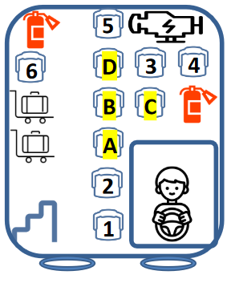
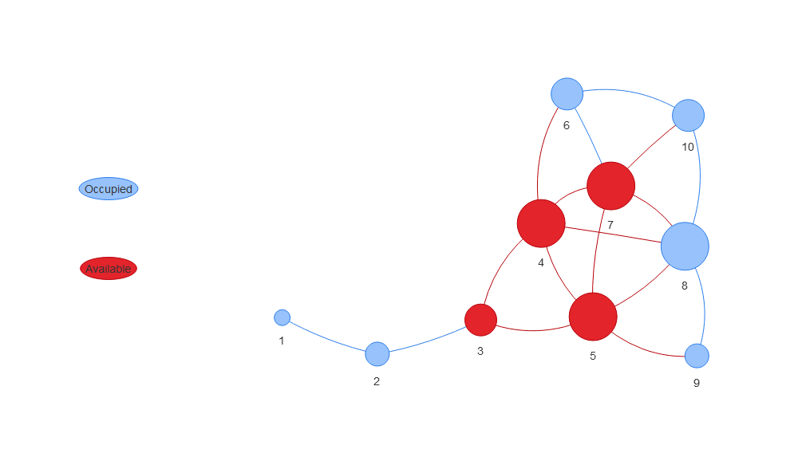

Assignment 2
================
Emery Dittmer
2023-03-09

# Excercise \#2

For this exercise we are investigating the idea of centrality in
networks. We will look at what seat or position that we should sit on
for the bus ride to Fakebook from downtown San Francisco! We can network
with the people in our immediate area but not outside of that.

## The Problem

We need to pick an optimal set on the bus. We can talk to people within
a fixed range (forward, back, side or diagonal) so we will need to be
careful how we pick the seat. Here is an illustration of the problem.
seats A-D are open and avaiable to sit in whereas the number seats 1-6
are open. For now we will assume that the other seats will be filled up.

## Data acquisition & preprocessing

We can reduce this problem to a set of coordinates and use X- Y
Cartesian plane to measure distances and proximity. We will simplify the
bus problem slightly by: 1- Ignoring the alley in the bus therefore seat
6 and D are adjacent in this model.

2- Creating a 4x6 grid where seats are either: taken, available or
un-available. The un-available seats do not exist.

3-assume a 100% than all seats will be filled/

    ## 
    ## Attaching package: 'dplyr'

    ## The following objects are masked from 'package:stats':
    ## 
    ##     filter, lag

    ## The following objects are masked from 'package:base':
    ## 
    ##     intersect, setdiff, setequal, union

    ## ── Attaching packages ─────────────────────────────────────── tidyverse 1.3.2 ──
    ## ✔ tibble  3.1.8     ✔ purrr   0.3.4
    ## ✔ tidyr   1.2.1     ✔ stringr 1.4.1
    ## ✔ readr   2.1.3     ✔ forcats 0.5.2
    ## ── Conflicts ────────────────────────────────────────── tidyverse_conflicts() ──
    ## ✖ dplyr::filter() masks stats::filter()
    ## ✖ dplyr::lag()    masks stats::lag()
    ## 
    ## Attaching package: 'igraph'
    ## 
    ## 
    ## The following objects are masked from 'package:purrr':
    ## 
    ##     compose, simplify
    ## 
    ## 
    ## The following object is masked from 'package:tidyr':
    ## 
    ##     crossing
    ## 
    ## 
    ## The following object is masked from 'package:tibble':
    ## 
    ##     as_data_frame
    ## 
    ## 
    ## The following objects are masked from 'package:dplyr':
    ## 
    ##     as_data_frame, groups, union
    ## 
    ## 
    ## The following objects are masked from 'package:stats':
    ## 
    ##     decompose, spectrum
    ## 
    ## 
    ## The following object is masked from 'package:base':
    ## 
    ##     union
    ## 
    ## 
    ## 
    ## Attaching package: 'tidygraph'
    ## 
    ## 
    ## The following object is masked from 'package:igraph':
    ## 
    ##     groups
    ## 
    ## 
    ## The following object is masked from 'package:stats':
    ## 
    ##     filter

### Making a bus coordinate system

### Lets Vislualize

Let’s take a look at our data!

<!-- -->

Looks like we have our bus, the seats available and taken! Now lets
filter our data frame to have only the useful coordinates, or seats that
exist

<!-- -->
We have a simplified coordinate system with the existing seats. We will
need all of this information to compute the degree of centrality for
each seat, which we can then filter out.

## Centrality Measure

Centrality indicates the influence of a node in a network. Higher
centrality means higher influence. Therefore for this problem we would
want higher centrality.

### Distance Matrix

We will need to look at the distance between each seat to see which
seats can form connection with others. Ultimately we will find the most
central in our network.

<table class="gt_table">
  
  <thead class="gt_col_headings">
    <tr>
      <th class="gt_col_heading gt_columns_bottom_border gt_right" rowspan="1" colspan="1" scope="col" id="from_seat_id">from_seat_id</th>
      <th class="gt_col_heading gt_columns_bottom_border gt_right" rowspan="1" colspan="1" scope="col" id="X">X</th>
      <th class="gt_col_heading gt_columns_bottom_border gt_right" rowspan="1" colspan="1" scope="col" id="Y">Y</th>
      <th class="gt_col_heading gt_columns_bottom_border gt_left" rowspan="1" colspan="1" scope="col" id="Status">Status</th>
      <th class="gt_col_heading gt_columns_bottom_border gt_right" rowspan="1" colspan="1" scope="col" id="to_seat_id">to_seat_id</th>
      <th class="gt_col_heading gt_columns_bottom_border gt_right" rowspan="1" colspan="1" scope="col" id="Distance">Distance</th>
    </tr>
  </thead>
  <tbody class="gt_table_body">
    <tr><td headers="from_seat_id" class="gt_row gt_right">1</td>
<td headers="X" class="gt_row gt_right">2</td>
<td headers="Y" class="gt_row gt_right">1</td>
<td headers="Status" class="gt_row gt_left">Taken</td>
<td headers="to_seat_id" class="gt_row gt_right">2</td>
<td headers="Distance" class="gt_row gt_right">1.000000</td></tr>
    <tr><td headers="from_seat_id" class="gt_row gt_right">1</td>
<td headers="X" class="gt_row gt_right">2</td>
<td headers="Y" class="gt_row gt_right">1</td>
<td headers="Status" class="gt_row gt_left">Taken</td>
<td headers="to_seat_id" class="gt_row gt_right">3</td>
<td headers="Distance" class="gt_row gt_right">2.000000</td></tr>
    <tr><td headers="from_seat_id" class="gt_row gt_right">1</td>
<td headers="X" class="gt_row gt_right">2</td>
<td headers="Y" class="gt_row gt_right">1</td>
<td headers="Status" class="gt_row gt_left">Taken</td>
<td headers="to_seat_id" class="gt_row gt_right">4</td>
<td headers="Distance" class="gt_row gt_right">3.000000</td></tr>
    <tr><td headers="from_seat_id" class="gt_row gt_right">1</td>
<td headers="X" class="gt_row gt_right">2</td>
<td headers="Y" class="gt_row gt_right">1</td>
<td headers="Status" class="gt_row gt_left">Taken</td>
<td headers="to_seat_id" class="gt_row gt_right">5</td>
<td headers="Distance" class="gt_row gt_right">3.162278</td></tr>
    <tr><td headers="from_seat_id" class="gt_row gt_right">1</td>
<td headers="X" class="gt_row gt_right">2</td>
<td headers="Y" class="gt_row gt_right">1</td>
<td headers="Status" class="gt_row gt_left">Taken</td>
<td headers="to_seat_id" class="gt_row gt_right">6</td>
<td headers="Distance" class="gt_row gt_right">4.123106</td></tr>
    <tr><td headers="from_seat_id" class="gt_row gt_right">1</td>
<td headers="X" class="gt_row gt_right">2</td>
<td headers="Y" class="gt_row gt_right">1</td>
<td headers="Status" class="gt_row gt_left">Taken</td>
<td headers="to_seat_id" class="gt_row gt_right">7</td>
<td headers="Distance" class="gt_row gt_right">4.000000</td></tr>
  </tbody>
  
  
</table>

This is just a sample, but the table overall contains all the distances
between seats.

Now we have the distance between each of the availabel seats and the
taken or occiped seats. We just need to apply the rules of connections
(diagonal, front,back, ect) and we will be able to summarize the table
to get the stregth of each seat based on the connections. We will filter
all of the connections who are further than sqrt 2 away from the current
seat

<!-- -->

Now let’s try to find the measures for each seat \## Centrality Measures

### Degree Centrality

Is the number of links incident upon a node (i.e., the number of ties
that a node has).

<table class="gt_table">
  
  <thead class="gt_col_headings">
    <tr>
      <th class="gt_col_heading gt_columns_bottom_border gt_left" rowspan="1" colspan="1" scope="col" id="Seat">Seat</th>
      <th class="gt_col_heading gt_columns_bottom_border gt_right" rowspan="1" colspan="1" scope="col" id="Degree_Centrality">Degree_Centrality</th>
    </tr>
  </thead>
  <tbody class="gt_table_body">
    <tr><td headers="Seat" class="gt_row gt_left">B</td>
<td headers="Degree_Centrality" class="gt_row gt_right">5</td></tr>
    <tr><td headers="Seat" class="gt_row gt_left">C</td>
<td headers="Degree_Centrality" class="gt_row gt_right">5</td></tr>
    <tr><td headers="Seat" class="gt_row gt_left">D</td>
<td headers="Degree_Centrality" class="gt_row gt_right">5</td></tr>
    <tr><td headers="Seat" class="gt_row gt_left">A</td>
<td headers="Degree_Centrality" class="gt_row gt_right">3</td></tr>
  </tbody>
  
  
</table>

We can validate this with the igraph package wich has a built in
functionality for centrality degree

<table class="gt_table">
  
  <thead class="gt_col_headings">
    <tr>
      <th class="gt_col_heading gt_columns_bottom_border gt_left" rowspan="1" colspan="1" scope="col" id="Seat">Seat</th>
      <th class="gt_col_heading gt_columns_bottom_border gt_right" rowspan="1" colspan="1" scope="col" id="Centrality_Degree">Centrality_Degree</th>
    </tr>
  </thead>
  <tbody class="gt_table_body">
    <tr><td headers="Seat" class="gt_row gt_left">B</td>
<td headers="Centrality_Degree" class="gt_row gt_right">5</td></tr>
    <tr><td headers="Seat" class="gt_row gt_left">C</td>
<td headers="Centrality_Degree" class="gt_row gt_right">5</td></tr>
    <tr><td headers="Seat" class="gt_row gt_left">D</td>
<td headers="Centrality_Degree" class="gt_row gt_right">5</td></tr>
    <tr><td headers="Seat" class="gt_row gt_left">A</td>
<td headers="Centrality_Degree" class="gt_row gt_right">3</td></tr>
  </tbody>
  
  
</table>

    ## Warning: Removed 6 rows containing missing values (`geom_point()`).

<!-- -->

There is agreement between our calculations and the calculations for the
package therefore we can use them!

### Closeness centrality

is a way of detecting nodes that are able to spread information very
efficiently through a graph. The closeness centrality of a node measures
its average farness (inverse distance) to all other nodes

<table class="gt_table">
  
  <thead class="gt_col_headings">
    <tr>
      <th class="gt_col_heading gt_columns_bottom_border gt_left" rowspan="1" colspan="1" scope="col" id="Seat">Seat</th>
      <th class="gt_col_heading gt_columns_bottom_border gt_right" rowspan="1" colspan="1" scope="col" id="Closeness_Degree">Closeness_Degree</th>
    </tr>
  </thead>
  <tbody class="gt_table_body">
    <tr><td headers="Seat" class="gt_row gt_left">B</td>
<td headers="Closeness_Degree" class="gt_row gt_right">0.07142857</td></tr>
    <tr><td headers="Seat" class="gt_row gt_left">C</td>
<td headers="Closeness_Degree" class="gt_row gt_right">0.07142857</td></tr>
    <tr><td headers="Seat" class="gt_row gt_left">A</td>
<td headers="Closeness_Degree" class="gt_row gt_right">0.06250000</td></tr>
    <tr><td headers="Seat" class="gt_row gt_left">D</td>
<td headers="Closeness_Degree" class="gt_row gt_right">0.06250000</td></tr>
  </tbody>
  
  
</table>

    ## Warning: Removed 6 rows containing missing values (`geom_point()`).

<!-- -->

### Betweenness centrality

s a way of detecting the amount of influence a node has over the flow of
information in a graph.

<table class="gt_table">
  
  <thead class="gt_col_headings">
    <tr>
      <th class="gt_col_heading gt_columns_bottom_border gt_left" rowspan="1" colspan="1" scope="col" id="Seat">Seat</th>
      <th class="gt_col_heading gt_columns_bottom_border gt_right" rowspan="1" colspan="1" scope="col" id="Betweenness_Degree">Betweenness_Degree</th>
    </tr>
  </thead>
  <tbody class="gt_table_body">
    <tr><td headers="Seat" class="gt_row gt_left">A</td>
<td headers="Betweenness_Degree" class="gt_row gt_right">14.000000</td></tr>
    <tr><td headers="Seat" class="gt_row gt_left">B</td>
<td headers="Betweenness_Degree" class="gt_row gt_right">9.033333</td></tr>
    <tr><td headers="Seat" class="gt_row gt_left">C</td>
<td headers="Betweenness_Degree" class="gt_row gt_right">8.600000</td></tr>
    <tr><td headers="Seat" class="gt_row gt_left">D</td>
<td headers="Betweenness_Degree" class="gt_row gt_right">3.266667</td></tr>
  </tbody>
  
  
</table>

    ## Warning: Removed 6 rows containing missing values (`geom_point()`).

<!-- -->

### Comparison between all 3!

<table class="gt_table">
  
  <thead class="gt_col_headings">
    <tr>
      <th class="gt_col_heading gt_columns_bottom_border gt_left" rowspan="1" colspan="1" scope="col" id="Seat">Seat</th>
      <th class="gt_col_heading gt_columns_bottom_border gt_right" rowspan="1" colspan="1" scope="col" id="Centrality_Degree">Centrality_Degree</th>
    </tr>
  </thead>
  <tbody class="gt_table_body">
    <tr class="gt_group_heading_row">
      <th colspan="2" class="gt_group_heading" scope="colgroup" id="Betweeness">Betweeness</th>
    </tr>
    <tr class="gt_row_group_first"><td headers="Betweeness  Seat" class="gt_row gt_left">A</td>
<td headers="Betweeness  Centrality_Degree" class="gt_row gt_right">14.00000000</td></tr>
    <tr><td headers="Betweeness  Seat" class="gt_row gt_left">B</td>
<td headers="Betweeness  Centrality_Degree" class="gt_row gt_right">9.03333333</td></tr>
    <tr><td headers="Betweeness  Seat" class="gt_row gt_left">C</td>
<td headers="Betweeness  Centrality_Degree" class="gt_row gt_right">8.60000000</td></tr>
    <tr><td headers="Betweeness  Seat" class="gt_row gt_left">D</td>
<td headers="Betweeness  Centrality_Degree" class="gt_row gt_right">3.26666667</td></tr>
    <tr class="gt_group_heading_row">
      <th colspan="2" class="gt_group_heading" scope="colgroup" id="Closesness">Closesness</th>
    </tr>
    <tr class="gt_row_group_first"><td headers="Closesness  Seat" class="gt_row gt_left">B</td>
<td headers="Closesness  Centrality_Degree" class="gt_row gt_right">0.07142857</td></tr>
    <tr><td headers="Closesness  Seat" class="gt_row gt_left">C</td>
<td headers="Closesness  Centrality_Degree" class="gt_row gt_right">0.07142857</td></tr>
    <tr><td headers="Closesness  Seat" class="gt_row gt_left">A</td>
<td headers="Closesness  Centrality_Degree" class="gt_row gt_right">0.06250000</td></tr>
    <tr><td headers="Closesness  Seat" class="gt_row gt_left">D</td>
<td headers="Closesness  Centrality_Degree" class="gt_row gt_right">0.06250000</td></tr>
    <tr class="gt_group_heading_row">
      <th colspan="2" class="gt_group_heading" scope="colgroup" id="Centrality Degree">Centrality Degree</th>
    </tr>
    <tr class="gt_row_group_first"><td headers="Centrality Degree  Seat" class="gt_row gt_left">B</td>
<td headers="Centrality Degree  Centrality_Degree" class="gt_row gt_right">5.00000000</td></tr>
    <tr><td headers="Centrality Degree  Seat" class="gt_row gt_left">C</td>
<td headers="Centrality Degree  Centrality_Degree" class="gt_row gt_right">5.00000000</td></tr>
    <tr><td headers="Centrality Degree  Seat" class="gt_row gt_left">D</td>
<td headers="Centrality Degree  Centrality_Degree" class="gt_row gt_right">5.00000000</td></tr>
    <tr><td headers="Centrality Degree  Seat" class="gt_row gt_left">A</td>
<td headers="Centrality Degree  Centrality_Degree" class="gt_row gt_right">3.00000000</td></tr>
  </tbody>
  
  
</table>

