Assignment 3
================
Emery Dittmer
2023-03-28

# 1:Load data

Load the following data: + applications from `app_data_sample.parquet` +
edges from `edges_sample.csv`

``` r
# change to your own path!
data_path <- "Data/"
applications <- read_parquet(paste0(data_path,"app_data_sample.parquet"))
edges <- read_csv(paste0(data_path,"edges_sample.csv"))
```

    ## Rows: 32906 Columns: 4
    ## ── Column specification ────────────────────────────────────────────────────────
    ## Delimiter: ","
    ## chr  (1): application_number
    ## dbl  (2): ego_examiner_id, alter_examiner_id
    ## date (1): advice_date
    ## 
    ## ℹ Use `spec()` to retrieve the full column specification for this data.
    ## ℹ Specify the column types or set `show_col_types = FALSE` to quiet this message.

``` r
applications
```

    ## # A tibble: 2,018,477 × 16
    ##    applicat…¹ filing_d…² exami…³ exami…⁴ exami…⁵ exami…⁶ exami…⁷ uspc_…⁸ uspc_…⁹
    ##    <chr>      <date>     <chr>   <chr>   <chr>     <dbl>   <dbl> <chr>   <chr>  
    ##  1 08284457   2000-01-26 HOWARD  JACQUE… V         96082    1764 508     273000 
    ##  2 08413193   2000-10-11 YILDIR… BEKIR   L         87678    1764 208     179000 
    ##  3 08531853   2000-05-17 HAMILT… CYNTHIA <NA>      63213    1752 430     271100 
    ##  4 08637752   2001-07-20 MOSHER  MARY    <NA>      73788    1648 530     388300 
    ##  5 08682726   2000-04-10 BARR    MICHAEL E         77294    1762 427     430100 
    ##  6 08687412   2000-04-28 GRAY    LINDA   LAMEY     68606    1734 156     204000 
    ##  7 08716371   2004-01-26 MCMILL… KARA    RENITA    89557    1627 424     401000 
    ##  8 08765941   2000-06-23 FORD    VANESSA L         97543    1645 424     001210 
    ##  9 08776818   2000-02-04 STRZEL… TERESA  E         98714    1637 435     006000 
    ## 10 08809677   2002-02-20 KIM     SUN     U         65530    1723 210     645000 
    ## # … with 2,018,467 more rows, 7 more variables: patent_number <chr>,
    ## #   patent_issue_date <date>, abandon_date <date>, disposal_type <chr>,
    ## #   appl_status_code <dbl>, appl_status_date <chr>, tc <dbl>, and abbreviated
    ## #   variable names ¹​application_number, ²​filing_date, ³​examiner_name_last,
    ## #   ⁴​examiner_name_first, ⁵​examiner_name_middle, ⁶​examiner_id,
    ## #   ⁷​examiner_art_unit, ⁸​uspc_class, ⁹​uspc_subclass

``` r
edges
```

    ## # A tibble: 32,906 × 4
    ##    application_number advice_date ego_examiner_id alter_examiner_id
    ##    <chr>              <date>                <dbl>             <dbl>
    ##  1 09402488           2008-11-17            84356             66266
    ##  2 09402488           2008-11-17            84356             63519
    ##  3 09402488           2008-11-17            84356             98531
    ##  4 09445135           2008-08-21            92953             71313
    ##  5 09445135           2008-08-21            92953             93865
    ##  6 09445135           2008-08-21            92953             91818
    ##  7 09479304           2008-12-15            61767             69277
    ##  8 09479304           2008-12-15            61767             92446
    ##  9 09479304           2008-12-15            61767             66805
    ## 10 09479304           2008-12-15            61767             70919
    ## # … with 32,896 more rows

## Get gender for examiners

We’ll get gender based on the first name of the examiner, which is
recorded in the field `examiner_name_first`. We’ll use library `gender`
for that, relying on a modified version of their own
[example](https://cran.r-project.org/web/packages/gender/vignettes/predicting-gender.html).

Note that there are over 2 million records in the applications table –
that’s because there are many records for each examiner, as many as the
number of applications that examiner worked on during this time frame.
Our first step therefore is to get all *unique* names in a separate list
`examiner_names`. We will then guess gender for each one and will join
this table back to the original dataset. So, let’s get names without
repetition:

``` r
library(gender)
#install_genderdata_package() # only run this line the first time you use the package, to get data for it
# get a list of first names without repetitions
examiner_names <- applications %>% 
  distinct(examiner_name_first)
examiner_names
```

    ## # A tibble: 2,595 × 1
    ##    examiner_name_first
    ##    <chr>              
    ##  1 JACQUELINE         
    ##  2 BEKIR              
    ##  3 CYNTHIA            
    ##  4 MARY               
    ##  5 MICHAEL            
    ##  6 LINDA              
    ##  7 KARA               
    ##  8 VANESSA            
    ##  9 TERESA             
    ## 10 SUN                
    ## # … with 2,585 more rows

Now let’s use function `gender()` as shown in the example for the
package to attach a gender and probability to each name and put the
results into the table `examiner_names_gender`

``` r
# get a table of names and gender
examiner_names_gender <- examiner_names %>% 
  do(results = gender(.$examiner_name_first, method = "ssa")) %>% 
  unnest(cols = c(results), keep_empty = TRUE) %>% 
  select(
    examiner_name_first = name,
    gender,
    proportion_female
  )
examiner_names_gender
```

    ## # A tibble: 1,822 × 3
    ##    examiner_name_first gender proportion_female
    ##    <chr>               <chr>              <dbl>
    ##  1 AARON               male              0.0082
    ##  2 ABDEL               male              0     
    ##  3 ABDOU               male              0     
    ##  4 ABDUL               male              0     
    ##  5 ABDULHAKIM          male              0     
    ##  6 ABDULLAH            male              0     
    ##  7 ABDULLAHI           male              0     
    ##  8 ABIGAIL             female            0.998 
    ##  9 ABIMBOLA            female            0.944 
    ## 10 ABRAHAM             male              0.0031
    ## # … with 1,812 more rows

Finally, let’s join that table back to our original applications data
and discard the temporary tables we have just created to reduce clutter
in our environment.

``` r
# remove extra colums from the gender table
examiner_names_gender <- examiner_names_gender %>% 
  select(examiner_name_first, gender)
# joining gender back to the dataset
applications <- applications %>% 
  left_join(examiner_names_gender, by = "examiner_name_first")
# cleaning up
rm(examiner_names)
rm(examiner_names_gender)
gc()
```

    ##            used  (Mb) gc trigger  (Mb) max used  (Mb)
    ## Ncells  4664564 249.2    8225374 439.3  5108855 272.9
    ## Vcells 49873523 380.6   93046010 709.9 80189278 611.8

## Guess the examiner’s race

We’ll now use package `wru` to estimate likely race of an examiner. Just
like with gender, we’ll get a list of unique names first, only now we
are using surnames.

``` r
library(wru)
examiner_surnames <- applications %>% 
  select(surname = examiner_name_last) %>% 
  distinct()
examiner_surnames
```

    ## # A tibble: 3,806 × 1
    ##    surname   
    ##    <chr>     
    ##  1 HOWARD    
    ##  2 YILDIRIM  
    ##  3 HAMILTON  
    ##  4 MOSHER    
    ##  5 BARR      
    ##  6 GRAY      
    ##  7 MCMILLIAN 
    ##  8 FORD      
    ##  9 STRZELECKA
    ## 10 KIM       
    ## # … with 3,796 more rows

We’ll follow the instructions for the package outlined here
<https://github.com/kosukeimai/wru>.

``` r
examiner_race <- predict_race(voter.file = examiner_surnames, surname.only = T) %>% 
  as_tibble()
```

    ## Warning: Unknown or uninitialised column: `state`.

    ## Proceeding with last name predictions...

    ## ℹ All local files already up-to-date!

    ## 701 (18.4%) individuals' last names were not matched.

``` r
examiner_race
```

    ## # A tibble: 3,806 × 6
    ##    surname    pred.whi pred.bla pred.his pred.asi pred.oth
    ##    <chr>         <dbl>    <dbl>    <dbl>    <dbl>    <dbl>
    ##  1 HOWARD       0.597   0.295    0.0275   0.00690   0.0741
    ##  2 YILDIRIM     0.807   0.0273   0.0694   0.0165    0.0798
    ##  3 HAMILTON     0.656   0.239    0.0286   0.00750   0.0692
    ##  4 MOSHER       0.915   0.00425  0.0291   0.00917   0.0427
    ##  5 BARR         0.784   0.120    0.0268   0.00830   0.0615
    ##  6 GRAY         0.640   0.252    0.0281   0.00748   0.0724
    ##  7 MCMILLIAN    0.322   0.554    0.0212   0.00340   0.0995
    ##  8 FORD         0.576   0.320    0.0275   0.00621   0.0697
    ##  9 STRZELECKA   0.472   0.171    0.220    0.0825    0.0543
    ## 10 KIM          0.0169  0.00282  0.00546  0.943     0.0319
    ## # … with 3,796 more rows

``` r
write.csv(examiner_race, "examiner_race.csv", row.names=FALSE)
```

As you can see, we get probabilities across five broad US Census
categories: white, black, Hispanic, Asian and other. (Some of you may
correctly point out that Hispanic is not a race category in the US
Census, but these are the limitations of this package.)

Our final step here is to pick the race category that has the highest
probability for each last name and then join the table back to the main
applications table. See this example for comparing values across
columns: <https://www.tidyverse.org/blog/2020/04/dplyr-1-0-0-rowwise/>.
And this one for `case_when()` function:
<https://dplyr.tidyverse.org/reference/case_when.html>.

``` r
examiner_race <- examiner_race %>% 
  mutate(max_race_p = pmax(pred.asi, pred.bla, pred.his, pred.oth, pred.whi)) %>% 
  mutate(race = case_when(
    max_race_p == pred.asi ~ "Asian",
    max_race_p == pred.bla ~ "black",
    max_race_p == pred.his ~ "Hispanic",
    max_race_p == pred.oth ~ "other",
    max_race_p == pred.whi ~ "white",
    TRUE ~ NA_character_
  ))
examiner_race
```

    ## # A tibble: 3,806 × 8
    ##    surname    pred.whi pred.bla pred.his pred.asi pred.oth max_race_p race 
    ##    <chr>         <dbl>    <dbl>    <dbl>    <dbl>    <dbl>      <dbl> <chr>
    ##  1 HOWARD       0.597   0.295    0.0275   0.00690   0.0741      0.597 white
    ##  2 YILDIRIM     0.807   0.0273   0.0694   0.0165    0.0798      0.807 white
    ##  3 HAMILTON     0.656   0.239    0.0286   0.00750   0.0692      0.656 white
    ##  4 MOSHER       0.915   0.00425  0.0291   0.00917   0.0427      0.915 white
    ##  5 BARR         0.784   0.120    0.0268   0.00830   0.0615      0.784 white
    ##  6 GRAY         0.640   0.252    0.0281   0.00748   0.0724      0.640 white
    ##  7 MCMILLIAN    0.322   0.554    0.0212   0.00340   0.0995      0.554 black
    ##  8 FORD         0.576   0.320    0.0275   0.00621   0.0697      0.576 white
    ##  9 STRZELECKA   0.472   0.171    0.220    0.0825    0.0543      0.472 white
    ## 10 KIM          0.0169  0.00282  0.00546  0.943     0.0319      0.943 Asian
    ## # … with 3,796 more rows

Let’s join the data back to the applications table.

``` r
# removing extra columns
examiner_race <- examiner_race %>% 
  select(surname,race)
applications <- applications %>% 
  left_join(examiner_race, by = c("examiner_name_last" = "surname"))
rm(examiner_race)
rm(examiner_surnames)
gc()
```

    ##            used  (Mb) gc trigger  (Mb) max used  (Mb)
    ## Ncells  4800482 256.4    8225374 439.3  8225374 439.3
    ## Vcells 54209955 413.6  111735212 852.5 93029950 709.8

\#2. Focus on Art Unit:Descriptive Stats \## Work Unit Breakdown of
people

We will compare genders and ethnicity across all work units within the
US Patent office. First let’s do some descriptive statistics on the
overall population.

Lets keep only one observation per person for the data since once person
could count twice for a work group

``` r
person_level_data <- applications %>% 
  group_by(examiner_id) %>% 
  summarise(
    art_unit = min(examiner_art_unit, na.rm = TRUE),
    gender = min(gender, na.rm = TRUE),
    race = min(race,na.rm=TRUE)) %>%
  mutate(
    tc = floor(art_unit/100)*100,
    work_group = as.factor(floor(art_unit/10)*10)
  ) %>% 
  filter(!is.na(gender) & !is.na(race)) # dropping all records where we don't know the gender
person_level_data
```

    ## # A tibble: 4,849 × 6
    ##    examiner_id art_unit gender race     tc work_group
    ##          <dbl>    <dbl> <chr>  <chr> <dbl> <fct>     
    ##  1       59012     1716 male   white  1700 1710      
    ##  2       59025     2465 male   Asian  2400 2460      
    ##  3       59040     1724 female Asian  1700 1720      
    ##  4       59052     2138 male   Asian  2100 2130      
    ##  5       59055     2165 male   Asian  2100 2160      
    ##  6       59056     2124 male   Asian  2100 2120      
    ##  7       59081     2489 male   Asian  2400 2480      
    ##  8       59086     2487 female white  2400 2480      
    ##  9       59096     1612 male   white  1600 1610      
    ## 10       59117     2439 male   white  2400 2430      
    ## # … with 4,839 more rows

``` r
#grouping by work unit
work_unit_level_data <-person_level_data %>%
  group_by(work_group,race,gender) %>%
  summarize(
    n=n()
  )
```

    ## `summarise()` has grouped output by 'work_group', 'race'. You can override
    ## using the `.groups` argument.

``` r
work_unit_level_data
```

    ## # A tibble: 263 × 4
    ## # Groups:   work_group, race [146]
    ##    work_group race     gender     n
    ##    <fct>      <chr>    <chr>  <int>
    ##  1 1600       Asian    female     3
    ##  2 1600       black    female     1
    ##  3 1600       white    female    13
    ##  4 1600       white    male      18
    ##  5 1610       Asian    female    18
    ##  6 1610       Asian    male      15
    ##  7 1610       black    female     4
    ##  8 1610       black    male       2
    ##  9 1610       Hispanic female     2
    ## 10 1610       Hispanic male       3
    ## # … with 253 more rows

``` r
#we will also need to aggregated by total number of people in work_unit
work_unit_aggregated <- work_unit_level_data %>%
  group_by(work_group) %>%
  summarize(
    n=sum(n)
  ) %>%
  arrange (desc(n))
work_unit_aggregated
```

    ## # A tibble: 38 × 2
    ##    work_group     n
    ##    <fct>      <int>
    ##  1 2130         237
    ##  2 1610         226
    ##  3 2150         226
    ##  4 1720         225
    ##  5 2120         210
    ##  6 1710         208
    ##  7 1630         207
    ##  8 2410         203
    ##  9 2160         197
    ## 10 1770         189
    ## # … with 28 more rows

Let’s plot the race, and gender as a function of workgroup. First
looking at counts then distributions

``` r
library(ggplot2)
ggplot(work_unit_level_data) +
  geom_boxplot(aes(x = work_group, color = gender))
```

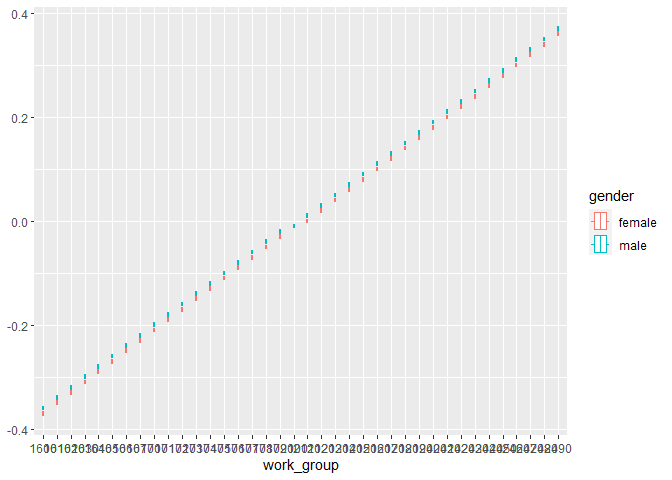<!-- -->

``` r
ggplot(work_unit_level_data,aes(x = work_group, color = gender, y=n)) +
  geom_bar(stat="identity", position=position_dodge())
```

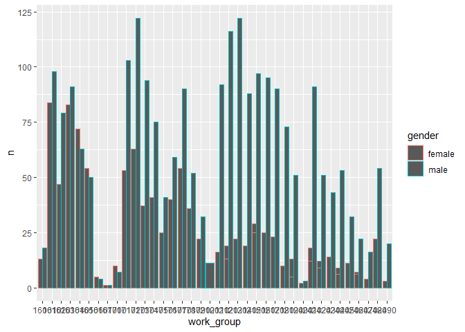<!-- -->

Let’s plot for the top 5 work groups to make it easier to read. First we
will look at the number (counts) then we will look at the distributions
using box plots.

``` r
work_unit_level_data_top5 <- work_unit_level_data %>%
  filter(work_group %in% head(work_unit_aggregated$work_group,5))

ggplot(work_unit_level_data_top5,aes(x = work_group, y=n)) +
  geom_bar(stat="identity", position=position_dodge())
```

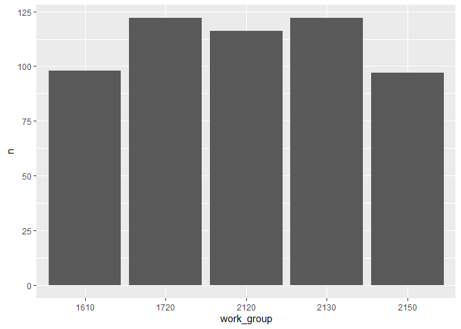<!-- -->

``` r
ggplot(work_unit_level_data_top5,aes(x = work_group, fill = gender, y=n)) +
  geom_bar(stat="identity", position=position_dodge())
```

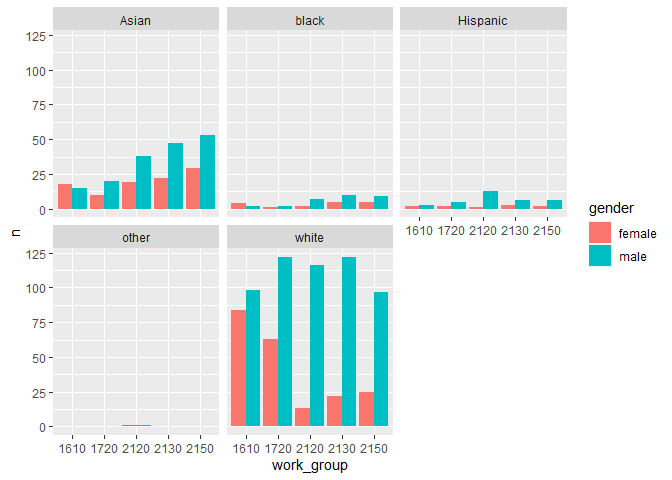<!-- -->

``` r
ggplot(work_unit_level_data_top5,aes(x = work_group, fill = gender, y=n)) +
  geom_bar(stat="identity", position=position_dodge())+
  facet_wrap(~race)
```

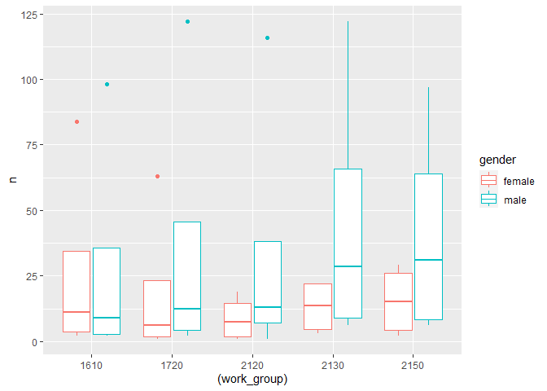<!-- -->

``` r
# 
# ggplot(work_unit_level_data_top5) +
#   geom_boxplot(aes(x = (work_group),y=n, color = gender))
# 
# ggplot(work_unit_level_data_top5) +
#   geom_boxplot(aes(x = (work_group),y=n, color = gender))+
#   facet_wrap(~race)
remove(work_unit_level_data_top5)
```

Even the top 5 is alot of data. For the remaining analysis we will focus
on the top 2 work_units: 2130 and 1610. Since we are only using 2 art
units the ditribution is not as relenvant to plot at the moment.

``` r
work_unit_level_data_top2 <- work_unit_level_data %>%
  filter(work_group %in% head(work_unit_aggregated$work_group,2))

ggplot(work_unit_level_data_top2,aes(x = work_group, y=n)) +
  geom_bar(stat="identity", position=position_dodge())
```

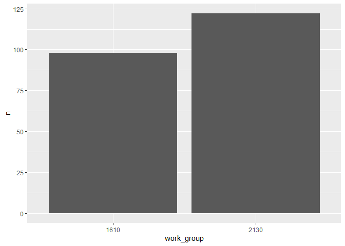<!-- -->

``` r
ggplot(work_unit_level_data_top2,aes(x = work_group, fill = gender, y=n)) +
  geom_bar(stat="identity", position=position_dodge())
```

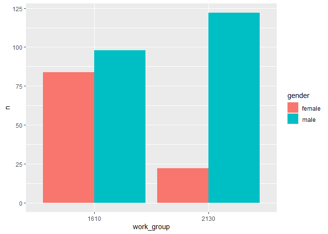<!-- -->

``` r
ggplot(work_unit_level_data_top2,aes(x = work_group, fill = gender, y=n)) +
  geom_bar(stat="identity", position=position_dodge())+
  facet_wrap(~race)
```

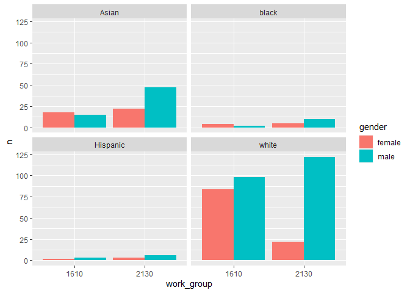<!-- -->

``` r
# ggplot(work_unit_level_data_top2) +
#   geom_boxplot(aes(x = (work_group),y=n, color = gender))
```

``` r
subset_app_data <- person_level_data %>% 
  #here we make sure on ly the top 2 work groups are picked
  filter(work_group %in% head(work_unit_aggregated$work_group,2)) %>% 
  mutate(race = race, gender =gender) %>% 
  select(gender, race, work_group)
```

## Gender

let’s investigate gender, first accros borht work groups then within the
workgroup

``` r
subset_app_data %>% 
  count(gender) %>% 
  mutate(pct = n/sum(n))
```

    ## # A tibble: 2 × 3
    ##   gender     n   pct
    ##   <chr>  <int> <dbl>
    ## 1 female   160 0.346
    ## 2 male     303 0.654

``` r
subset_app_data %>% 
  group_by(work_group) %>%
  count(gender) %>% 
  mutate(pct = n/sum(n))
```

    ## # A tibble: 4 × 4
    ## # Groups:   work_group [2]
    ##   work_group gender     n   pct
    ##   <fct>      <chr>  <int> <dbl>
    ## 1 1610       female   108 0.478
    ## 2 1610       male     118 0.522
    ## 3 2130       female    52 0.219
    ## 4 2130       male     185 0.781

## Race

let’s investigate race with the same process as above, first accros
borht work groups then within the workgroup

``` r
subset_app_data %>%
  group_by(work_group) %>%
  count(race) %>% 
  mutate(pct = n/sum(n))
```

    ## # A tibble: 8 × 4
    ## # Groups:   work_group [2]
    ##   work_group race         n    pct
    ##   <fct>      <chr>    <int>  <dbl>
    ## 1 1610       Asian       33 0.146 
    ## 2 1610       black        6 0.0265
    ## 3 1610       Hispanic     5 0.0221
    ## 4 1610       white      182 0.805 
    ## 5 2130       Asian       69 0.291 
    ## 6 2130       black       15 0.0633
    ## 7 2130       Hispanic     9 0.0380
    ## 8 2130       white      144 0.608

## Puttin it together

Let’s investgate both at the same time

``` r
library(webr)
PieDonut(subset_app_data, aes(gender,race), title = "USPTO Work Units 2130 & 1610 by gender and ethnicity")
```

    ## Warning: The `<scale>` argument of `guides()` cannot be `FALSE`. Use "none" instead as
    ## of ggplot2 3.3.4.
    ## ℹ The deprecated feature was likely used in the webr package.
    ##   Please report the issue at <]8;;https://github.com/cardiomoon/webr/issueshttps://github.com/cardiomoon/webr/issues]8;;>.

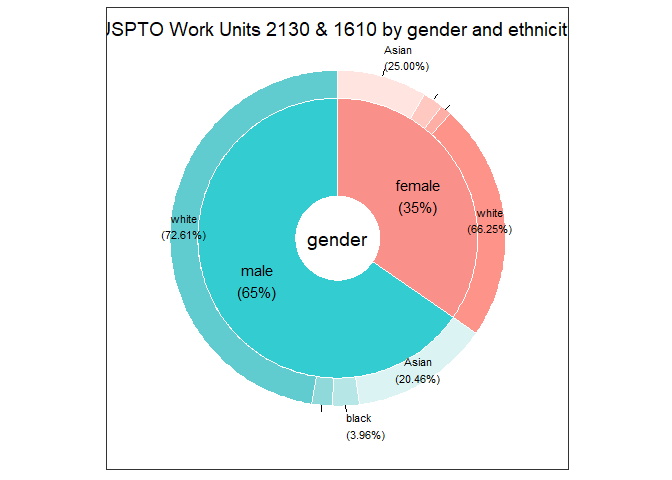<!-- -->

``` r
subset_app_data1 <- subset_app_data %>% filter(work_group==2130)
subset_app_data2 <- subset_app_data %>% filter(work_group==1610)

PieDonut(subset_app_data1, aes(gender,race), title = "USPTO Work Group 2130 breakown by gender and ethnicity", explodeDonut=TRUE)
```

    ## Warning in geom_arc_bar(aes_string(x0 = "x", y0 = "y", r0 = as.character(r1), :
    ## Ignoring unknown aesthetics: explode

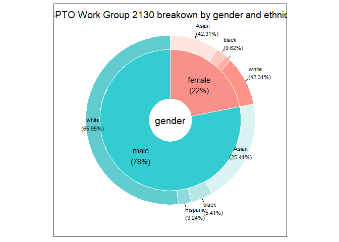<!-- -->

``` r
PieDonut(subset_app_data2, aes(gender,race), title = "USPTO Work Group 1610 breakown by gender and ethnicity", explodeDonut=TRUE)
```

    ## Warning in geom_arc_bar(aes_string(x0 = "x", y0 = "y", r0 = as.character(r1), :
    ## Ignoring unknown aesthetics: explode

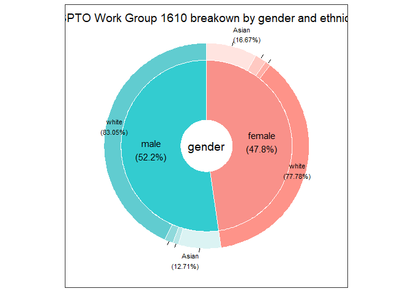<!-- -->

``` r
remove(subset_app_data1, subset_app_data2)
```

\#3: Advice Network \##Nodes & Edges First we need to subset the data
and remove the examiners who are not in the work groups we are looking
at

``` r
#copy data in case
edges_full <- edges
edges <- edges_full

subset_exam_id <- person_level_data %>%
  filter(work_group %in% head(work_unit_aggregated$work_group,2)) %>%
  select(examiner_id,work_group) %>%
  drop_na()

#crete the edges
edges <- edges %>%
  filter(ego_examiner_id %in% subset_exam_id$examiner_id)%>%
  drop_na() %>%
  mutate(from=ego_examiner_id,to=alter_examiner_id) %>%
  select(from, to)

#create the nodes
#many issues with nodes will try pulling from edges list
# nodes_all <- unique(select(edges_full, ego_examiner_id)) %>%
#   mutate(id=ego_examiner_id, verticies =ego_examiner_id) %>%
#   select(id,verticies) %>%
#   drop_na

nodes_all <-as.data.frame(do.call(rbind,append(as.list(edges$from),as.list(edges$to))))

nodes_all <- nodes_all %>%
  mutate(id=V1) %>%
  select(id) %>%
  distinct(id) %>%
  drop_na()
nodes <- nodes_all
# nodes <- nodes_all %>%
#   mutate(label=as.character(ego_examiner_id)) %>%
#   filter(id %in% edges$from | id %in% edges$to ) %>%
#   drop_na() %>%
#   select(id,label)
```

``` r
library(visNetwork)
visNetwork(nodes, edges)%>%
  visLegend() %>%
  visEdges(arrows ="to")%>%
  visEdges(arrows ="from")
```

<!-- -->

Based on this data we will only have about 121 employees in the work
groups we are interested in

### 3.1 Degree Centrality

The count of the number of links each node has to other nodes. For
instance, seat A(labelled as 3 above) has a degree centrality of 3 since
it is connected to 3 other nodes: 2, B & C (B labelled as 4 and C
labelled as 5 above)

We can validate this with the igraph package wich has a built in
functionality for centrality degree

``` r
library(igraph)
```

    ## 
    ## Attaching package: 'igraph'

    ## The following objects are masked from 'package:lubridate':
    ## 
    ##     %--%, union

    ## The following objects are masked from 'package:dplyr':
    ## 
    ##     as_data_frame, groups, union

    ## The following objects are masked from 'package:purrr':
    ## 
    ##     compose, simplify

    ## The following object is masked from 'package:tidyr':
    ## 
    ##     crossing

    ## The following object is masked from 'package:tibble':
    ## 
    ##     as_data_frame

    ## The following objects are masked from 'package:stats':
    ## 
    ##     decompose, spectrum

    ## The following object is masked from 'package:base':
    ## 
    ##     union

``` r
library(tidygraph)
```

    ## 
    ## Attaching package: 'tidygraph'

    ## The following object is masked from 'package:igraph':
    ## 
    ##     groups

    ## The following object is masked from 'package:stats':
    ## 
    ##     filter

``` r
library(tidyverse)

g <- igraph::graph_from_data_frame(edges, vertices = nodes) %>% as_tbl_graph(directed=TRUE)
#not sure why this isnt working
#g = tbl_graph(nodes = nodes, edges = edges, directed = FALSE)
g <- g %>% 
  activate(nodes) %>% 
  mutate(degree = centrality_degree()) %>% 
  activate(edges)

tg_nodes <-
  g %>%
  activate(nodes) %>%
  data.frame() %>%
  arrange(desc(degree)) %>%
  rename(Centrality_Degree=degree) %>%
  mutate(name=as.integer(name))

nodes_all <- nodes_all %>%
  left_join(tg_nodes,by=c("id"="name")) 

remove(g,tg_nodes)
```

There is agreement between our calculations and the calculations for the
package therefore we can use them!

### 3.2 Closeness centrality

    A measure that calculates the ability to spread information efficiently via the edges the node is connected to. It is calculated as the inverse of the average shortest path between nodes.

For instance, for node A (labelled 3), the closeness is
1/((1+2+1+1+2+2+2+2+3))=0.0625. The higher the number, the closer the
node is to the center based on distance. See appendix For details

``` r
g <- igraph::graph_from_data_frame(edges, vertices = nodes) %>% as_tbl_graph(directed=TRUE)

g <- g %>% 
  activate(nodes) %>% 
  mutate(degree = centrality_closeness()) %>% 
  activate(edges)

tg_nodes <-
  g %>%
  activate(nodes) %>%
  data.frame() %>%
  arrange(desc(degree)) %>%
  rename(Centrality_Closeness=degree) %>%
  mutate(name=as.integer(name))

nodes_all <- nodes_all %>%
  left_join(tg_nodes,by=c("id"="name")) 
remove(g,tg_nodes)
```

### 3.3 Betweenness centrality

A measure that detects a node’s influence over the flow of information
within a graph. This is the sum of the shortest paths between two points
i and j divided by the number of shortest paths that pass-through node
v.

``` r
g <- igraph::graph_from_data_frame(edges, vertices = nodes) %>% as_tbl_graph(directed=TRUE)

g <- g %>% 
  activate(nodes) %>% 
  mutate(degree = centrality_betweenness()) %>% 
  activate(edges)

tg_nodes <-
  g %>%
  activate(nodes) %>%
  data.frame() %>%
  arrange(desc(degree)) %>%
  rename(Centrality_Betweenness=degree) %>%
  mutate(name=as.integer(name))

nodes_all <- nodes_all %>%
  left_join(tg_nodes,by=c("id"="name")) 
remove(g,tg_nodes)
```

## Visualize all together

LEt’s put all the data together now!

``` r
nodes <- nodes_all %>% 
  left_join(subset_exam_id,by=c("id"="examiner_id")) %>%
  mutate(label = paste("Examiner:",id,"\n",
                      "Centrality Degre:",format(Centrality_Degree, digits = 2),"\n",
                      "Closenness:",format(Centrality_Closeness, digits = 2),"\n",
                      "Betweenness:",format(Centrality_Betweenness, digits = 2),"\n",
                      sep = " "),
         group=work_group) %>%
  mutate(font.size = 12) %>%
  drop_na()

visNetwork(nodes, edges)%>%
  visLegend() %>%
  visEdges(arrows ="to")%>%
  visEdges(arrows ="from")
```

<!-- -->

## Igraph version

labels must be removed for igraph or else it does not work well.

``` r
net <- igraph::graph_from_data_frame(edges, vertices = nodes_all) %>% as_tbl_graph(directed=TRUE)
plot(net, edge.arrow.size=.4,vertex.label=NA,vertex.size=4)
```

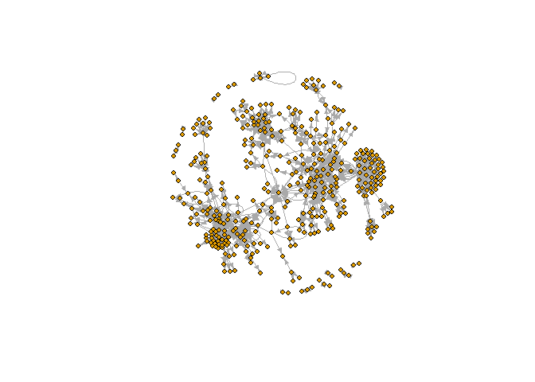<!-- -->

``` r
plot(net, edge.arrow.size=.4,vertex.label.cex=.4,vertex.label.dist=1,vertex.size=4)
```

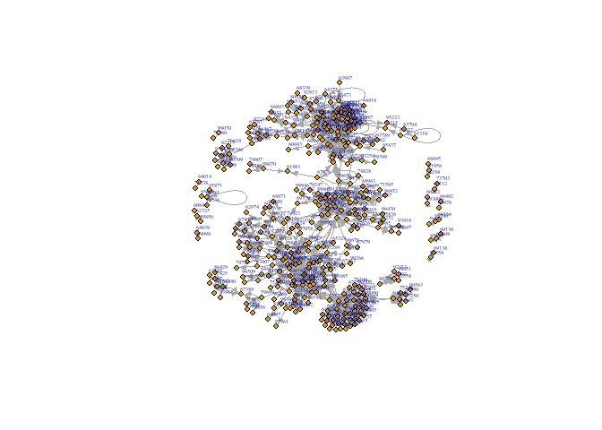<!-- -->

## Now to look at measures of centrality accross ethnicities and genders

``` r
#join race and gender data to nodes
library(gt)
nodes <- nodes %>%
  left_join(person_level_data,by=c("id"="examiner_id","work_group"="work_group" ))

ggplot(nodes) +
  geom_bar(aes(x = work_group))
```

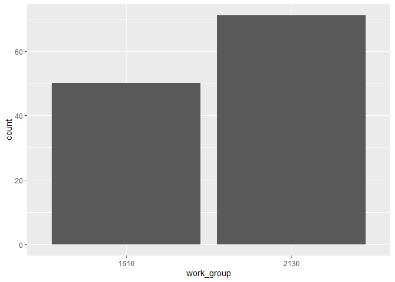<!-- -->

``` r
ggplot(nodes) +
  geom_bar(aes(x = work_group ,fill=gender))
```

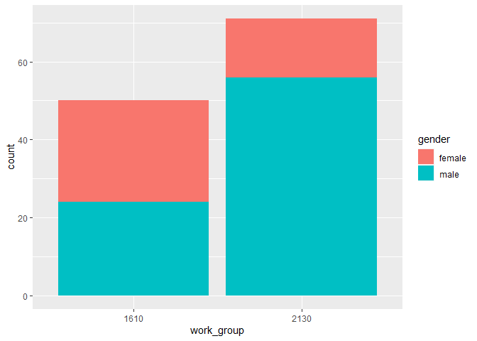<!-- -->

``` r
ggplot(nodes) +
  geom_bar(aes(x = work_group ,fill=race))
```

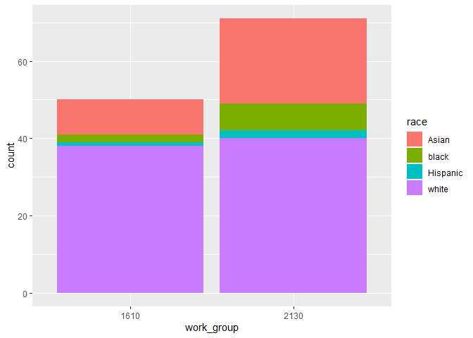<!-- -->

``` r
nodes %>% 
  group_by(work_group) %>%
  count(work_group) %>% 
  mutate(pct_within_work_group = round(n/sum(n)*100,0)) %>% gt()
```

<div id="euweucaudb" style="padding-left:0px;padding-right:0px;padding-top:10px;padding-bottom:10px;overflow-x:auto;overflow-y:auto;width:auto;height:auto;">
<style>html {
  font-family: -apple-system, BlinkMacSystemFont, 'Segoe UI', Roboto, Oxygen, Ubuntu, Cantarell, 'Helvetica Neue', 'Fira Sans', 'Droid Sans', Arial, sans-serif;
}

#euweucaudb .gt_table {
  display: table;
  border-collapse: collapse;
  margin-left: auto;
  margin-right: auto;
  color: #333333;
  font-size: 16px;
  font-weight: normal;
  font-style: normal;
  background-color: #FFFFFF;
  width: auto;
  border-top-style: solid;
  border-top-width: 2px;
  border-top-color: #A8A8A8;
  border-right-style: none;
  border-right-width: 2px;
  border-right-color: #D3D3D3;
  border-bottom-style: solid;
  border-bottom-width: 2px;
  border-bottom-color: #A8A8A8;
  border-left-style: none;
  border-left-width: 2px;
  border-left-color: #D3D3D3;
}

#euweucaudb .gt_heading {
  background-color: #FFFFFF;
  text-align: center;
  border-bottom-color: #FFFFFF;
  border-left-style: none;
  border-left-width: 1px;
  border-left-color: #D3D3D3;
  border-right-style: none;
  border-right-width: 1px;
  border-right-color: #D3D3D3;
}

#euweucaudb .gt_caption {
  padding-top: 4px;
  padding-bottom: 4px;
}

#euweucaudb .gt_title {
  color: #333333;
  font-size: 125%;
  font-weight: initial;
  padding-top: 4px;
  padding-bottom: 4px;
  padding-left: 5px;
  padding-right: 5px;
  border-bottom-color: #FFFFFF;
  border-bottom-width: 0;
}

#euweucaudb .gt_subtitle {
  color: #333333;
  font-size: 85%;
  font-weight: initial;
  padding-top: 0;
  padding-bottom: 6px;
  padding-left: 5px;
  padding-right: 5px;
  border-top-color: #FFFFFF;
  border-top-width: 0;
}

#euweucaudb .gt_bottom_border {
  border-bottom-style: solid;
  border-bottom-width: 2px;
  border-bottom-color: #D3D3D3;
}

#euweucaudb .gt_col_headings {
  border-top-style: solid;
  border-top-width: 2px;
  border-top-color: #D3D3D3;
  border-bottom-style: solid;
  border-bottom-width: 2px;
  border-bottom-color: #D3D3D3;
  border-left-style: none;
  border-left-width: 1px;
  border-left-color: #D3D3D3;
  border-right-style: none;
  border-right-width: 1px;
  border-right-color: #D3D3D3;
}

#euweucaudb .gt_col_heading {
  color: #333333;
  background-color: #FFFFFF;
  font-size: 100%;
  font-weight: normal;
  text-transform: inherit;
  border-left-style: none;
  border-left-width: 1px;
  border-left-color: #D3D3D3;
  border-right-style: none;
  border-right-width: 1px;
  border-right-color: #D3D3D3;
  vertical-align: bottom;
  padding-top: 5px;
  padding-bottom: 6px;
  padding-left: 5px;
  padding-right: 5px;
  overflow-x: hidden;
}

#euweucaudb .gt_column_spanner_outer {
  color: #333333;
  background-color: #FFFFFF;
  font-size: 100%;
  font-weight: normal;
  text-transform: inherit;
  padding-top: 0;
  padding-bottom: 0;
  padding-left: 4px;
  padding-right: 4px;
}

#euweucaudb .gt_column_spanner_outer:first-child {
  padding-left: 0;
}

#euweucaudb .gt_column_spanner_outer:last-child {
  padding-right: 0;
}

#euweucaudb .gt_column_spanner {
  border-bottom-style: solid;
  border-bottom-width: 2px;
  border-bottom-color: #D3D3D3;
  vertical-align: bottom;
  padding-top: 5px;
  padding-bottom: 5px;
  overflow-x: hidden;
  display: inline-block;
  width: 100%;
}

#euweucaudb .gt_group_heading {
  padding-top: 8px;
  padding-bottom: 8px;
  padding-left: 5px;
  padding-right: 5px;
  color: #333333;
  background-color: #FFFFFF;
  font-size: 100%;
  font-weight: initial;
  text-transform: inherit;
  border-top-style: solid;
  border-top-width: 2px;
  border-top-color: #D3D3D3;
  border-bottom-style: solid;
  border-bottom-width: 2px;
  border-bottom-color: #D3D3D3;
  border-left-style: none;
  border-left-width: 1px;
  border-left-color: #D3D3D3;
  border-right-style: none;
  border-right-width: 1px;
  border-right-color: #D3D3D3;
  vertical-align: middle;
  text-align: left;
}

#euweucaudb .gt_empty_group_heading {
  padding: 0.5px;
  color: #333333;
  background-color: #FFFFFF;
  font-size: 100%;
  font-weight: initial;
  border-top-style: solid;
  border-top-width: 2px;
  border-top-color: #D3D3D3;
  border-bottom-style: solid;
  border-bottom-width: 2px;
  border-bottom-color: #D3D3D3;
  vertical-align: middle;
}

#euweucaudb .gt_from_md > :first-child {
  margin-top: 0;
}

#euweucaudb .gt_from_md > :last-child {
  margin-bottom: 0;
}

#euweucaudb .gt_row {
  padding-top: 8px;
  padding-bottom: 8px;
  padding-left: 5px;
  padding-right: 5px;
  margin: 10px;
  border-top-style: solid;
  border-top-width: 1px;
  border-top-color: #D3D3D3;
  border-left-style: none;
  border-left-width: 1px;
  border-left-color: #D3D3D3;
  border-right-style: none;
  border-right-width: 1px;
  border-right-color: #D3D3D3;
  vertical-align: middle;
  overflow-x: hidden;
}

#euweucaudb .gt_stub {
  color: #333333;
  background-color: #FFFFFF;
  font-size: 100%;
  font-weight: initial;
  text-transform: inherit;
  border-right-style: solid;
  border-right-width: 2px;
  border-right-color: #D3D3D3;
  padding-left: 5px;
  padding-right: 5px;
}

#euweucaudb .gt_stub_row_group {
  color: #333333;
  background-color: #FFFFFF;
  font-size: 100%;
  font-weight: initial;
  text-transform: inherit;
  border-right-style: solid;
  border-right-width: 2px;
  border-right-color: #D3D3D3;
  padding-left: 5px;
  padding-right: 5px;
  vertical-align: top;
}

#euweucaudb .gt_row_group_first td {
  border-top-width: 2px;
}

#euweucaudb .gt_summary_row {
  color: #333333;
  background-color: #FFFFFF;
  text-transform: inherit;
  padding-top: 8px;
  padding-bottom: 8px;
  padding-left: 5px;
  padding-right: 5px;
}

#euweucaudb .gt_first_summary_row {
  border-top-style: solid;
  border-top-color: #D3D3D3;
}

#euweucaudb .gt_first_summary_row.thick {
  border-top-width: 2px;
}

#euweucaudb .gt_last_summary_row {
  padding-top: 8px;
  padding-bottom: 8px;
  padding-left: 5px;
  padding-right: 5px;
  border-bottom-style: solid;
  border-bottom-width: 2px;
  border-bottom-color: #D3D3D3;
}

#euweucaudb .gt_grand_summary_row {
  color: #333333;
  background-color: #FFFFFF;
  text-transform: inherit;
  padding-top: 8px;
  padding-bottom: 8px;
  padding-left: 5px;
  padding-right: 5px;
}

#euweucaudb .gt_first_grand_summary_row {
  padding-top: 8px;
  padding-bottom: 8px;
  padding-left: 5px;
  padding-right: 5px;
  border-top-style: double;
  border-top-width: 6px;
  border-top-color: #D3D3D3;
}

#euweucaudb .gt_striped {
  background-color: rgba(128, 128, 128, 0.05);
}

#euweucaudb .gt_table_body {
  border-top-style: solid;
  border-top-width: 2px;
  border-top-color: #D3D3D3;
  border-bottom-style: solid;
  border-bottom-width: 2px;
  border-bottom-color: #D3D3D3;
}

#euweucaudb .gt_footnotes {
  color: #333333;
  background-color: #FFFFFF;
  border-bottom-style: none;
  border-bottom-width: 2px;
  border-bottom-color: #D3D3D3;
  border-left-style: none;
  border-left-width: 2px;
  border-left-color: #D3D3D3;
  border-right-style: none;
  border-right-width: 2px;
  border-right-color: #D3D3D3;
}

#euweucaudb .gt_footnote {
  margin: 0px;
  font-size: 90%;
  padding-left: 4px;
  padding-right: 4px;
  padding-left: 5px;
  padding-right: 5px;
}

#euweucaudb .gt_sourcenotes {
  color: #333333;
  background-color: #FFFFFF;
  border-bottom-style: none;
  border-bottom-width: 2px;
  border-bottom-color: #D3D3D3;
  border-left-style: none;
  border-left-width: 2px;
  border-left-color: #D3D3D3;
  border-right-style: none;
  border-right-width: 2px;
  border-right-color: #D3D3D3;
}

#euweucaudb .gt_sourcenote {
  font-size: 90%;
  padding-top: 4px;
  padding-bottom: 4px;
  padding-left: 5px;
  padding-right: 5px;
}

#euweucaudb .gt_left {
  text-align: left;
}

#euweucaudb .gt_center {
  text-align: center;
}

#euweucaudb .gt_right {
  text-align: right;
  font-variant-numeric: tabular-nums;
}

#euweucaudb .gt_font_normal {
  font-weight: normal;
}

#euweucaudb .gt_font_bold {
  font-weight: bold;
}

#euweucaudb .gt_font_italic {
  font-style: italic;
}

#euweucaudb .gt_super {
  font-size: 65%;
}

#euweucaudb .gt_footnote_marks {
  font-style: italic;
  font-weight: normal;
  font-size: 75%;
  vertical-align: 0.4em;
}

#euweucaudb .gt_asterisk {
  font-size: 100%;
  vertical-align: 0;
}

#euweucaudb .gt_indent_1 {
  text-indent: 5px;
}

#euweucaudb .gt_indent_2 {
  text-indent: 10px;
}

#euweucaudb .gt_indent_3 {
  text-indent: 15px;
}

#euweucaudb .gt_indent_4 {
  text-indent: 20px;
}

#euweucaudb .gt_indent_5 {
  text-indent: 25px;
}
</style>
<table class="gt_table">
  
  <thead class="gt_col_headings">
    <tr>
      <th class="gt_col_heading gt_columns_bottom_border gt_right" rowspan="1" colspan="1" scope="col" id="n">n</th>
      <th class="gt_col_heading gt_columns_bottom_border gt_right" rowspan="1" colspan="1" scope="col" id="pct_within_work_group">pct_within_work_group</th>
    </tr>
  </thead>
  <tbody class="gt_table_body">
    <tr class="gt_group_heading_row">
      <th colspan="2" class="gt_group_heading" scope="colgroup" id="1610">1610</th>
    </tr>
    <tr class="gt_row_group_first"><td headers="1610  n" class="gt_row gt_right">50</td>
<td headers="1610  pct_within_work_group" class="gt_row gt_right">100</td></tr>
    <tr class="gt_group_heading_row">
      <th colspan="2" class="gt_group_heading" scope="colgroup" id="2130">2130</th>
    </tr>
    <tr class="gt_row_group_first"><td headers="2130  n" class="gt_row gt_right">71</td>
<td headers="2130  pct_within_work_group" class="gt_row gt_right">100</td></tr>
  </tbody>
  
  
</table>
</div>

``` r
nodes %>% 
  group_by(work_group) %>%
  count(gender) %>% 
  mutate(pct_within_work_group = round(n/sum(n)*100,0)) %>% gt()
```

<div id="ncogjfqnkl" style="padding-left:0px;padding-right:0px;padding-top:10px;padding-bottom:10px;overflow-x:auto;overflow-y:auto;width:auto;height:auto;">
<style>html {
  font-family: -apple-system, BlinkMacSystemFont, 'Segoe UI', Roboto, Oxygen, Ubuntu, Cantarell, 'Helvetica Neue', 'Fira Sans', 'Droid Sans', Arial, sans-serif;
}

#ncogjfqnkl .gt_table {
  display: table;
  border-collapse: collapse;
  margin-left: auto;
  margin-right: auto;
  color: #333333;
  font-size: 16px;
  font-weight: normal;
  font-style: normal;
  background-color: #FFFFFF;
  width: auto;
  border-top-style: solid;
  border-top-width: 2px;
  border-top-color: #A8A8A8;
  border-right-style: none;
  border-right-width: 2px;
  border-right-color: #D3D3D3;
  border-bottom-style: solid;
  border-bottom-width: 2px;
  border-bottom-color: #A8A8A8;
  border-left-style: none;
  border-left-width: 2px;
  border-left-color: #D3D3D3;
}

#ncogjfqnkl .gt_heading {
  background-color: #FFFFFF;
  text-align: center;
  border-bottom-color: #FFFFFF;
  border-left-style: none;
  border-left-width: 1px;
  border-left-color: #D3D3D3;
  border-right-style: none;
  border-right-width: 1px;
  border-right-color: #D3D3D3;
}

#ncogjfqnkl .gt_caption {
  padding-top: 4px;
  padding-bottom: 4px;
}

#ncogjfqnkl .gt_title {
  color: #333333;
  font-size: 125%;
  font-weight: initial;
  padding-top: 4px;
  padding-bottom: 4px;
  padding-left: 5px;
  padding-right: 5px;
  border-bottom-color: #FFFFFF;
  border-bottom-width: 0;
}

#ncogjfqnkl .gt_subtitle {
  color: #333333;
  font-size: 85%;
  font-weight: initial;
  padding-top: 0;
  padding-bottom: 6px;
  padding-left: 5px;
  padding-right: 5px;
  border-top-color: #FFFFFF;
  border-top-width: 0;
}

#ncogjfqnkl .gt_bottom_border {
  border-bottom-style: solid;
  border-bottom-width: 2px;
  border-bottom-color: #D3D3D3;
}

#ncogjfqnkl .gt_col_headings {
  border-top-style: solid;
  border-top-width: 2px;
  border-top-color: #D3D3D3;
  border-bottom-style: solid;
  border-bottom-width: 2px;
  border-bottom-color: #D3D3D3;
  border-left-style: none;
  border-left-width: 1px;
  border-left-color: #D3D3D3;
  border-right-style: none;
  border-right-width: 1px;
  border-right-color: #D3D3D3;
}

#ncogjfqnkl .gt_col_heading {
  color: #333333;
  background-color: #FFFFFF;
  font-size: 100%;
  font-weight: normal;
  text-transform: inherit;
  border-left-style: none;
  border-left-width: 1px;
  border-left-color: #D3D3D3;
  border-right-style: none;
  border-right-width: 1px;
  border-right-color: #D3D3D3;
  vertical-align: bottom;
  padding-top: 5px;
  padding-bottom: 6px;
  padding-left: 5px;
  padding-right: 5px;
  overflow-x: hidden;
}

#ncogjfqnkl .gt_column_spanner_outer {
  color: #333333;
  background-color: #FFFFFF;
  font-size: 100%;
  font-weight: normal;
  text-transform: inherit;
  padding-top: 0;
  padding-bottom: 0;
  padding-left: 4px;
  padding-right: 4px;
}

#ncogjfqnkl .gt_column_spanner_outer:first-child {
  padding-left: 0;
}

#ncogjfqnkl .gt_column_spanner_outer:last-child {
  padding-right: 0;
}

#ncogjfqnkl .gt_column_spanner {
  border-bottom-style: solid;
  border-bottom-width: 2px;
  border-bottom-color: #D3D3D3;
  vertical-align: bottom;
  padding-top: 5px;
  padding-bottom: 5px;
  overflow-x: hidden;
  display: inline-block;
  width: 100%;
}

#ncogjfqnkl .gt_group_heading {
  padding-top: 8px;
  padding-bottom: 8px;
  padding-left: 5px;
  padding-right: 5px;
  color: #333333;
  background-color: #FFFFFF;
  font-size: 100%;
  font-weight: initial;
  text-transform: inherit;
  border-top-style: solid;
  border-top-width: 2px;
  border-top-color: #D3D3D3;
  border-bottom-style: solid;
  border-bottom-width: 2px;
  border-bottom-color: #D3D3D3;
  border-left-style: none;
  border-left-width: 1px;
  border-left-color: #D3D3D3;
  border-right-style: none;
  border-right-width: 1px;
  border-right-color: #D3D3D3;
  vertical-align: middle;
  text-align: left;
}

#ncogjfqnkl .gt_empty_group_heading {
  padding: 0.5px;
  color: #333333;
  background-color: #FFFFFF;
  font-size: 100%;
  font-weight: initial;
  border-top-style: solid;
  border-top-width: 2px;
  border-top-color: #D3D3D3;
  border-bottom-style: solid;
  border-bottom-width: 2px;
  border-bottom-color: #D3D3D3;
  vertical-align: middle;
}

#ncogjfqnkl .gt_from_md > :first-child {
  margin-top: 0;
}

#ncogjfqnkl .gt_from_md > :last-child {
  margin-bottom: 0;
}

#ncogjfqnkl .gt_row {
  padding-top: 8px;
  padding-bottom: 8px;
  padding-left: 5px;
  padding-right: 5px;
  margin: 10px;
  border-top-style: solid;
  border-top-width: 1px;
  border-top-color: #D3D3D3;
  border-left-style: none;
  border-left-width: 1px;
  border-left-color: #D3D3D3;
  border-right-style: none;
  border-right-width: 1px;
  border-right-color: #D3D3D3;
  vertical-align: middle;
  overflow-x: hidden;
}

#ncogjfqnkl .gt_stub {
  color: #333333;
  background-color: #FFFFFF;
  font-size: 100%;
  font-weight: initial;
  text-transform: inherit;
  border-right-style: solid;
  border-right-width: 2px;
  border-right-color: #D3D3D3;
  padding-left: 5px;
  padding-right: 5px;
}

#ncogjfqnkl .gt_stub_row_group {
  color: #333333;
  background-color: #FFFFFF;
  font-size: 100%;
  font-weight: initial;
  text-transform: inherit;
  border-right-style: solid;
  border-right-width: 2px;
  border-right-color: #D3D3D3;
  padding-left: 5px;
  padding-right: 5px;
  vertical-align: top;
}

#ncogjfqnkl .gt_row_group_first td {
  border-top-width: 2px;
}

#ncogjfqnkl .gt_summary_row {
  color: #333333;
  background-color: #FFFFFF;
  text-transform: inherit;
  padding-top: 8px;
  padding-bottom: 8px;
  padding-left: 5px;
  padding-right: 5px;
}

#ncogjfqnkl .gt_first_summary_row {
  border-top-style: solid;
  border-top-color: #D3D3D3;
}

#ncogjfqnkl .gt_first_summary_row.thick {
  border-top-width: 2px;
}

#ncogjfqnkl .gt_last_summary_row {
  padding-top: 8px;
  padding-bottom: 8px;
  padding-left: 5px;
  padding-right: 5px;
  border-bottom-style: solid;
  border-bottom-width: 2px;
  border-bottom-color: #D3D3D3;
}

#ncogjfqnkl .gt_grand_summary_row {
  color: #333333;
  background-color: #FFFFFF;
  text-transform: inherit;
  padding-top: 8px;
  padding-bottom: 8px;
  padding-left: 5px;
  padding-right: 5px;
}

#ncogjfqnkl .gt_first_grand_summary_row {
  padding-top: 8px;
  padding-bottom: 8px;
  padding-left: 5px;
  padding-right: 5px;
  border-top-style: double;
  border-top-width: 6px;
  border-top-color: #D3D3D3;
}

#ncogjfqnkl .gt_striped {
  background-color: rgba(128, 128, 128, 0.05);
}

#ncogjfqnkl .gt_table_body {
  border-top-style: solid;
  border-top-width: 2px;
  border-top-color: #D3D3D3;
  border-bottom-style: solid;
  border-bottom-width: 2px;
  border-bottom-color: #D3D3D3;
}

#ncogjfqnkl .gt_footnotes {
  color: #333333;
  background-color: #FFFFFF;
  border-bottom-style: none;
  border-bottom-width: 2px;
  border-bottom-color: #D3D3D3;
  border-left-style: none;
  border-left-width: 2px;
  border-left-color: #D3D3D3;
  border-right-style: none;
  border-right-width: 2px;
  border-right-color: #D3D3D3;
}

#ncogjfqnkl .gt_footnote {
  margin: 0px;
  font-size: 90%;
  padding-left: 4px;
  padding-right: 4px;
  padding-left: 5px;
  padding-right: 5px;
}

#ncogjfqnkl .gt_sourcenotes {
  color: #333333;
  background-color: #FFFFFF;
  border-bottom-style: none;
  border-bottom-width: 2px;
  border-bottom-color: #D3D3D3;
  border-left-style: none;
  border-left-width: 2px;
  border-left-color: #D3D3D3;
  border-right-style: none;
  border-right-width: 2px;
  border-right-color: #D3D3D3;
}

#ncogjfqnkl .gt_sourcenote {
  font-size: 90%;
  padding-top: 4px;
  padding-bottom: 4px;
  padding-left: 5px;
  padding-right: 5px;
}

#ncogjfqnkl .gt_left {
  text-align: left;
}

#ncogjfqnkl .gt_center {
  text-align: center;
}

#ncogjfqnkl .gt_right {
  text-align: right;
  font-variant-numeric: tabular-nums;
}

#ncogjfqnkl .gt_font_normal {
  font-weight: normal;
}

#ncogjfqnkl .gt_font_bold {
  font-weight: bold;
}

#ncogjfqnkl .gt_font_italic {
  font-style: italic;
}

#ncogjfqnkl .gt_super {
  font-size: 65%;
}

#ncogjfqnkl .gt_footnote_marks {
  font-style: italic;
  font-weight: normal;
  font-size: 75%;
  vertical-align: 0.4em;
}

#ncogjfqnkl .gt_asterisk {
  font-size: 100%;
  vertical-align: 0;
}

#ncogjfqnkl .gt_indent_1 {
  text-indent: 5px;
}

#ncogjfqnkl .gt_indent_2 {
  text-indent: 10px;
}

#ncogjfqnkl .gt_indent_3 {
  text-indent: 15px;
}

#ncogjfqnkl .gt_indent_4 {
  text-indent: 20px;
}

#ncogjfqnkl .gt_indent_5 {
  text-indent: 25px;
}
</style>
<table class="gt_table">
  
  <thead class="gt_col_headings">
    <tr>
      <th class="gt_col_heading gt_columns_bottom_border gt_left" rowspan="1" colspan="1" scope="col" id="gender">gender</th>
      <th class="gt_col_heading gt_columns_bottom_border gt_right" rowspan="1" colspan="1" scope="col" id="n">n</th>
      <th class="gt_col_heading gt_columns_bottom_border gt_right" rowspan="1" colspan="1" scope="col" id="pct_within_work_group">pct_within_work_group</th>
    </tr>
  </thead>
  <tbody class="gt_table_body">
    <tr class="gt_group_heading_row">
      <th colspan="3" class="gt_group_heading" scope="colgroup" id="1610">1610</th>
    </tr>
    <tr class="gt_row_group_first"><td headers="1610  gender" class="gt_row gt_left">female</td>
<td headers="1610  n" class="gt_row gt_right">26</td>
<td headers="1610  pct_within_work_group" class="gt_row gt_right">52</td></tr>
    <tr><td headers="1610  gender" class="gt_row gt_left">male</td>
<td headers="1610  n" class="gt_row gt_right">24</td>
<td headers="1610  pct_within_work_group" class="gt_row gt_right">48</td></tr>
    <tr class="gt_group_heading_row">
      <th colspan="3" class="gt_group_heading" scope="colgroup" id="2130">2130</th>
    </tr>
    <tr class="gt_row_group_first"><td headers="2130  gender" class="gt_row gt_left">female</td>
<td headers="2130  n" class="gt_row gt_right">15</td>
<td headers="2130  pct_within_work_group" class="gt_row gt_right">21</td></tr>
    <tr><td headers="2130  gender" class="gt_row gt_left">male</td>
<td headers="2130  n" class="gt_row gt_right">56</td>
<td headers="2130  pct_within_work_group" class="gt_row gt_right">79</td></tr>
  </tbody>
  
  
</table>
</div>

``` r
nodes %>% 
  group_by(work_group) %>%
  count(race) %>% 
  mutate(pct_within_work_group = round(n/sum(n)*100,0)) %>% gt()
```

<div id="aywgjwectp" style="padding-left:0px;padding-right:0px;padding-top:10px;padding-bottom:10px;overflow-x:auto;overflow-y:auto;width:auto;height:auto;">
<style>html {
  font-family: -apple-system, BlinkMacSystemFont, 'Segoe UI', Roboto, Oxygen, Ubuntu, Cantarell, 'Helvetica Neue', 'Fira Sans', 'Droid Sans', Arial, sans-serif;
}

#aywgjwectp .gt_table {
  display: table;
  border-collapse: collapse;
  margin-left: auto;
  margin-right: auto;
  color: #333333;
  font-size: 16px;
  font-weight: normal;
  font-style: normal;
  background-color: #FFFFFF;
  width: auto;
  border-top-style: solid;
  border-top-width: 2px;
  border-top-color: #A8A8A8;
  border-right-style: none;
  border-right-width: 2px;
  border-right-color: #D3D3D3;
  border-bottom-style: solid;
  border-bottom-width: 2px;
  border-bottom-color: #A8A8A8;
  border-left-style: none;
  border-left-width: 2px;
  border-left-color: #D3D3D3;
}

#aywgjwectp .gt_heading {
  background-color: #FFFFFF;
  text-align: center;
  border-bottom-color: #FFFFFF;
  border-left-style: none;
  border-left-width: 1px;
  border-left-color: #D3D3D3;
  border-right-style: none;
  border-right-width: 1px;
  border-right-color: #D3D3D3;
}

#aywgjwectp .gt_caption {
  padding-top: 4px;
  padding-bottom: 4px;
}

#aywgjwectp .gt_title {
  color: #333333;
  font-size: 125%;
  font-weight: initial;
  padding-top: 4px;
  padding-bottom: 4px;
  padding-left: 5px;
  padding-right: 5px;
  border-bottom-color: #FFFFFF;
  border-bottom-width: 0;
}

#aywgjwectp .gt_subtitle {
  color: #333333;
  font-size: 85%;
  font-weight: initial;
  padding-top: 0;
  padding-bottom: 6px;
  padding-left: 5px;
  padding-right: 5px;
  border-top-color: #FFFFFF;
  border-top-width: 0;
}

#aywgjwectp .gt_bottom_border {
  border-bottom-style: solid;
  border-bottom-width: 2px;
  border-bottom-color: #D3D3D3;
}

#aywgjwectp .gt_col_headings {
  border-top-style: solid;
  border-top-width: 2px;
  border-top-color: #D3D3D3;
  border-bottom-style: solid;
  border-bottom-width: 2px;
  border-bottom-color: #D3D3D3;
  border-left-style: none;
  border-left-width: 1px;
  border-left-color: #D3D3D3;
  border-right-style: none;
  border-right-width: 1px;
  border-right-color: #D3D3D3;
}

#aywgjwectp .gt_col_heading {
  color: #333333;
  background-color: #FFFFFF;
  font-size: 100%;
  font-weight: normal;
  text-transform: inherit;
  border-left-style: none;
  border-left-width: 1px;
  border-left-color: #D3D3D3;
  border-right-style: none;
  border-right-width: 1px;
  border-right-color: #D3D3D3;
  vertical-align: bottom;
  padding-top: 5px;
  padding-bottom: 6px;
  padding-left: 5px;
  padding-right: 5px;
  overflow-x: hidden;
}

#aywgjwectp .gt_column_spanner_outer {
  color: #333333;
  background-color: #FFFFFF;
  font-size: 100%;
  font-weight: normal;
  text-transform: inherit;
  padding-top: 0;
  padding-bottom: 0;
  padding-left: 4px;
  padding-right: 4px;
}

#aywgjwectp .gt_column_spanner_outer:first-child {
  padding-left: 0;
}

#aywgjwectp .gt_column_spanner_outer:last-child {
  padding-right: 0;
}

#aywgjwectp .gt_column_spanner {
  border-bottom-style: solid;
  border-bottom-width: 2px;
  border-bottom-color: #D3D3D3;
  vertical-align: bottom;
  padding-top: 5px;
  padding-bottom: 5px;
  overflow-x: hidden;
  display: inline-block;
  width: 100%;
}

#aywgjwectp .gt_group_heading {
  padding-top: 8px;
  padding-bottom: 8px;
  padding-left: 5px;
  padding-right: 5px;
  color: #333333;
  background-color: #FFFFFF;
  font-size: 100%;
  font-weight: initial;
  text-transform: inherit;
  border-top-style: solid;
  border-top-width: 2px;
  border-top-color: #D3D3D3;
  border-bottom-style: solid;
  border-bottom-width: 2px;
  border-bottom-color: #D3D3D3;
  border-left-style: none;
  border-left-width: 1px;
  border-left-color: #D3D3D3;
  border-right-style: none;
  border-right-width: 1px;
  border-right-color: #D3D3D3;
  vertical-align: middle;
  text-align: left;
}

#aywgjwectp .gt_empty_group_heading {
  padding: 0.5px;
  color: #333333;
  background-color: #FFFFFF;
  font-size: 100%;
  font-weight: initial;
  border-top-style: solid;
  border-top-width: 2px;
  border-top-color: #D3D3D3;
  border-bottom-style: solid;
  border-bottom-width: 2px;
  border-bottom-color: #D3D3D3;
  vertical-align: middle;
}

#aywgjwectp .gt_from_md > :first-child {
  margin-top: 0;
}

#aywgjwectp .gt_from_md > :last-child {
  margin-bottom: 0;
}

#aywgjwectp .gt_row {
  padding-top: 8px;
  padding-bottom: 8px;
  padding-left: 5px;
  padding-right: 5px;
  margin: 10px;
  border-top-style: solid;
  border-top-width: 1px;
  border-top-color: #D3D3D3;
  border-left-style: none;
  border-left-width: 1px;
  border-left-color: #D3D3D3;
  border-right-style: none;
  border-right-width: 1px;
  border-right-color: #D3D3D3;
  vertical-align: middle;
  overflow-x: hidden;
}

#aywgjwectp .gt_stub {
  color: #333333;
  background-color: #FFFFFF;
  font-size: 100%;
  font-weight: initial;
  text-transform: inherit;
  border-right-style: solid;
  border-right-width: 2px;
  border-right-color: #D3D3D3;
  padding-left: 5px;
  padding-right: 5px;
}

#aywgjwectp .gt_stub_row_group {
  color: #333333;
  background-color: #FFFFFF;
  font-size: 100%;
  font-weight: initial;
  text-transform: inherit;
  border-right-style: solid;
  border-right-width: 2px;
  border-right-color: #D3D3D3;
  padding-left: 5px;
  padding-right: 5px;
  vertical-align: top;
}

#aywgjwectp .gt_row_group_first td {
  border-top-width: 2px;
}

#aywgjwectp .gt_summary_row {
  color: #333333;
  background-color: #FFFFFF;
  text-transform: inherit;
  padding-top: 8px;
  padding-bottom: 8px;
  padding-left: 5px;
  padding-right: 5px;
}

#aywgjwectp .gt_first_summary_row {
  border-top-style: solid;
  border-top-color: #D3D3D3;
}

#aywgjwectp .gt_first_summary_row.thick {
  border-top-width: 2px;
}

#aywgjwectp .gt_last_summary_row {
  padding-top: 8px;
  padding-bottom: 8px;
  padding-left: 5px;
  padding-right: 5px;
  border-bottom-style: solid;
  border-bottom-width: 2px;
  border-bottom-color: #D3D3D3;
}

#aywgjwectp .gt_grand_summary_row {
  color: #333333;
  background-color: #FFFFFF;
  text-transform: inherit;
  padding-top: 8px;
  padding-bottom: 8px;
  padding-left: 5px;
  padding-right: 5px;
}

#aywgjwectp .gt_first_grand_summary_row {
  padding-top: 8px;
  padding-bottom: 8px;
  padding-left: 5px;
  padding-right: 5px;
  border-top-style: double;
  border-top-width: 6px;
  border-top-color: #D3D3D3;
}

#aywgjwectp .gt_striped {
  background-color: rgba(128, 128, 128, 0.05);
}

#aywgjwectp .gt_table_body {
  border-top-style: solid;
  border-top-width: 2px;
  border-top-color: #D3D3D3;
  border-bottom-style: solid;
  border-bottom-width: 2px;
  border-bottom-color: #D3D3D3;
}

#aywgjwectp .gt_footnotes {
  color: #333333;
  background-color: #FFFFFF;
  border-bottom-style: none;
  border-bottom-width: 2px;
  border-bottom-color: #D3D3D3;
  border-left-style: none;
  border-left-width: 2px;
  border-left-color: #D3D3D3;
  border-right-style: none;
  border-right-width: 2px;
  border-right-color: #D3D3D3;
}

#aywgjwectp .gt_footnote {
  margin: 0px;
  font-size: 90%;
  padding-left: 4px;
  padding-right: 4px;
  padding-left: 5px;
  padding-right: 5px;
}

#aywgjwectp .gt_sourcenotes {
  color: #333333;
  background-color: #FFFFFF;
  border-bottom-style: none;
  border-bottom-width: 2px;
  border-bottom-color: #D3D3D3;
  border-left-style: none;
  border-left-width: 2px;
  border-left-color: #D3D3D3;
  border-right-style: none;
  border-right-width: 2px;
  border-right-color: #D3D3D3;
}

#aywgjwectp .gt_sourcenote {
  font-size: 90%;
  padding-top: 4px;
  padding-bottom: 4px;
  padding-left: 5px;
  padding-right: 5px;
}

#aywgjwectp .gt_left {
  text-align: left;
}

#aywgjwectp .gt_center {
  text-align: center;
}

#aywgjwectp .gt_right {
  text-align: right;
  font-variant-numeric: tabular-nums;
}

#aywgjwectp .gt_font_normal {
  font-weight: normal;
}

#aywgjwectp .gt_font_bold {
  font-weight: bold;
}

#aywgjwectp .gt_font_italic {
  font-style: italic;
}

#aywgjwectp .gt_super {
  font-size: 65%;
}

#aywgjwectp .gt_footnote_marks {
  font-style: italic;
  font-weight: normal;
  font-size: 75%;
  vertical-align: 0.4em;
}

#aywgjwectp .gt_asterisk {
  font-size: 100%;
  vertical-align: 0;
}

#aywgjwectp .gt_indent_1 {
  text-indent: 5px;
}

#aywgjwectp .gt_indent_2 {
  text-indent: 10px;
}

#aywgjwectp .gt_indent_3 {
  text-indent: 15px;
}

#aywgjwectp .gt_indent_4 {
  text-indent: 20px;
}

#aywgjwectp .gt_indent_5 {
  text-indent: 25px;
}
</style>
<table class="gt_table">
  
  <thead class="gt_col_headings">
    <tr>
      <th class="gt_col_heading gt_columns_bottom_border gt_left" rowspan="1" colspan="1" scope="col" id="race">race</th>
      <th class="gt_col_heading gt_columns_bottom_border gt_right" rowspan="1" colspan="1" scope="col" id="n">n</th>
      <th class="gt_col_heading gt_columns_bottom_border gt_right" rowspan="1" colspan="1" scope="col" id="pct_within_work_group">pct_within_work_group</th>
    </tr>
  </thead>
  <tbody class="gt_table_body">
    <tr class="gt_group_heading_row">
      <th colspan="3" class="gt_group_heading" scope="colgroup" id="1610">1610</th>
    </tr>
    <tr class="gt_row_group_first"><td headers="1610  race" class="gt_row gt_left">Asian</td>
<td headers="1610  n" class="gt_row gt_right">9</td>
<td headers="1610  pct_within_work_group" class="gt_row gt_right">18</td></tr>
    <tr><td headers="1610  race" class="gt_row gt_left">black</td>
<td headers="1610  n" class="gt_row gt_right">2</td>
<td headers="1610  pct_within_work_group" class="gt_row gt_right">4</td></tr>
    <tr><td headers="1610  race" class="gt_row gt_left">Hispanic</td>
<td headers="1610  n" class="gt_row gt_right">1</td>
<td headers="1610  pct_within_work_group" class="gt_row gt_right">2</td></tr>
    <tr><td headers="1610  race" class="gt_row gt_left">white</td>
<td headers="1610  n" class="gt_row gt_right">38</td>
<td headers="1610  pct_within_work_group" class="gt_row gt_right">76</td></tr>
    <tr class="gt_group_heading_row">
      <th colspan="3" class="gt_group_heading" scope="colgroup" id="2130">2130</th>
    </tr>
    <tr class="gt_row_group_first"><td headers="2130  race" class="gt_row gt_left">Asian</td>
<td headers="2130  n" class="gt_row gt_right">22</td>
<td headers="2130  pct_within_work_group" class="gt_row gt_right">31</td></tr>
    <tr><td headers="2130  race" class="gt_row gt_left">black</td>
<td headers="2130  n" class="gt_row gt_right">7</td>
<td headers="2130  pct_within_work_group" class="gt_row gt_right">10</td></tr>
    <tr><td headers="2130  race" class="gt_row gt_left">Hispanic</td>
<td headers="2130  n" class="gt_row gt_right">2</td>
<td headers="2130  pct_within_work_group" class="gt_row gt_right">3</td></tr>
    <tr><td headers="2130  race" class="gt_row gt_left">white</td>
<td headers="2130  n" class="gt_row gt_right">40</td>
<td headers="2130  pct_within_work_group" class="gt_row gt_right">56</td></tr>
  </tbody>
  
  
</table>
</div>

``` r
nodes %>% 
  group_by(work_group) %>%
  summarize(
    Sum_of_Centrality_Degree=sum(Centrality_Degree),
    Sum_of_Centrality_Closeness=sum(Centrality_Closeness),
    Sum_of_Centrality_Betweenness=sum(Centrality_Betweenness),
    Count=n()
  ) %>% gt()
```

<div id="ubsravthlq" style="padding-left:0px;padding-right:0px;padding-top:10px;padding-bottom:10px;overflow-x:auto;overflow-y:auto;width:auto;height:auto;">
<style>html {
  font-family: -apple-system, BlinkMacSystemFont, 'Segoe UI', Roboto, Oxygen, Ubuntu, Cantarell, 'Helvetica Neue', 'Fira Sans', 'Droid Sans', Arial, sans-serif;
}

#ubsravthlq .gt_table {
  display: table;
  border-collapse: collapse;
  margin-left: auto;
  margin-right: auto;
  color: #333333;
  font-size: 16px;
  font-weight: normal;
  font-style: normal;
  background-color: #FFFFFF;
  width: auto;
  border-top-style: solid;
  border-top-width: 2px;
  border-top-color: #A8A8A8;
  border-right-style: none;
  border-right-width: 2px;
  border-right-color: #D3D3D3;
  border-bottom-style: solid;
  border-bottom-width: 2px;
  border-bottom-color: #A8A8A8;
  border-left-style: none;
  border-left-width: 2px;
  border-left-color: #D3D3D3;
}

#ubsravthlq .gt_heading {
  background-color: #FFFFFF;
  text-align: center;
  border-bottom-color: #FFFFFF;
  border-left-style: none;
  border-left-width: 1px;
  border-left-color: #D3D3D3;
  border-right-style: none;
  border-right-width: 1px;
  border-right-color: #D3D3D3;
}

#ubsravthlq .gt_caption {
  padding-top: 4px;
  padding-bottom: 4px;
}

#ubsravthlq .gt_title {
  color: #333333;
  font-size: 125%;
  font-weight: initial;
  padding-top: 4px;
  padding-bottom: 4px;
  padding-left: 5px;
  padding-right: 5px;
  border-bottom-color: #FFFFFF;
  border-bottom-width: 0;
}

#ubsravthlq .gt_subtitle {
  color: #333333;
  font-size: 85%;
  font-weight: initial;
  padding-top: 0;
  padding-bottom: 6px;
  padding-left: 5px;
  padding-right: 5px;
  border-top-color: #FFFFFF;
  border-top-width: 0;
}

#ubsravthlq .gt_bottom_border {
  border-bottom-style: solid;
  border-bottom-width: 2px;
  border-bottom-color: #D3D3D3;
}

#ubsravthlq .gt_col_headings {
  border-top-style: solid;
  border-top-width: 2px;
  border-top-color: #D3D3D3;
  border-bottom-style: solid;
  border-bottom-width: 2px;
  border-bottom-color: #D3D3D3;
  border-left-style: none;
  border-left-width: 1px;
  border-left-color: #D3D3D3;
  border-right-style: none;
  border-right-width: 1px;
  border-right-color: #D3D3D3;
}

#ubsravthlq .gt_col_heading {
  color: #333333;
  background-color: #FFFFFF;
  font-size: 100%;
  font-weight: normal;
  text-transform: inherit;
  border-left-style: none;
  border-left-width: 1px;
  border-left-color: #D3D3D3;
  border-right-style: none;
  border-right-width: 1px;
  border-right-color: #D3D3D3;
  vertical-align: bottom;
  padding-top: 5px;
  padding-bottom: 6px;
  padding-left: 5px;
  padding-right: 5px;
  overflow-x: hidden;
}

#ubsravthlq .gt_column_spanner_outer {
  color: #333333;
  background-color: #FFFFFF;
  font-size: 100%;
  font-weight: normal;
  text-transform: inherit;
  padding-top: 0;
  padding-bottom: 0;
  padding-left: 4px;
  padding-right: 4px;
}

#ubsravthlq .gt_column_spanner_outer:first-child {
  padding-left: 0;
}

#ubsravthlq .gt_column_spanner_outer:last-child {
  padding-right: 0;
}

#ubsravthlq .gt_column_spanner {
  border-bottom-style: solid;
  border-bottom-width: 2px;
  border-bottom-color: #D3D3D3;
  vertical-align: bottom;
  padding-top: 5px;
  padding-bottom: 5px;
  overflow-x: hidden;
  display: inline-block;
  width: 100%;
}

#ubsravthlq .gt_group_heading {
  padding-top: 8px;
  padding-bottom: 8px;
  padding-left: 5px;
  padding-right: 5px;
  color: #333333;
  background-color: #FFFFFF;
  font-size: 100%;
  font-weight: initial;
  text-transform: inherit;
  border-top-style: solid;
  border-top-width: 2px;
  border-top-color: #D3D3D3;
  border-bottom-style: solid;
  border-bottom-width: 2px;
  border-bottom-color: #D3D3D3;
  border-left-style: none;
  border-left-width: 1px;
  border-left-color: #D3D3D3;
  border-right-style: none;
  border-right-width: 1px;
  border-right-color: #D3D3D3;
  vertical-align: middle;
  text-align: left;
}

#ubsravthlq .gt_empty_group_heading {
  padding: 0.5px;
  color: #333333;
  background-color: #FFFFFF;
  font-size: 100%;
  font-weight: initial;
  border-top-style: solid;
  border-top-width: 2px;
  border-top-color: #D3D3D3;
  border-bottom-style: solid;
  border-bottom-width: 2px;
  border-bottom-color: #D3D3D3;
  vertical-align: middle;
}

#ubsravthlq .gt_from_md > :first-child {
  margin-top: 0;
}

#ubsravthlq .gt_from_md > :last-child {
  margin-bottom: 0;
}

#ubsravthlq .gt_row {
  padding-top: 8px;
  padding-bottom: 8px;
  padding-left: 5px;
  padding-right: 5px;
  margin: 10px;
  border-top-style: solid;
  border-top-width: 1px;
  border-top-color: #D3D3D3;
  border-left-style: none;
  border-left-width: 1px;
  border-left-color: #D3D3D3;
  border-right-style: none;
  border-right-width: 1px;
  border-right-color: #D3D3D3;
  vertical-align: middle;
  overflow-x: hidden;
}

#ubsravthlq .gt_stub {
  color: #333333;
  background-color: #FFFFFF;
  font-size: 100%;
  font-weight: initial;
  text-transform: inherit;
  border-right-style: solid;
  border-right-width: 2px;
  border-right-color: #D3D3D3;
  padding-left: 5px;
  padding-right: 5px;
}

#ubsravthlq .gt_stub_row_group {
  color: #333333;
  background-color: #FFFFFF;
  font-size: 100%;
  font-weight: initial;
  text-transform: inherit;
  border-right-style: solid;
  border-right-width: 2px;
  border-right-color: #D3D3D3;
  padding-left: 5px;
  padding-right: 5px;
  vertical-align: top;
}

#ubsravthlq .gt_row_group_first td {
  border-top-width: 2px;
}

#ubsravthlq .gt_summary_row {
  color: #333333;
  background-color: #FFFFFF;
  text-transform: inherit;
  padding-top: 8px;
  padding-bottom: 8px;
  padding-left: 5px;
  padding-right: 5px;
}

#ubsravthlq .gt_first_summary_row {
  border-top-style: solid;
  border-top-color: #D3D3D3;
}

#ubsravthlq .gt_first_summary_row.thick {
  border-top-width: 2px;
}

#ubsravthlq .gt_last_summary_row {
  padding-top: 8px;
  padding-bottom: 8px;
  padding-left: 5px;
  padding-right: 5px;
  border-bottom-style: solid;
  border-bottom-width: 2px;
  border-bottom-color: #D3D3D3;
}

#ubsravthlq .gt_grand_summary_row {
  color: #333333;
  background-color: #FFFFFF;
  text-transform: inherit;
  padding-top: 8px;
  padding-bottom: 8px;
  padding-left: 5px;
  padding-right: 5px;
}

#ubsravthlq .gt_first_grand_summary_row {
  padding-top: 8px;
  padding-bottom: 8px;
  padding-left: 5px;
  padding-right: 5px;
  border-top-style: double;
  border-top-width: 6px;
  border-top-color: #D3D3D3;
}

#ubsravthlq .gt_striped {
  background-color: rgba(128, 128, 128, 0.05);
}

#ubsravthlq .gt_table_body {
  border-top-style: solid;
  border-top-width: 2px;
  border-top-color: #D3D3D3;
  border-bottom-style: solid;
  border-bottom-width: 2px;
  border-bottom-color: #D3D3D3;
}

#ubsravthlq .gt_footnotes {
  color: #333333;
  background-color: #FFFFFF;
  border-bottom-style: none;
  border-bottom-width: 2px;
  border-bottom-color: #D3D3D3;
  border-left-style: none;
  border-left-width: 2px;
  border-left-color: #D3D3D3;
  border-right-style: none;
  border-right-width: 2px;
  border-right-color: #D3D3D3;
}

#ubsravthlq .gt_footnote {
  margin: 0px;
  font-size: 90%;
  padding-left: 4px;
  padding-right: 4px;
  padding-left: 5px;
  padding-right: 5px;
}

#ubsravthlq .gt_sourcenotes {
  color: #333333;
  background-color: #FFFFFF;
  border-bottom-style: none;
  border-bottom-width: 2px;
  border-bottom-color: #D3D3D3;
  border-left-style: none;
  border-left-width: 2px;
  border-left-color: #D3D3D3;
  border-right-style: none;
  border-right-width: 2px;
  border-right-color: #D3D3D3;
}

#ubsravthlq .gt_sourcenote {
  font-size: 90%;
  padding-top: 4px;
  padding-bottom: 4px;
  padding-left: 5px;
  padding-right: 5px;
}

#ubsravthlq .gt_left {
  text-align: left;
}

#ubsravthlq .gt_center {
  text-align: center;
}

#ubsravthlq .gt_right {
  text-align: right;
  font-variant-numeric: tabular-nums;
}

#ubsravthlq .gt_font_normal {
  font-weight: normal;
}

#ubsravthlq .gt_font_bold {
  font-weight: bold;
}

#ubsravthlq .gt_font_italic {
  font-style: italic;
}

#ubsravthlq .gt_super {
  font-size: 65%;
}

#ubsravthlq .gt_footnote_marks {
  font-style: italic;
  font-weight: normal;
  font-size: 75%;
  vertical-align: 0.4em;
}

#ubsravthlq .gt_asterisk {
  font-size: 100%;
  vertical-align: 0;
}

#ubsravthlq .gt_indent_1 {
  text-indent: 5px;
}

#ubsravthlq .gt_indent_2 {
  text-indent: 10px;
}

#ubsravthlq .gt_indent_3 {
  text-indent: 15px;
}

#ubsravthlq .gt_indent_4 {
  text-indent: 20px;
}

#ubsravthlq .gt_indent_5 {
  text-indent: 25px;
}
</style>
<table class="gt_table">
  
  <thead class="gt_col_headings">
    <tr>
      <th class="gt_col_heading gt_columns_bottom_border gt_center" rowspan="1" colspan="1" scope="col" id="work_group">work_group</th>
      <th class="gt_col_heading gt_columns_bottom_border gt_right" rowspan="1" colspan="1" scope="col" id="Sum_of_Centrality_Degree">Sum_of_Centrality_Degree</th>
      <th class="gt_col_heading gt_columns_bottom_border gt_right" rowspan="1" colspan="1" scope="col" id="Sum_of_Centrality_Closeness">Sum_of_Centrality_Closeness</th>
      <th class="gt_col_heading gt_columns_bottom_border gt_right" rowspan="1" colspan="1" scope="col" id="Sum_of_Centrality_Betweenness">Sum_of_Centrality_Betweenness</th>
      <th class="gt_col_heading gt_columns_bottom_border gt_right" rowspan="1" colspan="1" scope="col" id="Count">Count</th>
    </tr>
  </thead>
  <tbody class="gt_table_body">
    <tr><td headers="work_group" class="gt_row gt_center">1610</td>
<td headers="Sum_of_Centrality_Degree" class="gt_row gt_right">579</td>
<td headers="Sum_of_Centrality_Closeness" class="gt_row gt_right">21.77945</td>
<td headers="Sum_of_Centrality_Betweenness" class="gt_row gt_right">124</td>
<td headers="Count" class="gt_row gt_right">50</td></tr>
    <tr><td headers="work_group" class="gt_row gt_center">2130</td>
<td headers="Sum_of_Centrality_Degree" class="gt_row gt_right">566</td>
<td headers="Sum_of_Centrality_Closeness" class="gt_row gt_right">24.99051</td>
<td headers="Sum_of_Centrality_Betweenness" class="gt_row gt_right">164</td>
<td headers="Count" class="gt_row gt_right">71</td></tr>
  </tbody>
  
  
</table>
</div>

``` r
nodes %>% 
  group_by(gender) %>%
  summarize(
    Sum_of_Centrality_Degree=sum(Centrality_Degree),
    Sum_of_Centrality_Closeness=sum(Centrality_Closeness),
    Sum_of_Centrality_Betweenness=sum(Centrality_Betweenness),
    Count=n()
  ) %>% gt()
```

<div id="oabsuiyqma" style="padding-left:0px;padding-right:0px;padding-top:10px;padding-bottom:10px;overflow-x:auto;overflow-y:auto;width:auto;height:auto;">
<style>html {
  font-family: -apple-system, BlinkMacSystemFont, 'Segoe UI', Roboto, Oxygen, Ubuntu, Cantarell, 'Helvetica Neue', 'Fira Sans', 'Droid Sans', Arial, sans-serif;
}

#oabsuiyqma .gt_table {
  display: table;
  border-collapse: collapse;
  margin-left: auto;
  margin-right: auto;
  color: #333333;
  font-size: 16px;
  font-weight: normal;
  font-style: normal;
  background-color: #FFFFFF;
  width: auto;
  border-top-style: solid;
  border-top-width: 2px;
  border-top-color: #A8A8A8;
  border-right-style: none;
  border-right-width: 2px;
  border-right-color: #D3D3D3;
  border-bottom-style: solid;
  border-bottom-width: 2px;
  border-bottom-color: #A8A8A8;
  border-left-style: none;
  border-left-width: 2px;
  border-left-color: #D3D3D3;
}

#oabsuiyqma .gt_heading {
  background-color: #FFFFFF;
  text-align: center;
  border-bottom-color: #FFFFFF;
  border-left-style: none;
  border-left-width: 1px;
  border-left-color: #D3D3D3;
  border-right-style: none;
  border-right-width: 1px;
  border-right-color: #D3D3D3;
}

#oabsuiyqma .gt_caption {
  padding-top: 4px;
  padding-bottom: 4px;
}

#oabsuiyqma .gt_title {
  color: #333333;
  font-size: 125%;
  font-weight: initial;
  padding-top: 4px;
  padding-bottom: 4px;
  padding-left: 5px;
  padding-right: 5px;
  border-bottom-color: #FFFFFF;
  border-bottom-width: 0;
}

#oabsuiyqma .gt_subtitle {
  color: #333333;
  font-size: 85%;
  font-weight: initial;
  padding-top: 0;
  padding-bottom: 6px;
  padding-left: 5px;
  padding-right: 5px;
  border-top-color: #FFFFFF;
  border-top-width: 0;
}

#oabsuiyqma .gt_bottom_border {
  border-bottom-style: solid;
  border-bottom-width: 2px;
  border-bottom-color: #D3D3D3;
}

#oabsuiyqma .gt_col_headings {
  border-top-style: solid;
  border-top-width: 2px;
  border-top-color: #D3D3D3;
  border-bottom-style: solid;
  border-bottom-width: 2px;
  border-bottom-color: #D3D3D3;
  border-left-style: none;
  border-left-width: 1px;
  border-left-color: #D3D3D3;
  border-right-style: none;
  border-right-width: 1px;
  border-right-color: #D3D3D3;
}

#oabsuiyqma .gt_col_heading {
  color: #333333;
  background-color: #FFFFFF;
  font-size: 100%;
  font-weight: normal;
  text-transform: inherit;
  border-left-style: none;
  border-left-width: 1px;
  border-left-color: #D3D3D3;
  border-right-style: none;
  border-right-width: 1px;
  border-right-color: #D3D3D3;
  vertical-align: bottom;
  padding-top: 5px;
  padding-bottom: 6px;
  padding-left: 5px;
  padding-right: 5px;
  overflow-x: hidden;
}

#oabsuiyqma .gt_column_spanner_outer {
  color: #333333;
  background-color: #FFFFFF;
  font-size: 100%;
  font-weight: normal;
  text-transform: inherit;
  padding-top: 0;
  padding-bottom: 0;
  padding-left: 4px;
  padding-right: 4px;
}

#oabsuiyqma .gt_column_spanner_outer:first-child {
  padding-left: 0;
}

#oabsuiyqma .gt_column_spanner_outer:last-child {
  padding-right: 0;
}

#oabsuiyqma .gt_column_spanner {
  border-bottom-style: solid;
  border-bottom-width: 2px;
  border-bottom-color: #D3D3D3;
  vertical-align: bottom;
  padding-top: 5px;
  padding-bottom: 5px;
  overflow-x: hidden;
  display: inline-block;
  width: 100%;
}

#oabsuiyqma .gt_group_heading {
  padding-top: 8px;
  padding-bottom: 8px;
  padding-left: 5px;
  padding-right: 5px;
  color: #333333;
  background-color: #FFFFFF;
  font-size: 100%;
  font-weight: initial;
  text-transform: inherit;
  border-top-style: solid;
  border-top-width: 2px;
  border-top-color: #D3D3D3;
  border-bottom-style: solid;
  border-bottom-width: 2px;
  border-bottom-color: #D3D3D3;
  border-left-style: none;
  border-left-width: 1px;
  border-left-color: #D3D3D3;
  border-right-style: none;
  border-right-width: 1px;
  border-right-color: #D3D3D3;
  vertical-align: middle;
  text-align: left;
}

#oabsuiyqma .gt_empty_group_heading {
  padding: 0.5px;
  color: #333333;
  background-color: #FFFFFF;
  font-size: 100%;
  font-weight: initial;
  border-top-style: solid;
  border-top-width: 2px;
  border-top-color: #D3D3D3;
  border-bottom-style: solid;
  border-bottom-width: 2px;
  border-bottom-color: #D3D3D3;
  vertical-align: middle;
}

#oabsuiyqma .gt_from_md > :first-child {
  margin-top: 0;
}

#oabsuiyqma .gt_from_md > :last-child {
  margin-bottom: 0;
}

#oabsuiyqma .gt_row {
  padding-top: 8px;
  padding-bottom: 8px;
  padding-left: 5px;
  padding-right: 5px;
  margin: 10px;
  border-top-style: solid;
  border-top-width: 1px;
  border-top-color: #D3D3D3;
  border-left-style: none;
  border-left-width: 1px;
  border-left-color: #D3D3D3;
  border-right-style: none;
  border-right-width: 1px;
  border-right-color: #D3D3D3;
  vertical-align: middle;
  overflow-x: hidden;
}

#oabsuiyqma .gt_stub {
  color: #333333;
  background-color: #FFFFFF;
  font-size: 100%;
  font-weight: initial;
  text-transform: inherit;
  border-right-style: solid;
  border-right-width: 2px;
  border-right-color: #D3D3D3;
  padding-left: 5px;
  padding-right: 5px;
}

#oabsuiyqma .gt_stub_row_group {
  color: #333333;
  background-color: #FFFFFF;
  font-size: 100%;
  font-weight: initial;
  text-transform: inherit;
  border-right-style: solid;
  border-right-width: 2px;
  border-right-color: #D3D3D3;
  padding-left: 5px;
  padding-right: 5px;
  vertical-align: top;
}

#oabsuiyqma .gt_row_group_first td {
  border-top-width: 2px;
}

#oabsuiyqma .gt_summary_row {
  color: #333333;
  background-color: #FFFFFF;
  text-transform: inherit;
  padding-top: 8px;
  padding-bottom: 8px;
  padding-left: 5px;
  padding-right: 5px;
}

#oabsuiyqma .gt_first_summary_row {
  border-top-style: solid;
  border-top-color: #D3D3D3;
}

#oabsuiyqma .gt_first_summary_row.thick {
  border-top-width: 2px;
}

#oabsuiyqma .gt_last_summary_row {
  padding-top: 8px;
  padding-bottom: 8px;
  padding-left: 5px;
  padding-right: 5px;
  border-bottom-style: solid;
  border-bottom-width: 2px;
  border-bottom-color: #D3D3D3;
}

#oabsuiyqma .gt_grand_summary_row {
  color: #333333;
  background-color: #FFFFFF;
  text-transform: inherit;
  padding-top: 8px;
  padding-bottom: 8px;
  padding-left: 5px;
  padding-right: 5px;
}

#oabsuiyqma .gt_first_grand_summary_row {
  padding-top: 8px;
  padding-bottom: 8px;
  padding-left: 5px;
  padding-right: 5px;
  border-top-style: double;
  border-top-width: 6px;
  border-top-color: #D3D3D3;
}

#oabsuiyqma .gt_striped {
  background-color: rgba(128, 128, 128, 0.05);
}

#oabsuiyqma .gt_table_body {
  border-top-style: solid;
  border-top-width: 2px;
  border-top-color: #D3D3D3;
  border-bottom-style: solid;
  border-bottom-width: 2px;
  border-bottom-color: #D3D3D3;
}

#oabsuiyqma .gt_footnotes {
  color: #333333;
  background-color: #FFFFFF;
  border-bottom-style: none;
  border-bottom-width: 2px;
  border-bottom-color: #D3D3D3;
  border-left-style: none;
  border-left-width: 2px;
  border-left-color: #D3D3D3;
  border-right-style: none;
  border-right-width: 2px;
  border-right-color: #D3D3D3;
}

#oabsuiyqma .gt_footnote {
  margin: 0px;
  font-size: 90%;
  padding-left: 4px;
  padding-right: 4px;
  padding-left: 5px;
  padding-right: 5px;
}

#oabsuiyqma .gt_sourcenotes {
  color: #333333;
  background-color: #FFFFFF;
  border-bottom-style: none;
  border-bottom-width: 2px;
  border-bottom-color: #D3D3D3;
  border-left-style: none;
  border-left-width: 2px;
  border-left-color: #D3D3D3;
  border-right-style: none;
  border-right-width: 2px;
  border-right-color: #D3D3D3;
}

#oabsuiyqma .gt_sourcenote {
  font-size: 90%;
  padding-top: 4px;
  padding-bottom: 4px;
  padding-left: 5px;
  padding-right: 5px;
}

#oabsuiyqma .gt_left {
  text-align: left;
}

#oabsuiyqma .gt_center {
  text-align: center;
}

#oabsuiyqma .gt_right {
  text-align: right;
  font-variant-numeric: tabular-nums;
}

#oabsuiyqma .gt_font_normal {
  font-weight: normal;
}

#oabsuiyqma .gt_font_bold {
  font-weight: bold;
}

#oabsuiyqma .gt_font_italic {
  font-style: italic;
}

#oabsuiyqma .gt_super {
  font-size: 65%;
}

#oabsuiyqma .gt_footnote_marks {
  font-style: italic;
  font-weight: normal;
  font-size: 75%;
  vertical-align: 0.4em;
}

#oabsuiyqma .gt_asterisk {
  font-size: 100%;
  vertical-align: 0;
}

#oabsuiyqma .gt_indent_1 {
  text-indent: 5px;
}

#oabsuiyqma .gt_indent_2 {
  text-indent: 10px;
}

#oabsuiyqma .gt_indent_3 {
  text-indent: 15px;
}

#oabsuiyqma .gt_indent_4 {
  text-indent: 20px;
}

#oabsuiyqma .gt_indent_5 {
  text-indent: 25px;
}
</style>
<table class="gt_table">
  
  <thead class="gt_col_headings">
    <tr>
      <th class="gt_col_heading gt_columns_bottom_border gt_left" rowspan="1" colspan="1" scope="col" id="gender">gender</th>
      <th class="gt_col_heading gt_columns_bottom_border gt_right" rowspan="1" colspan="1" scope="col" id="Sum_of_Centrality_Degree">Sum_of_Centrality_Degree</th>
      <th class="gt_col_heading gt_columns_bottom_border gt_right" rowspan="1" colspan="1" scope="col" id="Sum_of_Centrality_Closeness">Sum_of_Centrality_Closeness</th>
      <th class="gt_col_heading gt_columns_bottom_border gt_right" rowspan="1" colspan="1" scope="col" id="Sum_of_Centrality_Betweenness">Sum_of_Centrality_Betweenness</th>
      <th class="gt_col_heading gt_columns_bottom_border gt_right" rowspan="1" colspan="1" scope="col" id="Count">Count</th>
    </tr>
  </thead>
  <tbody class="gt_table_body">
    <tr><td headers="gender" class="gt_row gt_left">female</td>
<td headers="Sum_of_Centrality_Degree" class="gt_row gt_right">442</td>
<td headers="Sum_of_Centrality_Closeness" class="gt_row gt_right">15.66323</td>
<td headers="Sum_of_Centrality_Betweenness" class="gt_row gt_right">102.1905</td>
<td headers="Count" class="gt_row gt_right">41</td></tr>
    <tr><td headers="gender" class="gt_row gt_left">male</td>
<td headers="Sum_of_Centrality_Degree" class="gt_row gt_right">703</td>
<td headers="Sum_of_Centrality_Closeness" class="gt_row gt_right">31.10673</td>
<td headers="Sum_of_Centrality_Betweenness" class="gt_row gt_right">185.8095</td>
<td headers="Count" class="gt_row gt_right">80</td></tr>
  </tbody>
  
  
</table>
</div>

``` r
nodes %>% 
  group_by(race) %>%
  summarize(
    Sum_of_Centrality_Degree=sum(Centrality_Degree),
    Sum_of_Centrality_Closeness=sum(Centrality_Closeness),
    Sum_of_Centrality_Betweenness=sum(Centrality_Betweenness),
    Count=n()
  ) %>% gt()
```

<div id="gmmkqrnfrl" style="padding-left:0px;padding-right:0px;padding-top:10px;padding-bottom:10px;overflow-x:auto;overflow-y:auto;width:auto;height:auto;">
<style>html {
  font-family: -apple-system, BlinkMacSystemFont, 'Segoe UI', Roboto, Oxygen, Ubuntu, Cantarell, 'Helvetica Neue', 'Fira Sans', 'Droid Sans', Arial, sans-serif;
}

#gmmkqrnfrl .gt_table {
  display: table;
  border-collapse: collapse;
  margin-left: auto;
  margin-right: auto;
  color: #333333;
  font-size: 16px;
  font-weight: normal;
  font-style: normal;
  background-color: #FFFFFF;
  width: auto;
  border-top-style: solid;
  border-top-width: 2px;
  border-top-color: #A8A8A8;
  border-right-style: none;
  border-right-width: 2px;
  border-right-color: #D3D3D3;
  border-bottom-style: solid;
  border-bottom-width: 2px;
  border-bottom-color: #A8A8A8;
  border-left-style: none;
  border-left-width: 2px;
  border-left-color: #D3D3D3;
}

#gmmkqrnfrl .gt_heading {
  background-color: #FFFFFF;
  text-align: center;
  border-bottom-color: #FFFFFF;
  border-left-style: none;
  border-left-width: 1px;
  border-left-color: #D3D3D3;
  border-right-style: none;
  border-right-width: 1px;
  border-right-color: #D3D3D3;
}

#gmmkqrnfrl .gt_caption {
  padding-top: 4px;
  padding-bottom: 4px;
}

#gmmkqrnfrl .gt_title {
  color: #333333;
  font-size: 125%;
  font-weight: initial;
  padding-top: 4px;
  padding-bottom: 4px;
  padding-left: 5px;
  padding-right: 5px;
  border-bottom-color: #FFFFFF;
  border-bottom-width: 0;
}

#gmmkqrnfrl .gt_subtitle {
  color: #333333;
  font-size: 85%;
  font-weight: initial;
  padding-top: 0;
  padding-bottom: 6px;
  padding-left: 5px;
  padding-right: 5px;
  border-top-color: #FFFFFF;
  border-top-width: 0;
}

#gmmkqrnfrl .gt_bottom_border {
  border-bottom-style: solid;
  border-bottom-width: 2px;
  border-bottom-color: #D3D3D3;
}

#gmmkqrnfrl .gt_col_headings {
  border-top-style: solid;
  border-top-width: 2px;
  border-top-color: #D3D3D3;
  border-bottom-style: solid;
  border-bottom-width: 2px;
  border-bottom-color: #D3D3D3;
  border-left-style: none;
  border-left-width: 1px;
  border-left-color: #D3D3D3;
  border-right-style: none;
  border-right-width: 1px;
  border-right-color: #D3D3D3;
}

#gmmkqrnfrl .gt_col_heading {
  color: #333333;
  background-color: #FFFFFF;
  font-size: 100%;
  font-weight: normal;
  text-transform: inherit;
  border-left-style: none;
  border-left-width: 1px;
  border-left-color: #D3D3D3;
  border-right-style: none;
  border-right-width: 1px;
  border-right-color: #D3D3D3;
  vertical-align: bottom;
  padding-top: 5px;
  padding-bottom: 6px;
  padding-left: 5px;
  padding-right: 5px;
  overflow-x: hidden;
}

#gmmkqrnfrl .gt_column_spanner_outer {
  color: #333333;
  background-color: #FFFFFF;
  font-size: 100%;
  font-weight: normal;
  text-transform: inherit;
  padding-top: 0;
  padding-bottom: 0;
  padding-left: 4px;
  padding-right: 4px;
}

#gmmkqrnfrl .gt_column_spanner_outer:first-child {
  padding-left: 0;
}

#gmmkqrnfrl .gt_column_spanner_outer:last-child {
  padding-right: 0;
}

#gmmkqrnfrl .gt_column_spanner {
  border-bottom-style: solid;
  border-bottom-width: 2px;
  border-bottom-color: #D3D3D3;
  vertical-align: bottom;
  padding-top: 5px;
  padding-bottom: 5px;
  overflow-x: hidden;
  display: inline-block;
  width: 100%;
}

#gmmkqrnfrl .gt_group_heading {
  padding-top: 8px;
  padding-bottom: 8px;
  padding-left: 5px;
  padding-right: 5px;
  color: #333333;
  background-color: #FFFFFF;
  font-size: 100%;
  font-weight: initial;
  text-transform: inherit;
  border-top-style: solid;
  border-top-width: 2px;
  border-top-color: #D3D3D3;
  border-bottom-style: solid;
  border-bottom-width: 2px;
  border-bottom-color: #D3D3D3;
  border-left-style: none;
  border-left-width: 1px;
  border-left-color: #D3D3D3;
  border-right-style: none;
  border-right-width: 1px;
  border-right-color: #D3D3D3;
  vertical-align: middle;
  text-align: left;
}

#gmmkqrnfrl .gt_empty_group_heading {
  padding: 0.5px;
  color: #333333;
  background-color: #FFFFFF;
  font-size: 100%;
  font-weight: initial;
  border-top-style: solid;
  border-top-width: 2px;
  border-top-color: #D3D3D3;
  border-bottom-style: solid;
  border-bottom-width: 2px;
  border-bottom-color: #D3D3D3;
  vertical-align: middle;
}

#gmmkqrnfrl .gt_from_md > :first-child {
  margin-top: 0;
}

#gmmkqrnfrl .gt_from_md > :last-child {
  margin-bottom: 0;
}

#gmmkqrnfrl .gt_row {
  padding-top: 8px;
  padding-bottom: 8px;
  padding-left: 5px;
  padding-right: 5px;
  margin: 10px;
  border-top-style: solid;
  border-top-width: 1px;
  border-top-color: #D3D3D3;
  border-left-style: none;
  border-left-width: 1px;
  border-left-color: #D3D3D3;
  border-right-style: none;
  border-right-width: 1px;
  border-right-color: #D3D3D3;
  vertical-align: middle;
  overflow-x: hidden;
}

#gmmkqrnfrl .gt_stub {
  color: #333333;
  background-color: #FFFFFF;
  font-size: 100%;
  font-weight: initial;
  text-transform: inherit;
  border-right-style: solid;
  border-right-width: 2px;
  border-right-color: #D3D3D3;
  padding-left: 5px;
  padding-right: 5px;
}

#gmmkqrnfrl .gt_stub_row_group {
  color: #333333;
  background-color: #FFFFFF;
  font-size: 100%;
  font-weight: initial;
  text-transform: inherit;
  border-right-style: solid;
  border-right-width: 2px;
  border-right-color: #D3D3D3;
  padding-left: 5px;
  padding-right: 5px;
  vertical-align: top;
}

#gmmkqrnfrl .gt_row_group_first td {
  border-top-width: 2px;
}

#gmmkqrnfrl .gt_summary_row {
  color: #333333;
  background-color: #FFFFFF;
  text-transform: inherit;
  padding-top: 8px;
  padding-bottom: 8px;
  padding-left: 5px;
  padding-right: 5px;
}

#gmmkqrnfrl .gt_first_summary_row {
  border-top-style: solid;
  border-top-color: #D3D3D3;
}

#gmmkqrnfrl .gt_first_summary_row.thick {
  border-top-width: 2px;
}

#gmmkqrnfrl .gt_last_summary_row {
  padding-top: 8px;
  padding-bottom: 8px;
  padding-left: 5px;
  padding-right: 5px;
  border-bottom-style: solid;
  border-bottom-width: 2px;
  border-bottom-color: #D3D3D3;
}

#gmmkqrnfrl .gt_grand_summary_row {
  color: #333333;
  background-color: #FFFFFF;
  text-transform: inherit;
  padding-top: 8px;
  padding-bottom: 8px;
  padding-left: 5px;
  padding-right: 5px;
}

#gmmkqrnfrl .gt_first_grand_summary_row {
  padding-top: 8px;
  padding-bottom: 8px;
  padding-left: 5px;
  padding-right: 5px;
  border-top-style: double;
  border-top-width: 6px;
  border-top-color: #D3D3D3;
}

#gmmkqrnfrl .gt_striped {
  background-color: rgba(128, 128, 128, 0.05);
}

#gmmkqrnfrl .gt_table_body {
  border-top-style: solid;
  border-top-width: 2px;
  border-top-color: #D3D3D3;
  border-bottom-style: solid;
  border-bottom-width: 2px;
  border-bottom-color: #D3D3D3;
}

#gmmkqrnfrl .gt_footnotes {
  color: #333333;
  background-color: #FFFFFF;
  border-bottom-style: none;
  border-bottom-width: 2px;
  border-bottom-color: #D3D3D3;
  border-left-style: none;
  border-left-width: 2px;
  border-left-color: #D3D3D3;
  border-right-style: none;
  border-right-width: 2px;
  border-right-color: #D3D3D3;
}

#gmmkqrnfrl .gt_footnote {
  margin: 0px;
  font-size: 90%;
  padding-left: 4px;
  padding-right: 4px;
  padding-left: 5px;
  padding-right: 5px;
}

#gmmkqrnfrl .gt_sourcenotes {
  color: #333333;
  background-color: #FFFFFF;
  border-bottom-style: none;
  border-bottom-width: 2px;
  border-bottom-color: #D3D3D3;
  border-left-style: none;
  border-left-width: 2px;
  border-left-color: #D3D3D3;
  border-right-style: none;
  border-right-width: 2px;
  border-right-color: #D3D3D3;
}

#gmmkqrnfrl .gt_sourcenote {
  font-size: 90%;
  padding-top: 4px;
  padding-bottom: 4px;
  padding-left: 5px;
  padding-right: 5px;
}

#gmmkqrnfrl .gt_left {
  text-align: left;
}

#gmmkqrnfrl .gt_center {
  text-align: center;
}

#gmmkqrnfrl .gt_right {
  text-align: right;
  font-variant-numeric: tabular-nums;
}

#gmmkqrnfrl .gt_font_normal {
  font-weight: normal;
}

#gmmkqrnfrl .gt_font_bold {
  font-weight: bold;
}

#gmmkqrnfrl .gt_font_italic {
  font-style: italic;
}

#gmmkqrnfrl .gt_super {
  font-size: 65%;
}

#gmmkqrnfrl .gt_footnote_marks {
  font-style: italic;
  font-weight: normal;
  font-size: 75%;
  vertical-align: 0.4em;
}

#gmmkqrnfrl .gt_asterisk {
  font-size: 100%;
  vertical-align: 0;
}

#gmmkqrnfrl .gt_indent_1 {
  text-indent: 5px;
}

#gmmkqrnfrl .gt_indent_2 {
  text-indent: 10px;
}

#gmmkqrnfrl .gt_indent_3 {
  text-indent: 15px;
}

#gmmkqrnfrl .gt_indent_4 {
  text-indent: 20px;
}

#gmmkqrnfrl .gt_indent_5 {
  text-indent: 25px;
}
</style>
<table class="gt_table">
  
  <thead class="gt_col_headings">
    <tr>
      <th class="gt_col_heading gt_columns_bottom_border gt_left" rowspan="1" colspan="1" scope="col" id="race">race</th>
      <th class="gt_col_heading gt_columns_bottom_border gt_right" rowspan="1" colspan="1" scope="col" id="Sum_of_Centrality_Degree">Sum_of_Centrality_Degree</th>
      <th class="gt_col_heading gt_columns_bottom_border gt_right" rowspan="1" colspan="1" scope="col" id="Sum_of_Centrality_Closeness">Sum_of_Centrality_Closeness</th>
      <th class="gt_col_heading gt_columns_bottom_border gt_right" rowspan="1" colspan="1" scope="col" id="Sum_of_Centrality_Betweenness">Sum_of_Centrality_Betweenness</th>
      <th class="gt_col_heading gt_columns_bottom_border gt_right" rowspan="1" colspan="1" scope="col" id="Count">Count</th>
    </tr>
  </thead>
  <tbody class="gt_table_body">
    <tr><td headers="race" class="gt_row gt_left">Asian</td>
<td headers="Sum_of_Centrality_Degree" class="gt_row gt_right">360</td>
<td headers="Sum_of_Centrality_Closeness" class="gt_row gt_right">12.330561</td>
<td headers="Sum_of_Centrality_Betweenness" class="gt_row gt_right">72.66667</td>
<td headers="Count" class="gt_row gt_right">31</td></tr>
    <tr><td headers="race" class="gt_row gt_left">black</td>
<td headers="Sum_of_Centrality_Degree" class="gt_row gt_right">47</td>
<td headers="Sum_of_Centrality_Closeness" class="gt_row gt_right">4.922756</td>
<td headers="Sum_of_Centrality_Betweenness" class="gt_row gt_right">1.00000</td>
<td headers="Count" class="gt_row gt_right">9</td></tr>
    <tr><td headers="race" class="gt_row gt_left">Hispanic</td>
<td headers="Sum_of_Centrality_Degree" class="gt_row gt_right">55</td>
<td headers="Sum_of_Centrality_Closeness" class="gt_row gt_right">1.375000</td>
<td headers="Sum_of_Centrality_Betweenness" class="gt_row gt_right">51.14286</td>
<td headers="Count" class="gt_row gt_right">3</td></tr>
    <tr><td headers="race" class="gt_row gt_left">white</td>
<td headers="Sum_of_Centrality_Degree" class="gt_row gt_right">683</td>
<td headers="Sum_of_Centrality_Closeness" class="gt_row gt_right">28.141638</td>
<td headers="Sum_of_Centrality_Betweenness" class="gt_row gt_right">163.19048</td>
<td headers="Count" class="gt_row gt_right">78</td></tr>
  </tbody>
  
  
</table>
</div>

``` r
nodes %>% 
  group_by(work_group,race) %>%
  summarize(
    Sum_of_Centrality_Degree=sum(Centrality_Degree),
    Sum_of_Centrality_Closeness=sum(Centrality_Closeness),
    Sum_of_Centrality_Betweenness=sum(Centrality_Betweenness),
    Count=n()
  ) %>% gt()
```

    ## `summarise()` has grouped output by 'work_group'. You can override using the
    ## `.groups` argument.

<div id="pueptbecik" style="padding-left:0px;padding-right:0px;padding-top:10px;padding-bottom:10px;overflow-x:auto;overflow-y:auto;width:auto;height:auto;">
<style>html {
  font-family: -apple-system, BlinkMacSystemFont, 'Segoe UI', Roboto, Oxygen, Ubuntu, Cantarell, 'Helvetica Neue', 'Fira Sans', 'Droid Sans', Arial, sans-serif;
}

#pueptbecik .gt_table {
  display: table;
  border-collapse: collapse;
  margin-left: auto;
  margin-right: auto;
  color: #333333;
  font-size: 16px;
  font-weight: normal;
  font-style: normal;
  background-color: #FFFFFF;
  width: auto;
  border-top-style: solid;
  border-top-width: 2px;
  border-top-color: #A8A8A8;
  border-right-style: none;
  border-right-width: 2px;
  border-right-color: #D3D3D3;
  border-bottom-style: solid;
  border-bottom-width: 2px;
  border-bottom-color: #A8A8A8;
  border-left-style: none;
  border-left-width: 2px;
  border-left-color: #D3D3D3;
}

#pueptbecik .gt_heading {
  background-color: #FFFFFF;
  text-align: center;
  border-bottom-color: #FFFFFF;
  border-left-style: none;
  border-left-width: 1px;
  border-left-color: #D3D3D3;
  border-right-style: none;
  border-right-width: 1px;
  border-right-color: #D3D3D3;
}

#pueptbecik .gt_caption {
  padding-top: 4px;
  padding-bottom: 4px;
}

#pueptbecik .gt_title {
  color: #333333;
  font-size: 125%;
  font-weight: initial;
  padding-top: 4px;
  padding-bottom: 4px;
  padding-left: 5px;
  padding-right: 5px;
  border-bottom-color: #FFFFFF;
  border-bottom-width: 0;
}

#pueptbecik .gt_subtitle {
  color: #333333;
  font-size: 85%;
  font-weight: initial;
  padding-top: 0;
  padding-bottom: 6px;
  padding-left: 5px;
  padding-right: 5px;
  border-top-color: #FFFFFF;
  border-top-width: 0;
}

#pueptbecik .gt_bottom_border {
  border-bottom-style: solid;
  border-bottom-width: 2px;
  border-bottom-color: #D3D3D3;
}

#pueptbecik .gt_col_headings {
  border-top-style: solid;
  border-top-width: 2px;
  border-top-color: #D3D3D3;
  border-bottom-style: solid;
  border-bottom-width: 2px;
  border-bottom-color: #D3D3D3;
  border-left-style: none;
  border-left-width: 1px;
  border-left-color: #D3D3D3;
  border-right-style: none;
  border-right-width: 1px;
  border-right-color: #D3D3D3;
}

#pueptbecik .gt_col_heading {
  color: #333333;
  background-color: #FFFFFF;
  font-size: 100%;
  font-weight: normal;
  text-transform: inherit;
  border-left-style: none;
  border-left-width: 1px;
  border-left-color: #D3D3D3;
  border-right-style: none;
  border-right-width: 1px;
  border-right-color: #D3D3D3;
  vertical-align: bottom;
  padding-top: 5px;
  padding-bottom: 6px;
  padding-left: 5px;
  padding-right: 5px;
  overflow-x: hidden;
}

#pueptbecik .gt_column_spanner_outer {
  color: #333333;
  background-color: #FFFFFF;
  font-size: 100%;
  font-weight: normal;
  text-transform: inherit;
  padding-top: 0;
  padding-bottom: 0;
  padding-left: 4px;
  padding-right: 4px;
}

#pueptbecik .gt_column_spanner_outer:first-child {
  padding-left: 0;
}

#pueptbecik .gt_column_spanner_outer:last-child {
  padding-right: 0;
}

#pueptbecik .gt_column_spanner {
  border-bottom-style: solid;
  border-bottom-width: 2px;
  border-bottom-color: #D3D3D3;
  vertical-align: bottom;
  padding-top: 5px;
  padding-bottom: 5px;
  overflow-x: hidden;
  display: inline-block;
  width: 100%;
}

#pueptbecik .gt_group_heading {
  padding-top: 8px;
  padding-bottom: 8px;
  padding-left: 5px;
  padding-right: 5px;
  color: #333333;
  background-color: #FFFFFF;
  font-size: 100%;
  font-weight: initial;
  text-transform: inherit;
  border-top-style: solid;
  border-top-width: 2px;
  border-top-color: #D3D3D3;
  border-bottom-style: solid;
  border-bottom-width: 2px;
  border-bottom-color: #D3D3D3;
  border-left-style: none;
  border-left-width: 1px;
  border-left-color: #D3D3D3;
  border-right-style: none;
  border-right-width: 1px;
  border-right-color: #D3D3D3;
  vertical-align: middle;
  text-align: left;
}

#pueptbecik .gt_empty_group_heading {
  padding: 0.5px;
  color: #333333;
  background-color: #FFFFFF;
  font-size: 100%;
  font-weight: initial;
  border-top-style: solid;
  border-top-width: 2px;
  border-top-color: #D3D3D3;
  border-bottom-style: solid;
  border-bottom-width: 2px;
  border-bottom-color: #D3D3D3;
  vertical-align: middle;
}

#pueptbecik .gt_from_md > :first-child {
  margin-top: 0;
}

#pueptbecik .gt_from_md > :last-child {
  margin-bottom: 0;
}

#pueptbecik .gt_row {
  padding-top: 8px;
  padding-bottom: 8px;
  padding-left: 5px;
  padding-right: 5px;
  margin: 10px;
  border-top-style: solid;
  border-top-width: 1px;
  border-top-color: #D3D3D3;
  border-left-style: none;
  border-left-width: 1px;
  border-left-color: #D3D3D3;
  border-right-style: none;
  border-right-width: 1px;
  border-right-color: #D3D3D3;
  vertical-align: middle;
  overflow-x: hidden;
}

#pueptbecik .gt_stub {
  color: #333333;
  background-color: #FFFFFF;
  font-size: 100%;
  font-weight: initial;
  text-transform: inherit;
  border-right-style: solid;
  border-right-width: 2px;
  border-right-color: #D3D3D3;
  padding-left: 5px;
  padding-right: 5px;
}

#pueptbecik .gt_stub_row_group {
  color: #333333;
  background-color: #FFFFFF;
  font-size: 100%;
  font-weight: initial;
  text-transform: inherit;
  border-right-style: solid;
  border-right-width: 2px;
  border-right-color: #D3D3D3;
  padding-left: 5px;
  padding-right: 5px;
  vertical-align: top;
}

#pueptbecik .gt_row_group_first td {
  border-top-width: 2px;
}

#pueptbecik .gt_summary_row {
  color: #333333;
  background-color: #FFFFFF;
  text-transform: inherit;
  padding-top: 8px;
  padding-bottom: 8px;
  padding-left: 5px;
  padding-right: 5px;
}

#pueptbecik .gt_first_summary_row {
  border-top-style: solid;
  border-top-color: #D3D3D3;
}

#pueptbecik .gt_first_summary_row.thick {
  border-top-width: 2px;
}

#pueptbecik .gt_last_summary_row {
  padding-top: 8px;
  padding-bottom: 8px;
  padding-left: 5px;
  padding-right: 5px;
  border-bottom-style: solid;
  border-bottom-width: 2px;
  border-bottom-color: #D3D3D3;
}

#pueptbecik .gt_grand_summary_row {
  color: #333333;
  background-color: #FFFFFF;
  text-transform: inherit;
  padding-top: 8px;
  padding-bottom: 8px;
  padding-left: 5px;
  padding-right: 5px;
}

#pueptbecik .gt_first_grand_summary_row {
  padding-top: 8px;
  padding-bottom: 8px;
  padding-left: 5px;
  padding-right: 5px;
  border-top-style: double;
  border-top-width: 6px;
  border-top-color: #D3D3D3;
}

#pueptbecik .gt_striped {
  background-color: rgba(128, 128, 128, 0.05);
}

#pueptbecik .gt_table_body {
  border-top-style: solid;
  border-top-width: 2px;
  border-top-color: #D3D3D3;
  border-bottom-style: solid;
  border-bottom-width: 2px;
  border-bottom-color: #D3D3D3;
}

#pueptbecik .gt_footnotes {
  color: #333333;
  background-color: #FFFFFF;
  border-bottom-style: none;
  border-bottom-width: 2px;
  border-bottom-color: #D3D3D3;
  border-left-style: none;
  border-left-width: 2px;
  border-left-color: #D3D3D3;
  border-right-style: none;
  border-right-width: 2px;
  border-right-color: #D3D3D3;
}

#pueptbecik .gt_footnote {
  margin: 0px;
  font-size: 90%;
  padding-left: 4px;
  padding-right: 4px;
  padding-left: 5px;
  padding-right: 5px;
}

#pueptbecik .gt_sourcenotes {
  color: #333333;
  background-color: #FFFFFF;
  border-bottom-style: none;
  border-bottom-width: 2px;
  border-bottom-color: #D3D3D3;
  border-left-style: none;
  border-left-width: 2px;
  border-left-color: #D3D3D3;
  border-right-style: none;
  border-right-width: 2px;
  border-right-color: #D3D3D3;
}

#pueptbecik .gt_sourcenote {
  font-size: 90%;
  padding-top: 4px;
  padding-bottom: 4px;
  padding-left: 5px;
  padding-right: 5px;
}

#pueptbecik .gt_left {
  text-align: left;
}

#pueptbecik .gt_center {
  text-align: center;
}

#pueptbecik .gt_right {
  text-align: right;
  font-variant-numeric: tabular-nums;
}

#pueptbecik .gt_font_normal {
  font-weight: normal;
}

#pueptbecik .gt_font_bold {
  font-weight: bold;
}

#pueptbecik .gt_font_italic {
  font-style: italic;
}

#pueptbecik .gt_super {
  font-size: 65%;
}

#pueptbecik .gt_footnote_marks {
  font-style: italic;
  font-weight: normal;
  font-size: 75%;
  vertical-align: 0.4em;
}

#pueptbecik .gt_asterisk {
  font-size: 100%;
  vertical-align: 0;
}

#pueptbecik .gt_indent_1 {
  text-indent: 5px;
}

#pueptbecik .gt_indent_2 {
  text-indent: 10px;
}

#pueptbecik .gt_indent_3 {
  text-indent: 15px;
}

#pueptbecik .gt_indent_4 {
  text-indent: 20px;
}

#pueptbecik .gt_indent_5 {
  text-indent: 25px;
}
</style>
<table class="gt_table">
  
  <thead class="gt_col_headings">
    <tr>
      <th class="gt_col_heading gt_columns_bottom_border gt_left" rowspan="1" colspan="1" scope="col" id="race">race</th>
      <th class="gt_col_heading gt_columns_bottom_border gt_right" rowspan="1" colspan="1" scope="col" id="Sum_of_Centrality_Degree">Sum_of_Centrality_Degree</th>
      <th class="gt_col_heading gt_columns_bottom_border gt_right" rowspan="1" colspan="1" scope="col" id="Sum_of_Centrality_Closeness">Sum_of_Centrality_Closeness</th>
      <th class="gt_col_heading gt_columns_bottom_border gt_right" rowspan="1" colspan="1" scope="col" id="Sum_of_Centrality_Betweenness">Sum_of_Centrality_Betweenness</th>
      <th class="gt_col_heading gt_columns_bottom_border gt_right" rowspan="1" colspan="1" scope="col" id="Count">Count</th>
    </tr>
  </thead>
  <tbody class="gt_table_body">
    <tr class="gt_group_heading_row">
      <th colspan="5" class="gt_group_heading" scope="colgroup" id="1610">1610</th>
    </tr>
    <tr class="gt_row_group_first"><td headers="1610  race" class="gt_row gt_left">Asian</td>
<td headers="1610  Sum_of_Centrality_Degree" class="gt_row gt_right">111</td>
<td headers="1610  Sum_of_Centrality_Closeness" class="gt_row gt_right">5.27777778</td>
<td headers="1610  Sum_of_Centrality_Betweenness" class="gt_row gt_right">6.666667</td>
<td headers="1610  Count" class="gt_row gt_right">9</td></tr>
    <tr><td headers="1610  race" class="gt_row gt_left">black</td>
<td headers="1610  Sum_of_Centrality_Degree" class="gt_row gt_right">3</td>
<td headers="1610  Sum_of_Centrality_Closeness" class="gt_row gt_right">1.50000000</td>
<td headers="1610  Sum_of_Centrality_Betweenness" class="gt_row gt_right">0.000000</td>
<td headers="1610  Count" class="gt_row gt_right">2</td></tr>
    <tr><td headers="1610  race" class="gt_row gt_left">Hispanic</td>
<td headers="1610  Sum_of_Centrality_Degree" class="gt_row gt_right">51</td>
<td headers="1610  Sum_of_Centrality_Closeness" class="gt_row gt_right">0.04166667</td>
<td headers="1610  Sum_of_Centrality_Betweenness" class="gt_row gt_right">46.142857</td>
<td headers="1610  Count" class="gt_row gt_right">1</td></tr>
    <tr><td headers="1610  race" class="gt_row gt_left">white</td>
<td headers="1610  Sum_of_Centrality_Degree" class="gt_row gt_right">414</td>
<td headers="1610  Sum_of_Centrality_Closeness" class="gt_row gt_right">14.96000602</td>
<td headers="1610  Sum_of_Centrality_Betweenness" class="gt_row gt_right">71.190476</td>
<td headers="1610  Count" class="gt_row gt_right">38</td></tr>
    <tr class="gt_group_heading_row">
      <th colspan="5" class="gt_group_heading" scope="colgroup" id="2130">2130</th>
    </tr>
    <tr class="gt_row_group_first"><td headers="2130  race" class="gt_row gt_left">Asian</td>
<td headers="2130  Sum_of_Centrality_Degree" class="gt_row gt_right">249</td>
<td headers="2130  Sum_of_Centrality_Closeness" class="gt_row gt_right">7.05278347</td>
<td headers="2130  Sum_of_Centrality_Betweenness" class="gt_row gt_right">66.000000</td>
<td headers="2130  Count" class="gt_row gt_right">22</td></tr>
    <tr><td headers="2130  race" class="gt_row gt_left">black</td>
<td headers="2130  Sum_of_Centrality_Degree" class="gt_row gt_right">44</td>
<td headers="2130  Sum_of_Centrality_Closeness" class="gt_row gt_right">3.42275641</td>
<td headers="2130  Sum_of_Centrality_Betweenness" class="gt_row gt_right">1.000000</td>
<td headers="2130  Count" class="gt_row gt_right">7</td></tr>
    <tr><td headers="2130  race" class="gt_row gt_left">Hispanic</td>
<td headers="2130  Sum_of_Centrality_Degree" class="gt_row gt_right">4</td>
<td headers="2130  Sum_of_Centrality_Closeness" class="gt_row gt_right">1.33333333</td>
<td headers="2130  Sum_of_Centrality_Betweenness" class="gt_row gt_right">5.000000</td>
<td headers="2130  Count" class="gt_row gt_right">2</td></tr>
    <tr><td headers="2130  race" class="gt_row gt_left">white</td>
<td headers="2130  Sum_of_Centrality_Degree" class="gt_row gt_right">269</td>
<td headers="2130  Sum_of_Centrality_Closeness" class="gt_row gt_right">13.18163211</td>
<td headers="2130  Sum_of_Centrality_Betweenness" class="gt_row gt_right">92.000000</td>
<td headers="2130  Count" class="gt_row gt_right">40</td></tr>
  </tbody>
  
  
</table>
</div>

``` r
nodes %>% 
  group_by(race,gender) %>%
  summarize(
    Sum_of_Centrality_Degree=sum(Centrality_Degree),
    Sum_of_Centrality_Closeness=sum(Centrality_Closeness),
    Sum_of_Centrality_Betweenness=sum(Centrality_Betweenness),
    Count=n()
  ) %>% gt()
```

    ## `summarise()` has grouped output by 'race'. You can override using the
    ## `.groups` argument.

<div id="zpvclpzzxl" style="padding-left:0px;padding-right:0px;padding-top:10px;padding-bottom:10px;overflow-x:auto;overflow-y:auto;width:auto;height:auto;">
<style>html {
  font-family: -apple-system, BlinkMacSystemFont, 'Segoe UI', Roboto, Oxygen, Ubuntu, Cantarell, 'Helvetica Neue', 'Fira Sans', 'Droid Sans', Arial, sans-serif;
}

#zpvclpzzxl .gt_table {
  display: table;
  border-collapse: collapse;
  margin-left: auto;
  margin-right: auto;
  color: #333333;
  font-size: 16px;
  font-weight: normal;
  font-style: normal;
  background-color: #FFFFFF;
  width: auto;
  border-top-style: solid;
  border-top-width: 2px;
  border-top-color: #A8A8A8;
  border-right-style: none;
  border-right-width: 2px;
  border-right-color: #D3D3D3;
  border-bottom-style: solid;
  border-bottom-width: 2px;
  border-bottom-color: #A8A8A8;
  border-left-style: none;
  border-left-width: 2px;
  border-left-color: #D3D3D3;
}

#zpvclpzzxl .gt_heading {
  background-color: #FFFFFF;
  text-align: center;
  border-bottom-color: #FFFFFF;
  border-left-style: none;
  border-left-width: 1px;
  border-left-color: #D3D3D3;
  border-right-style: none;
  border-right-width: 1px;
  border-right-color: #D3D3D3;
}

#zpvclpzzxl .gt_caption {
  padding-top: 4px;
  padding-bottom: 4px;
}

#zpvclpzzxl .gt_title {
  color: #333333;
  font-size: 125%;
  font-weight: initial;
  padding-top: 4px;
  padding-bottom: 4px;
  padding-left: 5px;
  padding-right: 5px;
  border-bottom-color: #FFFFFF;
  border-bottom-width: 0;
}

#zpvclpzzxl .gt_subtitle {
  color: #333333;
  font-size: 85%;
  font-weight: initial;
  padding-top: 0;
  padding-bottom: 6px;
  padding-left: 5px;
  padding-right: 5px;
  border-top-color: #FFFFFF;
  border-top-width: 0;
}

#zpvclpzzxl .gt_bottom_border {
  border-bottom-style: solid;
  border-bottom-width: 2px;
  border-bottom-color: #D3D3D3;
}

#zpvclpzzxl .gt_col_headings {
  border-top-style: solid;
  border-top-width: 2px;
  border-top-color: #D3D3D3;
  border-bottom-style: solid;
  border-bottom-width: 2px;
  border-bottom-color: #D3D3D3;
  border-left-style: none;
  border-left-width: 1px;
  border-left-color: #D3D3D3;
  border-right-style: none;
  border-right-width: 1px;
  border-right-color: #D3D3D3;
}

#zpvclpzzxl .gt_col_heading {
  color: #333333;
  background-color: #FFFFFF;
  font-size: 100%;
  font-weight: normal;
  text-transform: inherit;
  border-left-style: none;
  border-left-width: 1px;
  border-left-color: #D3D3D3;
  border-right-style: none;
  border-right-width: 1px;
  border-right-color: #D3D3D3;
  vertical-align: bottom;
  padding-top: 5px;
  padding-bottom: 6px;
  padding-left: 5px;
  padding-right: 5px;
  overflow-x: hidden;
}

#zpvclpzzxl .gt_column_spanner_outer {
  color: #333333;
  background-color: #FFFFFF;
  font-size: 100%;
  font-weight: normal;
  text-transform: inherit;
  padding-top: 0;
  padding-bottom: 0;
  padding-left: 4px;
  padding-right: 4px;
}

#zpvclpzzxl .gt_column_spanner_outer:first-child {
  padding-left: 0;
}

#zpvclpzzxl .gt_column_spanner_outer:last-child {
  padding-right: 0;
}

#zpvclpzzxl .gt_column_spanner {
  border-bottom-style: solid;
  border-bottom-width: 2px;
  border-bottom-color: #D3D3D3;
  vertical-align: bottom;
  padding-top: 5px;
  padding-bottom: 5px;
  overflow-x: hidden;
  display: inline-block;
  width: 100%;
}

#zpvclpzzxl .gt_group_heading {
  padding-top: 8px;
  padding-bottom: 8px;
  padding-left: 5px;
  padding-right: 5px;
  color: #333333;
  background-color: #FFFFFF;
  font-size: 100%;
  font-weight: initial;
  text-transform: inherit;
  border-top-style: solid;
  border-top-width: 2px;
  border-top-color: #D3D3D3;
  border-bottom-style: solid;
  border-bottom-width: 2px;
  border-bottom-color: #D3D3D3;
  border-left-style: none;
  border-left-width: 1px;
  border-left-color: #D3D3D3;
  border-right-style: none;
  border-right-width: 1px;
  border-right-color: #D3D3D3;
  vertical-align: middle;
  text-align: left;
}

#zpvclpzzxl .gt_empty_group_heading {
  padding: 0.5px;
  color: #333333;
  background-color: #FFFFFF;
  font-size: 100%;
  font-weight: initial;
  border-top-style: solid;
  border-top-width: 2px;
  border-top-color: #D3D3D3;
  border-bottom-style: solid;
  border-bottom-width: 2px;
  border-bottom-color: #D3D3D3;
  vertical-align: middle;
}

#zpvclpzzxl .gt_from_md > :first-child {
  margin-top: 0;
}

#zpvclpzzxl .gt_from_md > :last-child {
  margin-bottom: 0;
}

#zpvclpzzxl .gt_row {
  padding-top: 8px;
  padding-bottom: 8px;
  padding-left: 5px;
  padding-right: 5px;
  margin: 10px;
  border-top-style: solid;
  border-top-width: 1px;
  border-top-color: #D3D3D3;
  border-left-style: none;
  border-left-width: 1px;
  border-left-color: #D3D3D3;
  border-right-style: none;
  border-right-width: 1px;
  border-right-color: #D3D3D3;
  vertical-align: middle;
  overflow-x: hidden;
}

#zpvclpzzxl .gt_stub {
  color: #333333;
  background-color: #FFFFFF;
  font-size: 100%;
  font-weight: initial;
  text-transform: inherit;
  border-right-style: solid;
  border-right-width: 2px;
  border-right-color: #D3D3D3;
  padding-left: 5px;
  padding-right: 5px;
}

#zpvclpzzxl .gt_stub_row_group {
  color: #333333;
  background-color: #FFFFFF;
  font-size: 100%;
  font-weight: initial;
  text-transform: inherit;
  border-right-style: solid;
  border-right-width: 2px;
  border-right-color: #D3D3D3;
  padding-left: 5px;
  padding-right: 5px;
  vertical-align: top;
}

#zpvclpzzxl .gt_row_group_first td {
  border-top-width: 2px;
}

#zpvclpzzxl .gt_summary_row {
  color: #333333;
  background-color: #FFFFFF;
  text-transform: inherit;
  padding-top: 8px;
  padding-bottom: 8px;
  padding-left: 5px;
  padding-right: 5px;
}

#zpvclpzzxl .gt_first_summary_row {
  border-top-style: solid;
  border-top-color: #D3D3D3;
}

#zpvclpzzxl .gt_first_summary_row.thick {
  border-top-width: 2px;
}

#zpvclpzzxl .gt_last_summary_row {
  padding-top: 8px;
  padding-bottom: 8px;
  padding-left: 5px;
  padding-right: 5px;
  border-bottom-style: solid;
  border-bottom-width: 2px;
  border-bottom-color: #D3D3D3;
}

#zpvclpzzxl .gt_grand_summary_row {
  color: #333333;
  background-color: #FFFFFF;
  text-transform: inherit;
  padding-top: 8px;
  padding-bottom: 8px;
  padding-left: 5px;
  padding-right: 5px;
}

#zpvclpzzxl .gt_first_grand_summary_row {
  padding-top: 8px;
  padding-bottom: 8px;
  padding-left: 5px;
  padding-right: 5px;
  border-top-style: double;
  border-top-width: 6px;
  border-top-color: #D3D3D3;
}

#zpvclpzzxl .gt_striped {
  background-color: rgba(128, 128, 128, 0.05);
}

#zpvclpzzxl .gt_table_body {
  border-top-style: solid;
  border-top-width: 2px;
  border-top-color: #D3D3D3;
  border-bottom-style: solid;
  border-bottom-width: 2px;
  border-bottom-color: #D3D3D3;
}

#zpvclpzzxl .gt_footnotes {
  color: #333333;
  background-color: #FFFFFF;
  border-bottom-style: none;
  border-bottom-width: 2px;
  border-bottom-color: #D3D3D3;
  border-left-style: none;
  border-left-width: 2px;
  border-left-color: #D3D3D3;
  border-right-style: none;
  border-right-width: 2px;
  border-right-color: #D3D3D3;
}

#zpvclpzzxl .gt_footnote {
  margin: 0px;
  font-size: 90%;
  padding-left: 4px;
  padding-right: 4px;
  padding-left: 5px;
  padding-right: 5px;
}

#zpvclpzzxl .gt_sourcenotes {
  color: #333333;
  background-color: #FFFFFF;
  border-bottom-style: none;
  border-bottom-width: 2px;
  border-bottom-color: #D3D3D3;
  border-left-style: none;
  border-left-width: 2px;
  border-left-color: #D3D3D3;
  border-right-style: none;
  border-right-width: 2px;
  border-right-color: #D3D3D3;
}

#zpvclpzzxl .gt_sourcenote {
  font-size: 90%;
  padding-top: 4px;
  padding-bottom: 4px;
  padding-left: 5px;
  padding-right: 5px;
}

#zpvclpzzxl .gt_left {
  text-align: left;
}

#zpvclpzzxl .gt_center {
  text-align: center;
}

#zpvclpzzxl .gt_right {
  text-align: right;
  font-variant-numeric: tabular-nums;
}

#zpvclpzzxl .gt_font_normal {
  font-weight: normal;
}

#zpvclpzzxl .gt_font_bold {
  font-weight: bold;
}

#zpvclpzzxl .gt_font_italic {
  font-style: italic;
}

#zpvclpzzxl .gt_super {
  font-size: 65%;
}

#zpvclpzzxl .gt_footnote_marks {
  font-style: italic;
  font-weight: normal;
  font-size: 75%;
  vertical-align: 0.4em;
}

#zpvclpzzxl .gt_asterisk {
  font-size: 100%;
  vertical-align: 0;
}

#zpvclpzzxl .gt_indent_1 {
  text-indent: 5px;
}

#zpvclpzzxl .gt_indent_2 {
  text-indent: 10px;
}

#zpvclpzzxl .gt_indent_3 {
  text-indent: 15px;
}

#zpvclpzzxl .gt_indent_4 {
  text-indent: 20px;
}

#zpvclpzzxl .gt_indent_5 {
  text-indent: 25px;
}
</style>
<table class="gt_table">
  
  <thead class="gt_col_headings">
    <tr>
      <th class="gt_col_heading gt_columns_bottom_border gt_left" rowspan="1" colspan="1" scope="col" id="gender">gender</th>
      <th class="gt_col_heading gt_columns_bottom_border gt_right" rowspan="1" colspan="1" scope="col" id="Sum_of_Centrality_Degree">Sum_of_Centrality_Degree</th>
      <th class="gt_col_heading gt_columns_bottom_border gt_right" rowspan="1" colspan="1" scope="col" id="Sum_of_Centrality_Closeness">Sum_of_Centrality_Closeness</th>
      <th class="gt_col_heading gt_columns_bottom_border gt_right" rowspan="1" colspan="1" scope="col" id="Sum_of_Centrality_Betweenness">Sum_of_Centrality_Betweenness</th>
      <th class="gt_col_heading gt_columns_bottom_border gt_right" rowspan="1" colspan="1" scope="col" id="Count">Count</th>
    </tr>
  </thead>
  <tbody class="gt_table_body">
    <tr class="gt_group_heading_row">
      <th colspan="5" class="gt_group_heading" scope="colgroup" id="Asian">Asian</th>
    </tr>
    <tr class="gt_row_group_first"><td headers="Asian  gender" class="gt_row gt_left">female</td>
<td headers="Asian  Sum_of_Centrality_Degree" class="gt_row gt_right">230</td>
<td headers="Asian  Sum_of_Centrality_Closeness" class="gt_row gt_right">4.815007</td>
<td headers="Asian  Sum_of_Centrality_Betweenness" class="gt_row gt_right">60.00000</td>
<td headers="Asian  Count" class="gt_row gt_right">13</td></tr>
    <tr><td headers="Asian  gender" class="gt_row gt_left">male</td>
<td headers="Asian  Sum_of_Centrality_Degree" class="gt_row gt_right">130</td>
<td headers="Asian  Sum_of_Centrality_Closeness" class="gt_row gt_right">7.515554</td>
<td headers="Asian  Sum_of_Centrality_Betweenness" class="gt_row gt_right">12.66667</td>
<td headers="Asian  Count" class="gt_row gt_right">18</td></tr>
    <tr class="gt_group_heading_row">
      <th colspan="5" class="gt_group_heading" scope="colgroup" id="black">black</th>
    </tr>
    <tr class="gt_row_group_first"><td headers="black  gender" class="gt_row gt_left">female</td>
<td headers="black  Sum_of_Centrality_Degree" class="gt_row gt_right">36</td>
<td headers="black  Sum_of_Centrality_Closeness" class="gt_row gt_right">2.339423</td>
<td headers="black  Sum_of_Centrality_Betweenness" class="gt_row gt_right">1.00000</td>
<td headers="black  Count" class="gt_row gt_right">5</td></tr>
    <tr><td headers="black  gender" class="gt_row gt_left">male</td>
<td headers="black  Sum_of_Centrality_Degree" class="gt_row gt_right">11</td>
<td headers="black  Sum_of_Centrality_Closeness" class="gt_row gt_right">2.583333</td>
<td headers="black  Sum_of_Centrality_Betweenness" class="gt_row gt_right">0.00000</td>
<td headers="black  Count" class="gt_row gt_right">4</td></tr>
    <tr class="gt_group_heading_row">
      <th colspan="5" class="gt_group_heading" scope="colgroup" id="Hispanic">Hispanic</th>
    </tr>
    <tr class="gt_row_group_first"><td headers="Hispanic  gender" class="gt_row gt_left">male</td>
<td headers="Hispanic  Sum_of_Centrality_Degree" class="gt_row gt_right">55</td>
<td headers="Hispanic  Sum_of_Centrality_Closeness" class="gt_row gt_right">1.375000</td>
<td headers="Hispanic  Sum_of_Centrality_Betweenness" class="gt_row gt_right">51.14286</td>
<td headers="Hispanic  Count" class="gt_row gt_right">3</td></tr>
    <tr class="gt_group_heading_row">
      <th colspan="5" class="gt_group_heading" scope="colgroup" id="white">white</th>
    </tr>
    <tr class="gt_row_group_first"><td headers="white  gender" class="gt_row gt_left">female</td>
<td headers="white  Sum_of_Centrality_Degree" class="gt_row gt_right">176</td>
<td headers="white  Sum_of_Centrality_Closeness" class="gt_row gt_right">8.508796</td>
<td headers="white  Sum_of_Centrality_Betweenness" class="gt_row gt_right">41.19048</td>
<td headers="white  Count" class="gt_row gt_right">23</td></tr>
    <tr><td headers="white  gender" class="gt_row gt_left">male</td>
<td headers="white  Sum_of_Centrality_Degree" class="gt_row gt_right">507</td>
<td headers="white  Sum_of_Centrality_Closeness" class="gt_row gt_right">19.632842</td>
<td headers="white  Sum_of_Centrality_Betweenness" class="gt_row gt_right">122.00000</td>
<td headers="white  Count" class="gt_row gt_right">55</td></tr>
  </tbody>
  
  
</table>
</div>

``` r
nodes %>% 
  group_by(work_group,race,gender) %>%
  summarize(
    Sum_of_Centrality_Degree=sum(Centrality_Degree),
    Sum_of_Centrality_Closeness=sum(Centrality_Closeness),
    Sum_of_Centrality_Betweenness=sum(Centrality_Betweenness),
    Count=n()
  ) %>% gt()
```

    ## `summarise()` has grouped output by 'work_group', 'race'. You can override
    ## using the `.groups` argument.

<div id="lygewybbtj" style="padding-left:0px;padding-right:0px;padding-top:10px;padding-bottom:10px;overflow-x:auto;overflow-y:auto;width:auto;height:auto;">
<style>html {
  font-family: -apple-system, BlinkMacSystemFont, 'Segoe UI', Roboto, Oxygen, Ubuntu, Cantarell, 'Helvetica Neue', 'Fira Sans', 'Droid Sans', Arial, sans-serif;
}

#lygewybbtj .gt_table {
  display: table;
  border-collapse: collapse;
  margin-left: auto;
  margin-right: auto;
  color: #333333;
  font-size: 16px;
  font-weight: normal;
  font-style: normal;
  background-color: #FFFFFF;
  width: auto;
  border-top-style: solid;
  border-top-width: 2px;
  border-top-color: #A8A8A8;
  border-right-style: none;
  border-right-width: 2px;
  border-right-color: #D3D3D3;
  border-bottom-style: solid;
  border-bottom-width: 2px;
  border-bottom-color: #A8A8A8;
  border-left-style: none;
  border-left-width: 2px;
  border-left-color: #D3D3D3;
}

#lygewybbtj .gt_heading {
  background-color: #FFFFFF;
  text-align: center;
  border-bottom-color: #FFFFFF;
  border-left-style: none;
  border-left-width: 1px;
  border-left-color: #D3D3D3;
  border-right-style: none;
  border-right-width: 1px;
  border-right-color: #D3D3D3;
}

#lygewybbtj .gt_caption {
  padding-top: 4px;
  padding-bottom: 4px;
}

#lygewybbtj .gt_title {
  color: #333333;
  font-size: 125%;
  font-weight: initial;
  padding-top: 4px;
  padding-bottom: 4px;
  padding-left: 5px;
  padding-right: 5px;
  border-bottom-color: #FFFFFF;
  border-bottom-width: 0;
}

#lygewybbtj .gt_subtitle {
  color: #333333;
  font-size: 85%;
  font-weight: initial;
  padding-top: 0;
  padding-bottom: 6px;
  padding-left: 5px;
  padding-right: 5px;
  border-top-color: #FFFFFF;
  border-top-width: 0;
}

#lygewybbtj .gt_bottom_border {
  border-bottom-style: solid;
  border-bottom-width: 2px;
  border-bottom-color: #D3D3D3;
}

#lygewybbtj .gt_col_headings {
  border-top-style: solid;
  border-top-width: 2px;
  border-top-color: #D3D3D3;
  border-bottom-style: solid;
  border-bottom-width: 2px;
  border-bottom-color: #D3D3D3;
  border-left-style: none;
  border-left-width: 1px;
  border-left-color: #D3D3D3;
  border-right-style: none;
  border-right-width: 1px;
  border-right-color: #D3D3D3;
}

#lygewybbtj .gt_col_heading {
  color: #333333;
  background-color: #FFFFFF;
  font-size: 100%;
  font-weight: normal;
  text-transform: inherit;
  border-left-style: none;
  border-left-width: 1px;
  border-left-color: #D3D3D3;
  border-right-style: none;
  border-right-width: 1px;
  border-right-color: #D3D3D3;
  vertical-align: bottom;
  padding-top: 5px;
  padding-bottom: 6px;
  padding-left: 5px;
  padding-right: 5px;
  overflow-x: hidden;
}

#lygewybbtj .gt_column_spanner_outer {
  color: #333333;
  background-color: #FFFFFF;
  font-size: 100%;
  font-weight: normal;
  text-transform: inherit;
  padding-top: 0;
  padding-bottom: 0;
  padding-left: 4px;
  padding-right: 4px;
}

#lygewybbtj .gt_column_spanner_outer:first-child {
  padding-left: 0;
}

#lygewybbtj .gt_column_spanner_outer:last-child {
  padding-right: 0;
}

#lygewybbtj .gt_column_spanner {
  border-bottom-style: solid;
  border-bottom-width: 2px;
  border-bottom-color: #D3D3D3;
  vertical-align: bottom;
  padding-top: 5px;
  padding-bottom: 5px;
  overflow-x: hidden;
  display: inline-block;
  width: 100%;
}

#lygewybbtj .gt_group_heading {
  padding-top: 8px;
  padding-bottom: 8px;
  padding-left: 5px;
  padding-right: 5px;
  color: #333333;
  background-color: #FFFFFF;
  font-size: 100%;
  font-weight: initial;
  text-transform: inherit;
  border-top-style: solid;
  border-top-width: 2px;
  border-top-color: #D3D3D3;
  border-bottom-style: solid;
  border-bottom-width: 2px;
  border-bottom-color: #D3D3D3;
  border-left-style: none;
  border-left-width: 1px;
  border-left-color: #D3D3D3;
  border-right-style: none;
  border-right-width: 1px;
  border-right-color: #D3D3D3;
  vertical-align: middle;
  text-align: left;
}

#lygewybbtj .gt_empty_group_heading {
  padding: 0.5px;
  color: #333333;
  background-color: #FFFFFF;
  font-size: 100%;
  font-weight: initial;
  border-top-style: solid;
  border-top-width: 2px;
  border-top-color: #D3D3D3;
  border-bottom-style: solid;
  border-bottom-width: 2px;
  border-bottom-color: #D3D3D3;
  vertical-align: middle;
}

#lygewybbtj .gt_from_md > :first-child {
  margin-top: 0;
}

#lygewybbtj .gt_from_md > :last-child {
  margin-bottom: 0;
}

#lygewybbtj .gt_row {
  padding-top: 8px;
  padding-bottom: 8px;
  padding-left: 5px;
  padding-right: 5px;
  margin: 10px;
  border-top-style: solid;
  border-top-width: 1px;
  border-top-color: #D3D3D3;
  border-left-style: none;
  border-left-width: 1px;
  border-left-color: #D3D3D3;
  border-right-style: none;
  border-right-width: 1px;
  border-right-color: #D3D3D3;
  vertical-align: middle;
  overflow-x: hidden;
}

#lygewybbtj .gt_stub {
  color: #333333;
  background-color: #FFFFFF;
  font-size: 100%;
  font-weight: initial;
  text-transform: inherit;
  border-right-style: solid;
  border-right-width: 2px;
  border-right-color: #D3D3D3;
  padding-left: 5px;
  padding-right: 5px;
}

#lygewybbtj .gt_stub_row_group {
  color: #333333;
  background-color: #FFFFFF;
  font-size: 100%;
  font-weight: initial;
  text-transform: inherit;
  border-right-style: solid;
  border-right-width: 2px;
  border-right-color: #D3D3D3;
  padding-left: 5px;
  padding-right: 5px;
  vertical-align: top;
}

#lygewybbtj .gt_row_group_first td {
  border-top-width: 2px;
}

#lygewybbtj .gt_summary_row {
  color: #333333;
  background-color: #FFFFFF;
  text-transform: inherit;
  padding-top: 8px;
  padding-bottom: 8px;
  padding-left: 5px;
  padding-right: 5px;
}

#lygewybbtj .gt_first_summary_row {
  border-top-style: solid;
  border-top-color: #D3D3D3;
}

#lygewybbtj .gt_first_summary_row.thick {
  border-top-width: 2px;
}

#lygewybbtj .gt_last_summary_row {
  padding-top: 8px;
  padding-bottom: 8px;
  padding-left: 5px;
  padding-right: 5px;
  border-bottom-style: solid;
  border-bottom-width: 2px;
  border-bottom-color: #D3D3D3;
}

#lygewybbtj .gt_grand_summary_row {
  color: #333333;
  background-color: #FFFFFF;
  text-transform: inherit;
  padding-top: 8px;
  padding-bottom: 8px;
  padding-left: 5px;
  padding-right: 5px;
}

#lygewybbtj .gt_first_grand_summary_row {
  padding-top: 8px;
  padding-bottom: 8px;
  padding-left: 5px;
  padding-right: 5px;
  border-top-style: double;
  border-top-width: 6px;
  border-top-color: #D3D3D3;
}

#lygewybbtj .gt_striped {
  background-color: rgba(128, 128, 128, 0.05);
}

#lygewybbtj .gt_table_body {
  border-top-style: solid;
  border-top-width: 2px;
  border-top-color: #D3D3D3;
  border-bottom-style: solid;
  border-bottom-width: 2px;
  border-bottom-color: #D3D3D3;
}

#lygewybbtj .gt_footnotes {
  color: #333333;
  background-color: #FFFFFF;
  border-bottom-style: none;
  border-bottom-width: 2px;
  border-bottom-color: #D3D3D3;
  border-left-style: none;
  border-left-width: 2px;
  border-left-color: #D3D3D3;
  border-right-style: none;
  border-right-width: 2px;
  border-right-color: #D3D3D3;
}

#lygewybbtj .gt_footnote {
  margin: 0px;
  font-size: 90%;
  padding-left: 4px;
  padding-right: 4px;
  padding-left: 5px;
  padding-right: 5px;
}

#lygewybbtj .gt_sourcenotes {
  color: #333333;
  background-color: #FFFFFF;
  border-bottom-style: none;
  border-bottom-width: 2px;
  border-bottom-color: #D3D3D3;
  border-left-style: none;
  border-left-width: 2px;
  border-left-color: #D3D3D3;
  border-right-style: none;
  border-right-width: 2px;
  border-right-color: #D3D3D3;
}

#lygewybbtj .gt_sourcenote {
  font-size: 90%;
  padding-top: 4px;
  padding-bottom: 4px;
  padding-left: 5px;
  padding-right: 5px;
}

#lygewybbtj .gt_left {
  text-align: left;
}

#lygewybbtj .gt_center {
  text-align: center;
}

#lygewybbtj .gt_right {
  text-align: right;
  font-variant-numeric: tabular-nums;
}

#lygewybbtj .gt_font_normal {
  font-weight: normal;
}

#lygewybbtj .gt_font_bold {
  font-weight: bold;
}

#lygewybbtj .gt_font_italic {
  font-style: italic;
}

#lygewybbtj .gt_super {
  font-size: 65%;
}

#lygewybbtj .gt_footnote_marks {
  font-style: italic;
  font-weight: normal;
  font-size: 75%;
  vertical-align: 0.4em;
}

#lygewybbtj .gt_asterisk {
  font-size: 100%;
  vertical-align: 0;
}

#lygewybbtj .gt_indent_1 {
  text-indent: 5px;
}

#lygewybbtj .gt_indent_2 {
  text-indent: 10px;
}

#lygewybbtj .gt_indent_3 {
  text-indent: 15px;
}

#lygewybbtj .gt_indent_4 {
  text-indent: 20px;
}

#lygewybbtj .gt_indent_5 {
  text-indent: 25px;
}
</style>
<table class="gt_table">
  
  <thead class="gt_col_headings">
    <tr>
      <th class="gt_col_heading gt_columns_bottom_border gt_left" rowspan="1" colspan="1" scope="col" id="gender">gender</th>
      <th class="gt_col_heading gt_columns_bottom_border gt_right" rowspan="1" colspan="1" scope="col" id="Sum_of_Centrality_Degree">Sum_of_Centrality_Degree</th>
      <th class="gt_col_heading gt_columns_bottom_border gt_right" rowspan="1" colspan="1" scope="col" id="Sum_of_Centrality_Closeness">Sum_of_Centrality_Closeness</th>
      <th class="gt_col_heading gt_columns_bottom_border gt_right" rowspan="1" colspan="1" scope="col" id="Sum_of_Centrality_Betweenness">Sum_of_Centrality_Betweenness</th>
      <th class="gt_col_heading gt_columns_bottom_border gt_right" rowspan="1" colspan="1" scope="col" id="Count">Count</th>
    </tr>
  </thead>
  <tbody class="gt_table_body">
    <tr class="gt_group_heading_row">
      <th colspan="5" class="gt_group_heading" scope="colgroup" id="1610 - Asian">1610 - Asian</th>
    </tr>
    <tr class="gt_row_group_first"><td headers="1610 - Asian  gender" class="gt_row gt_left">female</td>
<td headers="1610 - Asian  Sum_of_Centrality_Degree" class="gt_row gt_right">96</td>
<td headers="1610 - Asian  Sum_of_Centrality_Closeness" class="gt_row gt_right">3.77777778</td>
<td headers="1610 - Asian  Sum_of_Centrality_Betweenness" class="gt_row gt_right">0.000000</td>
<td headers="1610 - Asian  Count" class="gt_row gt_right">6</td></tr>
    <tr><td headers="1610 - Asian  gender" class="gt_row gt_left">male</td>
<td headers="1610 - Asian  Sum_of_Centrality_Degree" class="gt_row gt_right">15</td>
<td headers="1610 - Asian  Sum_of_Centrality_Closeness" class="gt_row gt_right">1.50000000</td>
<td headers="1610 - Asian  Sum_of_Centrality_Betweenness" class="gt_row gt_right">6.666667</td>
<td headers="1610 - Asian  Count" class="gt_row gt_right">3</td></tr>
    <tr class="gt_group_heading_row">
      <th colspan="5" class="gt_group_heading" scope="colgroup" id="1610 - black">1610 - black</th>
    </tr>
    <tr class="gt_row_group_first"><td headers="1610 - black  gender" class="gt_row gt_left">female</td>
<td headers="1610 - black  Sum_of_Centrality_Degree" class="gt_row gt_right">1</td>
<td headers="1610 - black  Sum_of_Centrality_Closeness" class="gt_row gt_right">1.00000000</td>
<td headers="1610 - black  Sum_of_Centrality_Betweenness" class="gt_row gt_right">0.000000</td>
<td headers="1610 - black  Count" class="gt_row gt_right">1</td></tr>
    <tr><td headers="1610 - black  gender" class="gt_row gt_left">male</td>
<td headers="1610 - black  Sum_of_Centrality_Degree" class="gt_row gt_right">2</td>
<td headers="1610 - black  Sum_of_Centrality_Closeness" class="gt_row gt_right">0.50000000</td>
<td headers="1610 - black  Sum_of_Centrality_Betweenness" class="gt_row gt_right">0.000000</td>
<td headers="1610 - black  Count" class="gt_row gt_right">1</td></tr>
    <tr class="gt_group_heading_row">
      <th colspan="5" class="gt_group_heading" scope="colgroup" id="1610 - Hispanic">1610 - Hispanic</th>
    </tr>
    <tr class="gt_row_group_first"><td headers="1610 - Hispanic  gender" class="gt_row gt_left">male</td>
<td headers="1610 - Hispanic  Sum_of_Centrality_Degree" class="gt_row gt_right">51</td>
<td headers="1610 - Hispanic  Sum_of_Centrality_Closeness" class="gt_row gt_right">0.04166667</td>
<td headers="1610 - Hispanic  Sum_of_Centrality_Betweenness" class="gt_row gt_right">46.142857</td>
<td headers="1610 - Hispanic  Count" class="gt_row gt_right">1</td></tr>
    <tr class="gt_group_heading_row">
      <th colspan="5" class="gt_group_heading" scope="colgroup" id="1610 - white">1610 - white</th>
    </tr>
    <tr class="gt_row_group_first"><td headers="1610 - white  gender" class="gt_row gt_left">female</td>
<td headers="1610 - white  Sum_of_Centrality_Degree" class="gt_row gt_right">163</td>
<td headers="1610 - white  Sum_of_Centrality_Closeness" class="gt_row gt_right">7.32546296</td>
<td headers="1610 - white  Sum_of_Centrality_Betweenness" class="gt_row gt_right">41.190476</td>
<td headers="1610 - white  Count" class="gt_row gt_right">19</td></tr>
    <tr><td headers="1610 - white  gender" class="gt_row gt_left">male</td>
<td headers="1610 - white  Sum_of_Centrality_Degree" class="gt_row gt_right">251</td>
<td headers="1610 - white  Sum_of_Centrality_Closeness" class="gt_row gt_right">7.63454306</td>
<td headers="1610 - white  Sum_of_Centrality_Betweenness" class="gt_row gt_right">30.000000</td>
<td headers="1610 - white  Count" class="gt_row gt_right">19</td></tr>
    <tr class="gt_group_heading_row">
      <th colspan="5" class="gt_group_heading" scope="colgroup" id="2130 - Asian">2130 - Asian</th>
    </tr>
    <tr class="gt_row_group_first"><td headers="2130 - Asian  gender" class="gt_row gt_left">female</td>
<td headers="2130 - Asian  Sum_of_Centrality_Degree" class="gt_row gt_right">134</td>
<td headers="2130 - Asian  Sum_of_Centrality_Closeness" class="gt_row gt_right">1.03722944</td>
<td headers="2130 - Asian  Sum_of_Centrality_Betweenness" class="gt_row gt_right">60.000000</td>
<td headers="2130 - Asian  Count" class="gt_row gt_right">7</td></tr>
    <tr><td headers="2130 - Asian  gender" class="gt_row gt_left">male</td>
<td headers="2130 - Asian  Sum_of_Centrality_Degree" class="gt_row gt_right">115</td>
<td headers="2130 - Asian  Sum_of_Centrality_Closeness" class="gt_row gt_right">6.01555404</td>
<td headers="2130 - Asian  Sum_of_Centrality_Betweenness" class="gt_row gt_right">6.000000</td>
<td headers="2130 - Asian  Count" class="gt_row gt_right">15</td></tr>
    <tr class="gt_group_heading_row">
      <th colspan="5" class="gt_group_heading" scope="colgroup" id="2130 - black">2130 - black</th>
    </tr>
    <tr class="gt_row_group_first"><td headers="2130 - black  gender" class="gt_row gt_left">female</td>
<td headers="2130 - black  Sum_of_Centrality_Degree" class="gt_row gt_right">35</td>
<td headers="2130 - black  Sum_of_Centrality_Closeness" class="gt_row gt_right">1.33942308</td>
<td headers="2130 - black  Sum_of_Centrality_Betweenness" class="gt_row gt_right">1.000000</td>
<td headers="2130 - black  Count" class="gt_row gt_right">4</td></tr>
    <tr><td headers="2130 - black  gender" class="gt_row gt_left">male</td>
<td headers="2130 - black  Sum_of_Centrality_Degree" class="gt_row gt_right">9</td>
<td headers="2130 - black  Sum_of_Centrality_Closeness" class="gt_row gt_right">2.08333333</td>
<td headers="2130 - black  Sum_of_Centrality_Betweenness" class="gt_row gt_right">0.000000</td>
<td headers="2130 - black  Count" class="gt_row gt_right">3</td></tr>
    <tr class="gt_group_heading_row">
      <th colspan="5" class="gt_group_heading" scope="colgroup" id="2130 - Hispanic">2130 - Hispanic</th>
    </tr>
    <tr class="gt_row_group_first"><td headers="2130 - Hispanic  gender" class="gt_row gt_left">male</td>
<td headers="2130 - Hispanic  Sum_of_Centrality_Degree" class="gt_row gt_right">4</td>
<td headers="2130 - Hispanic  Sum_of_Centrality_Closeness" class="gt_row gt_right">1.33333333</td>
<td headers="2130 - Hispanic  Sum_of_Centrality_Betweenness" class="gt_row gt_right">5.000000</td>
<td headers="2130 - Hispanic  Count" class="gt_row gt_right">2</td></tr>
    <tr class="gt_group_heading_row">
      <th colspan="5" class="gt_group_heading" scope="colgroup" id="2130 - white">2130 - white</th>
    </tr>
    <tr class="gt_row_group_first"><td headers="2130 - white  gender" class="gt_row gt_left">female</td>
<td headers="2130 - white  Sum_of_Centrality_Degree" class="gt_row gt_right">13</td>
<td headers="2130 - white  Sum_of_Centrality_Closeness" class="gt_row gt_right">1.18333333</td>
<td headers="2130 - white  Sum_of_Centrality_Betweenness" class="gt_row gt_right">0.000000</td>
<td headers="2130 - white  Count" class="gt_row gt_right">4</td></tr>
    <tr><td headers="2130 - white  gender" class="gt_row gt_left">male</td>
<td headers="2130 - white  Sum_of_Centrality_Degree" class="gt_row gt_right">256</td>
<td headers="2130 - white  Sum_of_Centrality_Closeness" class="gt_row gt_right">11.99829878</td>
<td headers="2130 - white  Sum_of_Centrality_Betweenness" class="gt_row gt_right">92.000000</td>
<td headers="2130 - white  Count" class="gt_row gt_right">36</td></tr>
  </tbody>
  
  
</table>
</div>

``` r
node_matrix_all <- edges %>%
  left_join(nodes, by=c("from"="id")) %>%
  select(from,to,race,gender) %>%
  rename(from_gender=gender, from_race=race) %>%
  left_join(nodes, by=c("to"="id")) %>%
  select(from,to,race,gender,from_gender,from_race) %>%
  rename(to_gender=gender, to_race=race) %>%
  drop_na()

node_matrix <- node_matrix_all %>%
  group_by(to_race,from_race) %>%
  summarize(
    count=n()
  )
```

    ## `summarise()` has grouped output by 'to_race'. You can override using the
    ## `.groups` argument.

``` r
pivot_wider(node_matrix, names_from = to_race, values_from = count )
```

    ## # A tibble: 4 × 5
    ##   from_race Asian black Hispanic white
    ##   <chr>     <int> <int>    <int> <int>
    ## 1 Asian         1    NA        1    22
    ## 2 Hispanic      1    NA       NA     1
    ## 3 white         6     2        3    70
    ## 4 black        NA    NA        5    10

``` r
node_matrix <- node_matrix_all %>%
  group_by(to_gender,from_gender) %>%
  summarize(
    count=n()
  )
```

    ## `summarise()` has grouped output by 'to_gender'. You can override using the
    ## `.groups` argument.

``` r
pivot_wider(node_matrix, names_from = to_gender, values_from = count )
```

    ## # A tibble: 2 × 3
    ##   from_gender female  male
    ##   <chr>        <int> <int>
    ## 1 female          19    21
    ## 2 male            16    66

``` r
node_matrix <- node_matrix_all %>%
  group_by(from_race,to_gender,from_gender,to_race) %>%
  summarize(
    count=n()
  )
```

    ## `summarise()` has grouped output by 'from_race', 'to_gender', 'from_gender'.
    ## You can override using the `.groups` argument.

``` r
pivot_wider(node_matrix, names_from = c(to_race,to_gender), values_from = count )
```

    ## # A tibble: 7 × 8
    ## # Groups:   from_race, from_gender [7]
    ##   from_race from_gender white_female Asian_fem…¹ white…² Hispa…³ Asian…⁴ black…⁵
    ##   <chr>     <chr>              <int>       <int>   <int>   <int>   <int>   <int>
    ## 1 Asian     female                 5          NA       4      NA      NA      NA
    ## 2 Asian     male                  NA           1      13       1      NA      NA
    ## 3 black     female                NA          NA       9       5      NA      NA
    ## 4 black     male                  NA          NA       1      NA      NA      NA
    ## 5 Hispanic  male                   1          NA      NA      NA       1      NA
    ## 6 white     female                12          NA       2       1      NA       2
    ## 7 white     male                   9           5      47       2       1      NA
    ## # … with abbreviated variable names ¹​Asian_female, ²​white_male, ³​Hispanic_male,
    ## #   ⁴​Asian_male, ⁵​black_female

## appendix

testing to make sure examiners in edges data

``` r
test<-merge(edges,person_level_data,by.x="to",by.y="examiner_id")
test %>%
  group_by(work_group) %>%
  count(work_group) %>%
  arrange(desc(n))
```

    ## # A tibble: 27 × 2
    ## # Groups:   work_group [27]
    ##    work_group     n
    ##    <fct>      <int>
    ##  1 2130         223
    ##  2 1610         214
    ##  3 2110          66
    ##  4 2180          27
    ##  5 2400          26
    ##  6 1710          16
    ##  7 2120          14
    ##  8 1630          13
    ##  9 2150          12
    ## 10 1600          11
    ## # … with 17 more rows

Nodes and edges mismatch solving

``` r
test <- edges %>%
  filter(from %in% nodes$id)

test <- edges %>%
  filter(from %in% nodes$id | to %in% nodes$id)

test <- nodes %>%
  filter(id %in% edges$to)


edges[(!edges$from %in% nodes_all$id) ,]
```

    ## # A tibble: 0 × 2
    ## # … with 2 variables: from <dbl>, to <dbl>

``` r
edges[(!edges$to %in% nodes_all$id) ,]
```

    ## # A tibble: 0 × 2
    ## # … with 2 variables: from <dbl>, to <dbl>
