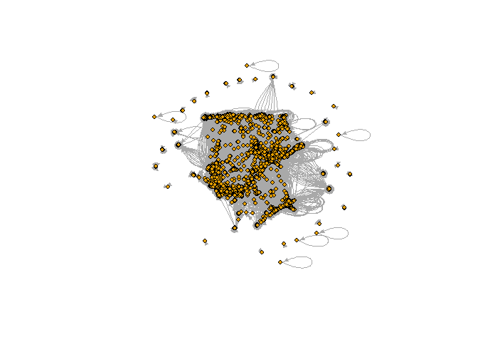
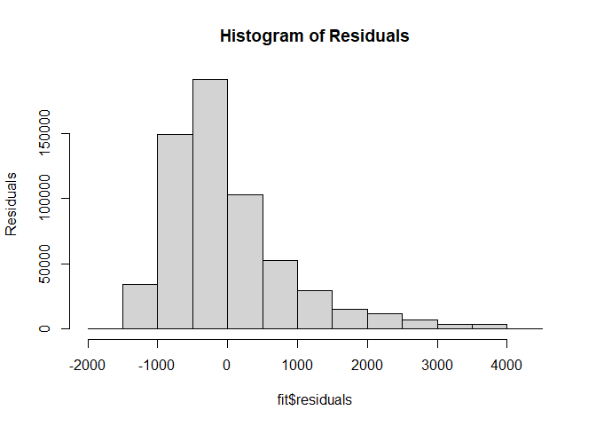
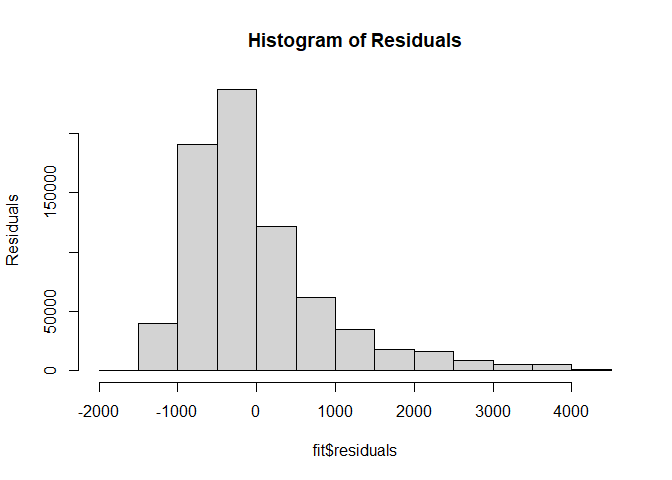
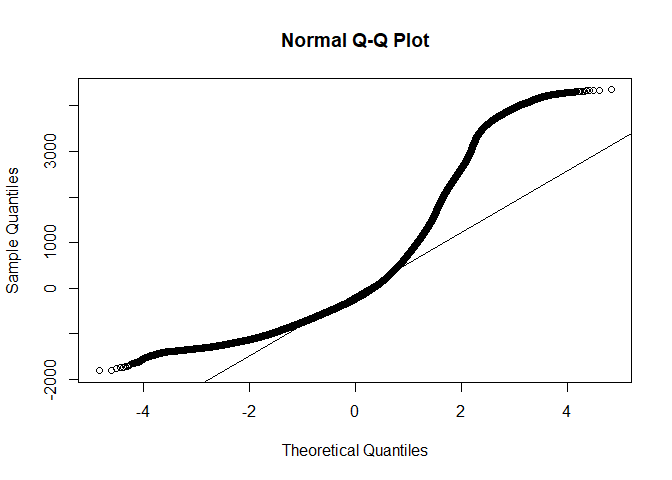

Assignment 4
================
Emery Dittmer
2023-04-05

# Background

This notebook contains all code and answers to the organizational
network analytics assignment 4. Specifically we will be tackling the
following question:

1.Create variable for application processing time ‘app_proc_time’ that
measures the number of days (or weeks) from application filing date,
until the final decision on it (patented or abandoned) 2. Use linear
regression models `lm()` to estimate the relationship between centrality
and `app_proc_time` – Make sure to control for other characteristics of
the examiner that you think might influence that relationship 3. Does
this relationship differ by examiner gender? – Hint: Include an
interaction term `gender x centrality` into your models 4. Discuss your
findings and their implication for the USPTO

# Data Cleaning & Pre-Processing

### Load packages

First we need to load the basic packages for the manipulation of data.
Other packages will be loaded as needed.

    ## ── Attaching packages ─────────────────────────────────────── tidyverse 1.3.2 ──
    ## ✔ ggplot2 3.4.0      ✔ purrr   0.3.4 
    ## ✔ tibble  3.1.8      ✔ dplyr   1.0.10
    ## ✔ tidyr   1.2.1      ✔ stringr 1.4.1 
    ## ✔ readr   2.1.3      ✔ forcats 0.5.2 
    ## ── Conflicts ────────────────────────────────────────── tidyverse_conflicts() ──
    ## ✖ dplyr::filter() masks stats::filter()
    ## ✖ dplyr::lag()    masks stats::lag()
    ## 
    ## Attaching package: 'arrow'
    ## 
    ## 
    ## The following object is masked from 'package:utils':
    ## 
    ##     timestamp
    ## 
    ## 
    ## 
    ## Attaching package: 'lubridate'
    ## 
    ## 
    ## The following object is masked from 'package:arrow':
    ## 
    ##     duration
    ## 
    ## 
    ## The following objects are masked from 'package:base':
    ## 
    ##     date, intersect, setdiff, union

Now we load in the data. There are 2 sources of data: The
app_gender_rate data is the primary data we will use for now. This data
contains the transaction data for all applications, the examiner who
processed them and their associated traits such as gender and ethnicity.

``` r
# change to your own path!
data_path <- "Data/"
applications <- read_csv(paste0(data_path,'apps_examiner_details.csv'))
```

    ## Rows: 2018477 Columns: 18
    ## ── Column specification ────────────────────────────────────────────────────────
    ## Delimiter: ","
    ## chr  (11): application_number, examiner_name_last, examiner_name_first, exam...
    ## dbl   (4): examiner_id, examiner_art_unit, appl_status_code, tc
    ## date  (3): filing_date, patent_issue_date, abandon_date
    ## 
    ## ℹ Use `spec()` to retrieve the full column specification for this data.
    ## ℹ Specify the column types or set `show_col_types = FALSE` to quiet this message.

``` r
edges <- read_csv(paste0(data_path,"edges_sample.csv"))
```

    ## Rows: 32906 Columns: 4
    ## ── Column specification ────────────────────────────────────────────────────────
    ## Delimiter: ","
    ## chr  (1): application_number
    ## dbl  (2): ego_examiner_id, alter_examiner_id
    ## date (1): advice_date
    ## 
    ## ℹ Use `spec()` to retrieve the full column specification for this data.
    ## ℹ Specify the column types or set `show_col_types = FALSE` to quiet this message.

``` r
applications
```

    ## # A tibble: 2,018,477 × 18
    ##    applicat…¹ filing_d…² exami…³ exami…⁴ exami…⁵ exami…⁶ exami…⁷ uspc_…⁸ uspc_…⁹
    ##    <chr>      <date>     <chr>   <chr>   <chr>     <dbl>   <dbl> <chr>   <chr>  
    ##  1 08284457   2000-01-26 HOWARD  JACQUE… V         96082    1764 508     273000 
    ##  2 08413193   2000-10-11 YILDIR… BEKIR   L         87678    1764 208     179000 
    ##  3 08531853   2000-05-17 HAMILT… CYNTHIA <NA>      63213    1752 430     271100 
    ##  4 08637752   2001-07-20 MOSHER  MARY    <NA>      73788    1648 530     388300 
    ##  5 08682726   2000-04-10 BARR    MICHAEL E         77294    1762 427     430100 
    ##  6 08687412   2000-04-28 GRAY    LINDA   LAMEY     68606    1734 156     204000 
    ##  7 08716371   2004-01-26 MCMILL… KARA    RENITA    89557    1627 424     401000 
    ##  8 08765941   2000-06-23 FORD    VANESSA L         97543    1645 424     001210 
    ##  9 08776818   2000-02-04 STRZEL… TERESA  E         98714    1637 435     006000 
    ## 10 08809677   2002-02-20 KIM     SUN     U         65530    1723 210     645000 
    ## # … with 2,018,467 more rows, 9 more variables: patent_number <chr>,
    ## #   patent_issue_date <date>, abandon_date <date>, disposal_type <chr>,
    ## #   appl_status_code <dbl>, appl_status_date <chr>, tc <dbl>, gender <chr>,
    ## #   race <chr>, and abbreviated variable names ¹​application_number,
    ## #   ²​filing_date, ³​examiner_name_last, ⁴​examiner_name_first,
    ## #   ⁵​examiner_name_middle, ⁶​examiner_id, ⁷​examiner_art_unit, ⁸​uspc_class,
    ## #   ⁹​uspc_subclass

``` r
edges
```

    ## # A tibble: 32,906 × 4
    ##    application_number advice_date ego_examiner_id alter_examiner_id
    ##    <chr>              <date>                <dbl>             <dbl>
    ##  1 09402488           2008-11-17            84356             66266
    ##  2 09402488           2008-11-17            84356             63519
    ##  3 09402488           2008-11-17            84356             98531
    ##  4 09445135           2008-08-21            92953             71313
    ##  5 09445135           2008-08-21            92953             93865
    ##  6 09445135           2008-08-21            92953             91818
    ##  7 09479304           2008-12-15            61767             69277
    ##  8 09479304           2008-12-15            61767             92446
    ##  9 09479304           2008-12-15            61767             66805
    ## 10 09479304           2008-12-15            61767             70919
    ## # … with 32,896 more rows

## Clean Data

Now that we have the data, we can clean and pre-process it. We will
remove all the fields with NAs so that we can get meaningful insights.

``` r
# Remove Nas from status date and gender
applications <- applications %>% 
  filter(!is.na(appl_status_date) | !is.na(gender) | !is.na(race))

# Clean Date format
#get the date format cleaned
applications$Date_time=as.Date(applications$appl_status_date, format="%d%b%Y")

#get the date format for the filing date cleaned
applications$filing_date=as.Date(applications$filing_date, format="%d%b%Y")
```

## Pre-process

There are 3 status that can exist for patent applications: “ISS” “ABN”
“PEND” . We are only interested in the ones that have a decision or the
ones that are issued (ISS) or abandoned (ABN)

``` r
#Remove all the data we will not need based on application status
exclude_list=c("PEND")
applications <- applications %>%
  filter(!disposal_type %in% exclude_list)
```

We will need to do some brief value conversion

``` r
#Setting Gender as factor
applications$gender = as.factor(applications$gender)

#Setting ethnicity as factor
applications$race = as.factor(applications$race)

#Setting disposal type as factor
applications$disposal_type = as.factor(applications$disposal_type)

#setting the technology center as a factor
applications$tc = as.factor(applications$tc)
```

# 1. Create ‘app_proc_time’ with Feature Engineering

Now for pre-processing we will need to add a column that computes the
time between application date and decision date. This column is called
the application time and is the time in days between application filing
and

``` r
#this is the amount of time in days that the applications take
applications$app_proc_time <- applications$Date_time - applications$filing_date
applications$app_proc_time <- as.numeric(applications$app_proc_time)

#adding the year of filling and the year of approval to see time's effect
applications$filing_year= as.numeric(year(applications$filing_date))
applications$descision_year=as.numeric(year(applications$Date_time))
```

Invesitagtion of new feature

``` r
summary(applications)
```

    ##  application_number  filing_date         examiner_name_last examiner_name_first
    ##  Length:1688717     Min.   :2000-01-02   Length:1688717     Length:1688717     
    ##  Class :character   1st Qu.:2004-06-25   Class :character   Class :character   
    ##  Mode  :character   Median :2008-03-14   Mode  :character   Mode  :character   
    ##                     Mean   :2008-01-26                                         
    ##                     3rd Qu.:2011-09-29                                         
    ##                     Max.   :2017-03-24                                         
    ##                                                                                
    ##  examiner_name_middle  examiner_id    examiner_art_unit  uspc_class       
    ##  Length:1688717       Min.   :59012   Min.   :1600      Length:1688717    
    ##  Class :character     1st Qu.:66481   1st Qu.:1657      Class :character  
    ##  Mode  :character     Median :75149   Median :1771      Mode  :character  
    ##                       Mean   :78651   Mean   :1919                        
    ##                       3rd Qu.:93760   3rd Qu.:2166                        
    ##                       Max.   :99990   Max.   :2498                        
    ##                       NA's   :3754                                        
    ##  uspc_subclass      patent_number      patent_issue_date   
    ##  Length:1688717     Length:1688717     Min.   :1997-03-04  
    ##  Class :character   Class :character   1st Qu.:2008-04-29  
    ##  Mode  :character   Mode  :character   Median :2012-05-22  
    ##                                        Mean   :2011-06-20  
    ##                                        3rd Qu.:2015-01-20  
    ##                                        Max.   :2017-06-20  
    ##                                        NA's   :601418      
    ##   abandon_date        disposal_type appl_status_code appl_status_date  
    ##  Min.   :1965-07-20   ABN: 601411   Min.   : 16.0    Length:1688717    
    ##  1st Qu.:2008-06-23   ISS:1087306   1st Qu.:150.0    Class :character  
    ##  Median :2011-04-19                 Median :150.0    Mode  :character  
    ##  Mean   :2011-01-28                 Mean   :164.4                      
    ##  3rd Qu.:2014-04-15                 3rd Qu.:161.0                      
    ##  Max.   :2050-06-30                 Max.   :854.0                      
    ##  NA's   :1087297                    NA's   :355                        
    ##     tc            gender             race           Date_time         
    ##  1600:461066   female:474708   Asian   : 491279   Min.   :2000-03-20  
    ##  1700:609324   male  :960125   black   :  77164   1st Qu.:2009-09-23  
    ##  2100:344357   NA's  :253884   Hispanic:  47141   Median :2012-11-14  
    ##  2400:273970                   other   :   1668   Mean   :2012-02-25  
    ##                                white   :1071465   3rd Qu.:2015-04-10  
    ##                                                   Max.   :9468-10-16  
    ##                                                   NA's   :356         
    ##  app_proc_time      filing_year   descision_year
    ##  Min.   :      0   Min.   :2000   Min.   :2000  
    ##  1st Qu.:    848   1st Qu.:2004   1st Qu.:2009  
    ##  Median :   1206   Median :2008   Median :2012  
    ##  Mean   :   1491   Mean   :2008   Mean   :2012  
    ##  3rd Qu.:   1785   3rd Qu.:2011   3rd Qu.:2015  
    ##  Max.   :2726819   Max.   :2017   Max.   :9468  
    ##  NA's   :356                      NA's   :356

Let’s look at the number of decisions issued first

``` r
library(ggplot2)
#histograpm of total population
ggplot(applications, aes(x=filing_year))+
  geom_histogram(bins = 30)
```

<!-- -->

``` r
#histogram by tc
ggplot(applications, aes(x=filing_year))+
  geom_histogram(bins = 30)+
  facet_grid(applications$tc)
```

<!-- -->

Based on the Data there is a right cutoff problem around 2016. This
means that we know applications are in process but that only the ones
that recieve a quick turn around are recorded. Based on this data we
will then need to filter these out as they will impact the correlation
and prdictive analysis.

``` r
trows=nrow(applications)
#remove all values before 2017
applications <- applications %>% 
  filter(Date_time<= as.Date("2016-01-01"))

#Data Remain
nrow(applications)/trows*100
```

    ## [1] 83.20394

Based on this we eliminated 20% of the data. We will use the remaining
80% for our analysis.

Let’s look at the application duration against time

``` r
#histograpm of total population
ggplot(applications,aes(x=Date_time,y=app_proc_time))+
  geom_bar(stat='identity')
```

<!-- -->

``` r
ggplot()+
  geom_point(data=applications, aes(filing_date,app_proc_time), size = 2,alpha=.005)+
  facet_grid(applications$tc~applications$disposal_type)
```

<!-- -->

It looks like over time the number of application days for processing
increases. This may be because there are more applications.

``` r
#histograpm of total population
ggplot(applications,aes(x=filing_date))+
  geom_histogram()
```

    ## `stat_bin()` using `bins = 30`. Pick better value with `binwidth`.

<!-- -->
The number of applications appears to be stable over time.

# 2 Investigate relationships

Use linear regression models `lm()` to estimate relationship between
centrality and `app_proc_time`

\##Nodes & Edges Creation First we need to create the netwrok data to
calculate centrality We will remove any records that contain NAs to
avoid future issues with coding

``` r
#Create the edges from edge data
edges_backup=edges
#edges=edges_backup
edges <- edges %>%
  mutate(from=ego_examiner_id,to=alter_examiner_id) %>%
  select(from, to) %>%
  drop_na()

#Create Nodes from Edges Data
nodes <-as.data.frame(do.call(rbind,append(as.list(edges$from),as.list(edges$to))))

nodes <- nodes %>%
  mutate(id=V1) %>%
  select(id) %>%
  distinct(id) %>%
  drop_na()
```

## Closeness Measures

We will now add 3 closeness measures to the nodes data frame:

1.Degree Centrality: The number of connections (or edges) that each node
has. 2. Closness Centrality : A measure that calculates the ability to
spread information efficiently via the edges the node is connected to.
It is calculated as the inverse of the average shortest path between
nodes. 3: Betweenness Centrality: A measure that detects a node’s
influence over the flow of information within a graph.

    ## 
    ## Attaching package: 'igraph'

    ## The following objects are masked from 'package:lubridate':
    ## 
    ##     %--%, union

    ## The following objects are masked from 'package:dplyr':
    ## 
    ##     as_data_frame, groups, union

    ## The following objects are masked from 'package:purrr':
    ## 
    ##     compose, simplify

    ## The following object is masked from 'package:tidyr':
    ## 
    ##     crossing

    ## The following object is masked from 'package:tibble':
    ## 
    ##     as_data_frame

    ## The following objects are masked from 'package:stats':
    ## 
    ##     decompose, spectrum

    ## The following object is masked from 'package:base':
    ## 
    ##     union

    ## 
    ## Attaching package: 'tidygraph'

    ## The following object is masked from 'package:igraph':
    ## 
    ##     groups

    ## The following object is masked from 'package:stats':
    ## 
    ##     filter

``` r
g <- igraph::graph_from_data_frame(edges, vertices = nodes) %>% as_tbl_graph(directed=TRUE)
#not sure why this isnt working
#g = tbl_graph(nodes = nodes, edges = edges, directed = FALSE)
g <- g %>% 
  activate(nodes) %>% 
  mutate(Centrality_Degree = centrality_degree(),
         Centrality_Closeness = centrality_closeness(),
         Centrality_Betweenness = centrality_betweenness()) %>% 
  activate(edges)

tg_nodes <-
  g %>%
  activate(nodes) %>%
  data.frame() %>%
  mutate(name=as.integer(name))

nodes <- nodes %>%
  left_join(tg_nodes,by=c("id"="name")) 

remove(g,tg_nodes)
```

Let’s combine the centrality measures and the application data

``` r
all_app_data <- applications %>%
  left_join(nodes,by=c("examiner_id"="id"))


# nodes <- nodes %>% 
#   left_join(applications,by=c("id"="examiner_id")) %>%
#   mutate(label = paste("Examiner:",id,"\n",
#                       "Centrality:",format(Centrality_Degree, digits = 2),"\n",
#                       "Closenness:",format(Centrality_Closeness, digits = 2),"\n",
#                       "Betweenness:",format(Centrality_Betweenness, digits = 2),"\n",
#                       sep = " ")) %>%
#   mutate(font.size = 12)

net <- igraph::graph_from_data_frame(edges, vertices = nodes) %>% as_tbl_graph(directed=TRUE)
plot(net, edge.arrow.size=.4,vertex.label=NA,vertex.size=4)
```

<!-- -->

``` r
fit=lm(app_proc_time~Centrality_Degree, data=all_app_data )
summary(fit)
```

    ## 
    ## Call:
    ## lm(formula = app_proc_time ~ Centrality_Degree, data = all_app_data)
    ## 
    ## Residuals:
    ##     Min      1Q  Median      3Q     Max 
    ## -1484.3  -604.1  -240.1   317.6  4336.9 
    ## 
    ## Coefficients:
    ##                     Estimate Std. Error  t value Pr(>|t|)    
    ## (Intercept)       1496.06467    1.04074 1437.499  < 2e-16 ***
    ## Centrality_Degree   -0.19749    0.03805   -5.191  2.1e-07 ***
    ## ---
    ## Signif. codes:  0 '***' 0.001 '**' 0.01 '*' 0.05 '.' 0.1 ' ' 1
    ## 
    ## Residual standard error: 926.6 on 909397 degrees of freedom
    ##   (495680 observations deleted due to missingness)
    ## Multiple R-squared:  2.962e-05,  Adjusted R-squared:  2.853e-05 
    ## F-statistic: 26.94 on 1 and 909397 DF,  p-value: 2.098e-07

``` r
fit=lm(app_proc_time~Centrality_Closeness, data=all_app_data )
summary(fit)
```

    ## 
    ## Call:
    ## lm(formula = app_proc_time ~ Centrality_Closeness, data = all_app_data)
    ## 
    ## Residuals:
    ##     Min      1Q  Median      3Q     Max 
    ## -1484.7  -582.2  -216.0   331.4  4329.2 
    ## 
    ## Coefficients:
    ##                      Estimate Std. Error  t value Pr(>|t|)    
    ## (Intercept)          1498.949      1.487 1008.173  < 2e-16 ***
    ## Centrality_Closeness  -20.785      3.107   -6.689 2.25e-11 ***
    ## ---
    ## Signif. codes:  0 '***' 0.001 '**' 0.01 '*' 0.05 '.' 0.1 ' ' 1
    ## 
    ## Residual standard error: 886.3 on 600351 degrees of freedom
    ##   (804726 observations deleted due to missingness)
    ## Multiple R-squared:  7.452e-05,  Adjusted R-squared:  7.285e-05 
    ## F-statistic: 44.74 on 1 and 600351 DF,  p-value: 2.25e-11

``` r
fit=lm(app_proc_time~Centrality_Betweenness, data=all_app_data )
summary(fit)
```

    ## 
    ## Call:
    ## lm(formula = app_proc_time ~ Centrality_Betweenness, data = all_app_data)
    ## 
    ## Residuals:
    ##     Min      1Q  Median      3Q     Max 
    ## -1761.9  -603.5  -239.5   316.5  4341.5 
    ## 
    ## Coefficients:
    ##                         Estimate Std. Error t value Pr(>|t|)    
    ## (Intercept)            1.491e+03  9.800e-01  1521.9   <2e-16 ***
    ## Centrality_Betweenness 3.275e-03  1.582e-04    20.7   <2e-16 ***
    ## ---
    ## Signif. codes:  0 '***' 0.001 '**' 0.01 '*' 0.05 '.' 0.1 ' ' 1
    ## 
    ## Residual standard error: 926.4 on 909397 degrees of freedom
    ##   (495680 observations deleted due to missingness)
    ## Multiple R-squared:  0.0004712,  Adjusted R-squared:  0.0004701 
    ## F-statistic: 428.7 on 1 and 909397 DF,  p-value: < 2.2e-16

``` r
fit=lm(app_proc_time~Centrality_Degree+Centrality_Closeness+Centrality_Betweenness, data=all_app_data )
summary(fit)
```

    ## 
    ## Call:
    ## lm(formula = app_proc_time ~ Centrality_Degree + Centrality_Closeness + 
    ##     Centrality_Betweenness, data = all_app_data)
    ## 
    ## Residuals:
    ##     Min      1Q  Median      3Q     Max 
    ## -1743.7  -582.0  -215.6   331.4  4330.8 
    ## 
    ## Coefficients:
    ##                          Estimate Std. Error t value Pr(>|t|)    
    ## (Intercept)             1.500e+03  1.745e+00 859.725  < 2e-16 ***
    ## Centrality_Degree      -3.490e-01  3.972e-02  -8.788  < 2e-16 ***
    ## Centrality_Closeness   -2.028e+01  3.268e+00  -6.204 5.52e-10 ***
    ## Centrality_Betweenness  3.369e-03  1.537e-04  21.911  < 2e-16 ***
    ## ---
    ## Signif. codes:  0 '***' 0.001 '**' 0.01 '*' 0.05 '.' 0.1 ' ' 1
    ## 
    ## Residual standard error: 885.9 on 600349 degrees of freedom
    ##   (804726 observations deleted due to missingness)
    ## Multiple R-squared:  0.0009566,  Adjusted R-squared:  0.0009516 
    ## F-statistic: 191.6 on 3 and 600349 DF,  p-value: < 2.2e-16

Based on these results bith degree closeness and betweenness are
erlavant factors and the most important predictors.

``` r
hist(fit$residuals, main="Histogram of Residuals",
 ylab="Residuals")
```

<!-- -->

``` r
#Q-Q Plot
qqnorm(fit$residuals)
qqline(fit$residuals)
```

<!-- -->

# 3 Gender

3.  Does this relationship differ by examiner gender?– Hint: Include an
    interaction term `gender x centrality` into your models

We can treat gnerder as a binary variable where it is 1 if femal and 0
if male.Therefore these measurements are

``` r
all_app_data$gender_x_centrality=ifelse(all_app_data$gender=='female',0,all_app_data$Centrality_Degree)
all_app_data$gender_x_closeness=ifelse(all_app_data$gender=='female',0,all_app_data$Centrality_Closeness)
all_app_data$gender_x_betweeness=ifelse(all_app_data$gender=='female',0,all_app_data$Centrality_Betweenness)


fit=lm(app_proc_time~gender_x_centrality, data=all_app_data )
summary(fit)
```

    ## 
    ## Call:
    ## lm(formula = app_proc_time ~ gender_x_centrality, data = all_app_data)
    ## 
    ## Residuals:
    ##     Min      1Q  Median      3Q     Max 
    ## -1468.6  -601.1  -242.6   310.7  4353.4 
    ## 
    ## Coefficients:
    ##                       Estimate Std. Error  t value Pr(>|t|)    
    ## (Intercept)         1479.62225    0.98692 1499.236  < 2e-16 ***
    ## gender_x_centrality   -0.22174    0.04422   -5.015 5.31e-07 ***
    ## ---
    ## Signif. codes:  0 '***' 0.001 '**' 0.01 '*' 0.05 '.' 0.1 ' ' 1
    ## 
    ## Residual standard error: 926.2 on 936790 degrees of freedom
    ##   (468287 observations deleted due to missingness)
    ## Multiple R-squared:  2.684e-05,  Adjusted R-squared:  2.578e-05 
    ## F-statistic: 25.15 on 1 and 936790 DF,  p-value: 5.311e-07

``` r
fit=lm(app_proc_time~gender_x_closeness, data=all_app_data )
summary(fit)
```

    ## 
    ## Call:
    ## lm(formula = app_proc_time ~ gender_x_closeness, data = all_app_data)
    ## 
    ## Residuals:
    ##     Min      1Q  Median      3Q     Max 
    ## -1465.5  -591.5  -231.5   318.5  4347.5 
    ## 
    ## Coefficients:
    ##                    Estimate Std. Error t value Pr(>|t|)    
    ## (Intercept)        1476.492      1.168 1264.66  < 2e-16 ***
    ## gender_x_closeness  -14.945      3.575   -4.18 2.91e-05 ***
    ## ---
    ## Signif. codes:  0 '***' 0.001 '**' 0.01 '*' 0.05 '.' 0.1 ' ' 1
    ## 
    ## Residual standard error: 906.1 on 740487 degrees of freedom
    ##   (664590 observations deleted due to missingness)
    ## Multiple R-squared:  2.36e-05,   Adjusted R-squared:  2.225e-05 
    ## F-statistic: 17.48 on 1 and 740487 DF,  p-value: 2.911e-05

``` r
fit=lm(app_proc_time~gender_x_betweeness, data=all_app_data )
summary(fit)
```

    ## 
    ## Call:
    ## lm(formula = app_proc_time ~ gender_x_betweeness, data = all_app_data)
    ## 
    ## Residuals:
    ##     Min      1Q  Median      3Q     Max 
    ## -1815.9  -601.2  -243.2   309.8  4356.8 
    ## 
    ## Coefficients:
    ##                      Estimate Std. Error t value Pr(>|t|)    
    ## (Intercept)         1.476e+03  9.622e-01 1534.18   <2e-16 ***
    ## gender_x_betweeness 3.900e-03  1.821e-04   21.42   <2e-16 ***
    ## ---
    ## Signif. codes:  0 '***' 0.001 '**' 0.01 '*' 0.05 '.' 0.1 ' ' 1
    ## 
    ## Residual standard error: 925.9 on 936790 degrees of freedom
    ##   (468287 observations deleted due to missingness)
    ## Multiple R-squared:  0.0004897,  Adjusted R-squared:  0.0004886 
    ## F-statistic: 458.9 on 1 and 936790 DF,  p-value: < 2.2e-16

``` r
fit=lm(app_proc_time~gender_x_centrality+gender_x_closeness+gender_x_betweeness, data=all_app_data )
summary(fit)
```

    ## 
    ## Call:
    ## lm(formula = app_proc_time ~ gender_x_centrality + gender_x_closeness + 
    ##     gender_x_betweeness, data = all_app_data)
    ## 
    ## Residuals:
    ##     Min      1Q  Median      3Q     Max 
    ## -1807.5  -591.3  -231.3   318.7  4348.7 
    ## 
    ## Coefficients:
    ##                       Estimate Std. Error  t value Pr(>|t|)    
    ## (Intercept)          1.475e+03  1.218e+00 1211.478  < 2e-16 ***
    ## gender_x_centrality -3.193e-01  4.406e-02   -7.246 4.29e-13 ***
    ## gender_x_closeness  -1.203e+01  3.583e+00   -3.359 0.000784 ***
    ## gender_x_betweeness  4.138e-03  1.802e-04   22.967  < 2e-16 ***
    ## ---
    ## Signif. codes:  0 '***' 0.001 '**' 0.01 '*' 0.05 '.' 0.1 ' ' 1
    ## 
    ## Residual standard error: 905.8 on 740485 degrees of freedom
    ##   (664590 observations deleted due to missingness)
    ## Multiple R-squared:  0.00076,    Adjusted R-squared:  0.000756 
    ## F-statistic: 187.7 on 3 and 740485 DF,  p-value: < 2.2e-16

Based on the model output it appears that the for woemn the centrality
and closesness are inversely proportional to the processing time while
the betweeness is proportiona.

Based on the previous responses it appears that gender does not have a
significant impact for between degree but closeness and cnetrality ande
much better predictors for men

``` r
hist(fit$residuals, main="Histogram of Residuals",
 ylab="Residuals")
```

<!-- -->

``` r
#Q-Q Plot
qqnorm(fit$residuals)
qqline(fit$residuals)
```

<!-- -->

Based on the residual histogram the residuals are normally distributed
and not a major concern for model accuracy.

Furthermore the qqplots fit is not exact but good enough for our
purposes.

4.  Discuss your findings and their implication for the USPTO

Based on these findings there is sufficient evidence to point to
centrality having a role with the USPTO application rates. IF a person
has higher degree centrality (the number of connections someone has) and
closeness centrality they have a lower application time than people who
have a high betweeness centrality. If we invesitaget how accessible is
the flow of information to people there is some correlation between low
application times and well information-connected people. therefore the
USPTO should make efforts to connect and network people better.
