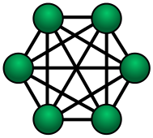
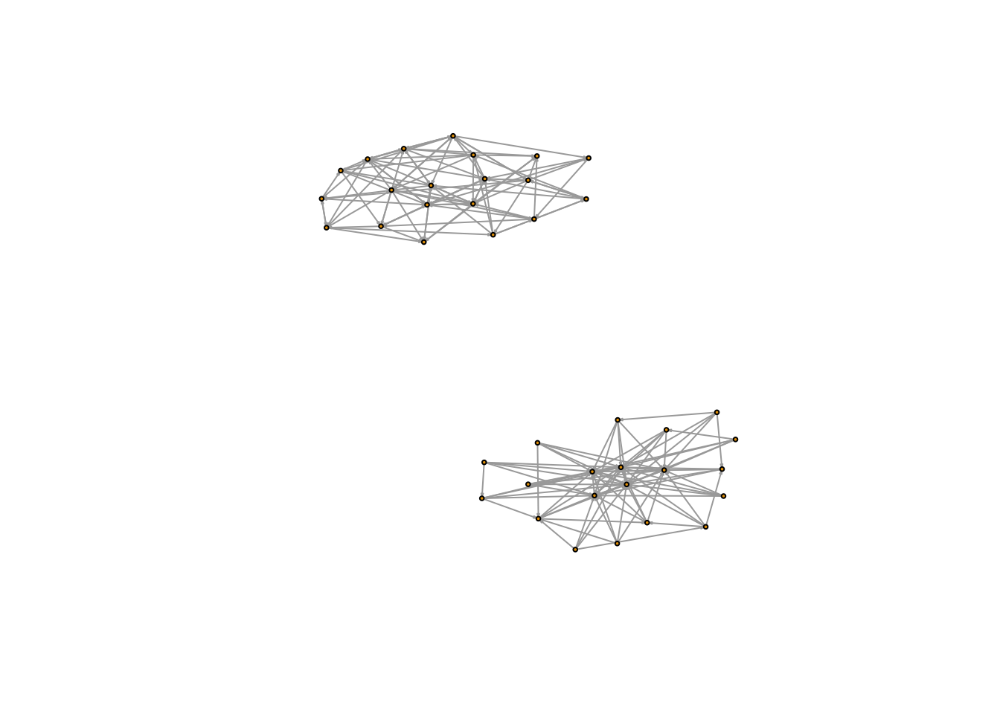

Assigment 5
================
Emery Dittmer
2023-04-05

# 1 What is complex contagion, and how it’s different from simple Contagion (you may want to refer to readings – Centola)

Simple contagion assumes an infection will spread to all connected nodes
over time. An infection is not necessarily a disease or a negative in
this context, it may be characterized as information, a type of activity
or a disease. In simple infections, an infection is acquired if a node
has an edge connecting to an infected node. In a network of people, if
one person is infected all their connections will be infected at the
next time interval. On the other hand, complex contagion assumes a
threshold number of infected connected nodes is required for infection.
In other words, in a network of people, there may be a requirement for
over 25% of their network to become affected. So, a person with 4
connections will only become infected once at least 2 of their
connections are infected. Complex contagion, therefore, requires many
nodes surrounding uninfected nodes to spread infections. This indicates
that networks need the right connections between nodes that surpass the
threshold for all nodes at time tn.

# 2 What does complex contagion mean for diffusion of behaviors in the organization

    Complex contagion within organizations has many implications. 

First, complex contagion indicates that the behavior of individuals is
influenced largely by the brrrrrrrr of those around them. The
connections that people have influence their behavior. An individual
where many connections are doing a behavior is likely to adopt the new
behavior versus others who have a network of people not adopting the
activity. From an organization perspective, as the Centola suggests,
leaders are reluctant to follow new behaviors. Instead, leaders tend to
follow the majority. So to get prominent leaders to adopt a behavior you
will need most people to do the behavior first. Centola cites the
example of how Oprah adopted Twitter because it was growing so much as
opposed to the growth being influenced by Oprah. The speed of diffusion
depends on the network connectivity.

A second insight is that you can use complex diffusion to detect the
interconnectedness of an organization. In order for a new behaviour to
spread through an organization, the organization network in place needs
to be sufficiently connected. There must be sufficient intragroup and
intergroup connections throughout the network. The image below shows an
example of insular networks that have high intragroup connections and
networks that have. Both inter and intragroup connections are required
for complex infections to spread. If the behavior stops or only effects
some people versus others this is key data to demonstrate and share the
influence network. As famous examples have shown networks can be rather
insular, but a lack of openness to information of behaviors through the
organization can lead to disaster as with the space shuttle Challenger.

# 3 How can we use the threshold models to better manage

• Prosocial behavior in organizations • Learning • Toxic or unproductive
behaviors

The threshold mode demonstrates a key method for knowledge spreading
within organizations. Generally spreading knowledge and behaviors
throughout an organization leads to harnessing the full potential of
organizations, a broad buy in from many perspectives and a certain
validation of behaviors as each person in the network plays a key role
in spreading the behavior as well as stopping it. Threshold model can be
used to better manage behavior or information within organizations in
two main ways. First we can evaluate the network within the organization
to understand the current state. Let’s assume that we are able to
introduce a behavior to the group. Understanding or seeing the evolution
of this behavior through time and its effectiveness will inform the
network of the organization. Complex infection networks need
interconnectivity and intra connectivity to spread effectively as the
behaviors will only change if the threshold is passed for the target
person. Pragmatically if a behavior is introduced and the CEO preforms
this behavior 2 weeks later then the network is balanced between inter
and intra connectivity. New behaviors and pro-social activities can be
influenced, new ideas will be spread through networks. If the network is
not effective at transmitting information, there may be more effort in
prosocial or mixing events required. However, the behaviors may not be
positive. Therefore, the network within organizations may be relatively
agnostic to the type of behavior that it is transmitting. This however
presents an opportunity for the organization to influence the behavior
or culture of the organization. If the network speeds information
effectively an organization can mandate training for some or all
individuals to effect change within the entire organization. In other
words by trainings 10% of the staff in advanced management or culture
techniques the entire organization will benefit from the training. The
trick is to get the right 10% who will effectively spread the
information.
